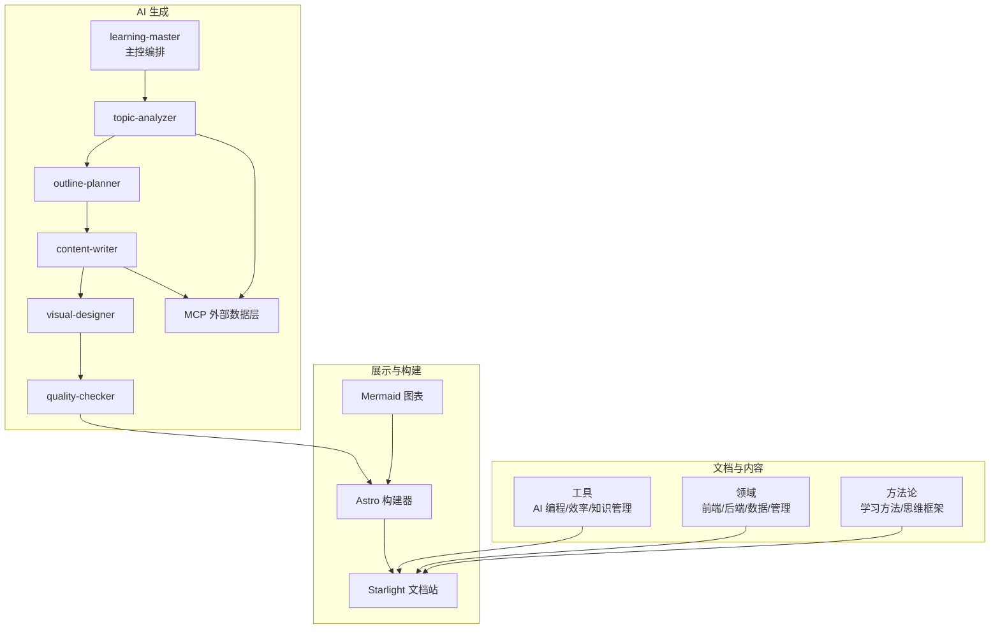
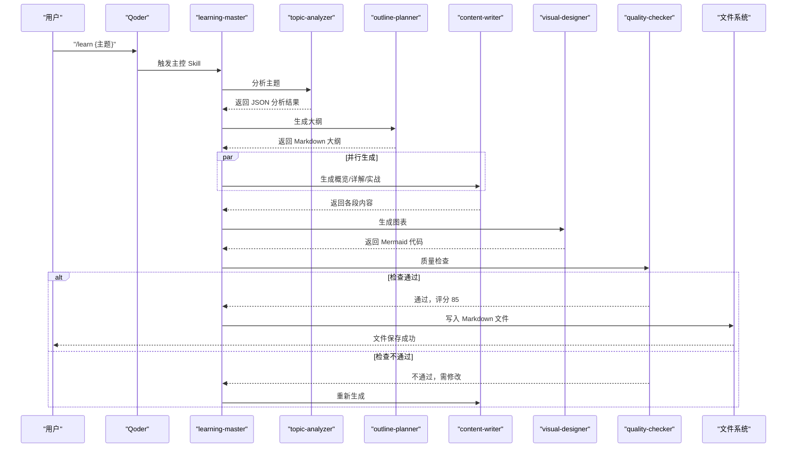
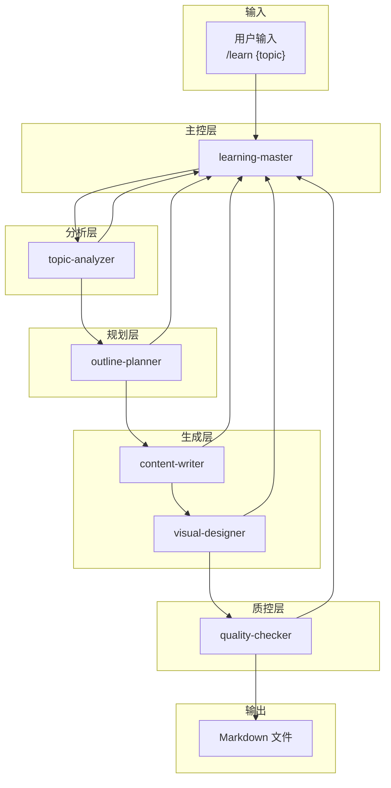
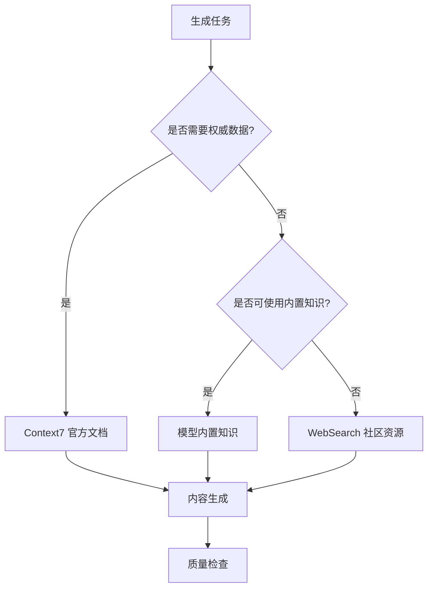
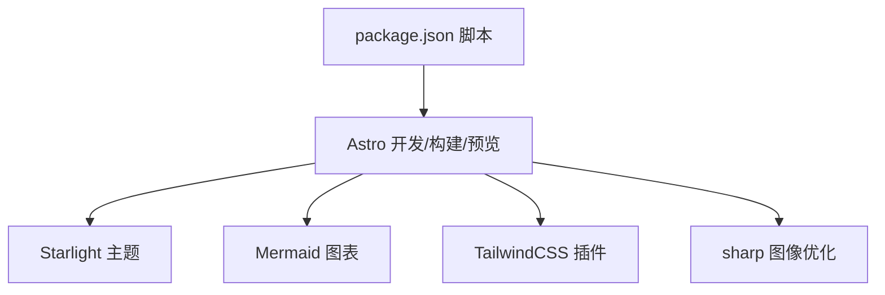
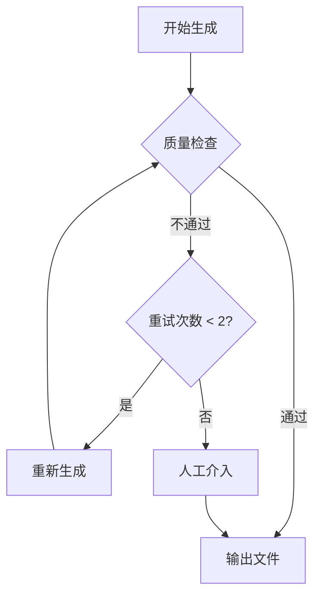

# 后端开发

<cite>
**本文引用的文件**
- [项目简介](file://docs/01-PROJECT-BRIEF.md)
- [技术架构设计](file://docs/03-ARCHITECTURE.md)
- [AI Skill 规格说明](file://docs/04-AI-SKILL-SPEC.md)
- [Docker 使用指南](file://src/content/docs/tools/efficiency/docker.md)
- [Astro 配置](file://astro.config.mjs)
- [包管理与脚本](file://package.json)
</cite>

## 目录
1. [引言](#引言)
2. [项目结构](#项目结构)
3. [核心组件](#核心组件)
4. [架构总览](#架构总览)
5. [详细组件分析](#详细组件分析)
6. [依赖分析](#依赖分析)
7. [性能考虑](#性能考虑)
8. [故障排查指南](#故障排查指南)
9. [结论](#结论)
10. [附录](#附录)

## 引言
本文件面向后端开发领域，围绕 StudyBuddy 项目的文档与 AI 生成体系，系统阐述后端相关的设计原则、技术选型与工程实践。尽管当前仓库以静态文档站点为主，但其“内容生成层”“外部数据层”“构建层”的分层思想，以及对 AI 多技能协作、MCP（Model Context Provider）调用策略的规范，均可迁移为后端系统在服务编排、数据获取与质量控制方面的最佳实践。

## 项目结构
- 文档与内容组织采用三层分类：工具、领域、方法论。其中“领域”包含后端开发专题入口，便于后续扩展后端主题内容。
- 技术栈以 Astro + Starlight 为核心，Mermaid 图表原生集成，构建产物为静态站点，适合本地离线使用与快速迭代。
- AI 生成流程由多个 Skill 协同完成，形成“主控编排 → 主题分析 → 大纲规划 → 内容生成 → 图表生成 → 质量检查”的闭环。

**图示来源**
- [技术架构设计](file://docs/03-ARCHITECTURE.md#L12-L69)
- [AI Skill 规格说明](file://docs/04-AI-SKILL-SPEC.md#L23-L73)

**章节来源**
- [技术架构设计](file://docs/03-ARCHITECTURE.md#L164-L240)
- [项目简介](file://docs/01-PROJECT-BRIEF.md#L61-L71)

## 核心组件
- 文档生成层（AI 多技能）：主控编排、主题分析、大纲规划、内容撰写、图表生成、质量检查。该流程体现了后端服务在“请求接入 → 任务编排 → 多下游协同 → 质量校验 → 结果产出”的典型模式。
- 外部数据层（MCP）：Context7 官方文档、WebSearch 联网搜索、WebFetch 网页抓取。体现了后端在“权威数据优先、补充数据兜底”的数据获取策略。
- 构建层（Astro + Mermaid）：将 Markdown 与 Mermaid 渲染为静态 HTML，强调“零运行时 JS、CDN 加速、懒加载图表”的性能策略。
- 展示层（Starlight + Mermaid）：内置搜索、导航、Mermaid 渲染，满足后端文档的可读性与可视化需求。

**章节来源**
- [技术架构设计](file://docs/03-ARCHITECTURE.md#L82-L161)
- [AI Skill 规格说明](file://docs/04-AI-SKILL-SPEC.md#L19-L126)

## 架构总览
下图展示了从用户触发到最终静态站点产出的端到端流程，体现“主控编排 + 多源数据 + 质量控制 + 静态构建”的后端设计范式。

**图示来源**
- [技术架构设计](file://docs/03-ARCHITECTURE.md#L86-L126)
- [AI Skill 规格说明](file://docs/04-AI-SKILL-SPEC.md#L149-L157)

## 详细组件分析

### 组件一：Mermaid 图表集成（用于后端架构图与数据流图）
- 集成方式：通过 Astro 配置启用 Mermaid 插件，并在 Markdown 中使用 Mermaid 语法。
- 支持类型：思维导图、流程图、时序图、类图、状态图等，适合后端系统架构图、API 交互图、状态机建模。
- 实施要点：在文档中以“Mermaid 原生语法 + 星光主题渲染”的方式呈现，确保 AI 可直接生成并渲染。

**图示来源**
- [技术架构设计](file://docs/03-ARCHITECTURE.md#L128-L160)
- [Astro 配置](file://astro.config.mjs#L9-L39)

**章节来源**
- [技术架构设计](file://docs/03-ARCHITECTURE.md#L242-L276)
- [Astro 配置](file://astro.config.mjs#L9-L39)

### 组件二：AI 多技能编排（主控编排/主题分析/大纲规划/内容撰写/图表生成/质量检查）
- 主控编排：负责任务编排与流程控制，类似后端的 API 网关或编排服务。
- 主题分析：对输入主题进行结构化解析，类似后端的请求解析与路由决策。
- 大纲规划：生成结构化内容骨架，类似后端的业务规则引擎或模板生成。
- 内容撰写：并行生成多段内容，体现后端的并发处理与异步任务调度。
- 图表生成：基于内容生成 Mermaid 代码，对应后端的可视化输出或报表生成。
- 质量检查：对生成内容进行评分与回退，类似后端的熔断、降级与重试策略。

**图示来源**
- [AI Skill 规格说明](file://docs/04-AI-SKILL-SPEC.md#L23-L73)

**章节来源**
- [AI Skill 规格说明](file://docs/04-AI-SKILL-SPEC.md#L149-L838)

### 组件三：外部数据层（MCP）与数据获取优先级
- 数据来源优先级：官方文档（权威）→ 官方网站（次权威）→ 社区资源（补充）→ 模型内置知识（兜底）。
- 必须联网场景：版本号、API 签名、安装/配置命令、官方最佳实践。
- 可用内置知识场景：概念解释、通用设计模式、不涉及版本的原理说明。
- 对后端的启示：对外部依赖进行分级治理，区分强一致与最终一致场景；对关键数据强制校验来源，对通用知识允许内置缓存。

**图示来源**
- [AI Skill 规格说明](file://docs/04-AI-SKILL-SPEC.md#L104-L126)

**章节来源**
- [AI Skill 规格说明](file://docs/04-AI-SKILL-SPEC.md#L104-L146)

### 组件四：静态站点构建与性能优化（对后端部署的借鉴）
- 构建优化：增量构建、图片优化、代码分割。
- 运行时优化：静态生成、CDN 缓存、懒加载图表。
- 对后端的借鉴：将“构建期优化”迁移到“部署期优化”，如镜像分层、冷启动优化、连接池预热、缓存预热等。

**图示来源**
- [技术架构设计](file://docs/03-ARCHITECTURE.md#L128-L160)

**章节来源**
- [技术架构设计](file://docs/03-ARCHITECTURE.md#L366-L383)

## 依赖分析
- 技术栈依赖：Astro、Starlight、Mermaid、TailwindCSS、sharp 等，构成“文档 + 图表 + 样式 + 图像优化”的组合。
- 构建脚本：通过 npm scripts 统一管理开发、构建、预览流程，便于 CI/CD 集成。
- 组件耦合：Mermaid 与 Astro 的集成通过配置项声明，星光主题与 Tailwind 的插件化集成，降低耦合度，提升可替换性。

**图示来源**
- [包管理与脚本](file://package.json#L5-L11)
- [Astro 配置](file://astro.config.mjs#L9-L39)

**章节来源**
- [包管理与脚本](file://package.json#L1-L22)
- [Astro 配置](file://astro.config.mjs#L1-L39)

## 性能考虑
- 构建期优化：增量构建减少重复计算；图片优化降低带宽与存储；自动代码分割缩短首屏加载。
- 运行期优化：静态站点零运行时 JS，CDN 边缘缓存显著降低延迟；图表懒加载避免阻塞首屏。
- 对后端的借鉴：在服务侧采用“构建期镜像优化 + 运行期缓存预热 + CDN 边缘分发”的组合拳，结合异步任务与限流熔断，保障高并发下的稳定性。

**章节来源**
- [技术架构设计](file://docs/03-ARCHITECTURE.md#L366-L383)

## 故障排查指南
- 错误类型与处理：主题分析失败（提示细化）、大纲不完整（自动补充）、内容质量低（重试上限）、图表语法错误（简化结构）、超时（返回部分结果）。
- 回退流程：质量检查不通过时，按最大重试次数回退至内容重写；超过阈值则人工介入。
- 对后端的借鉴：在服务层引入“质量门禁 + 指数退避重试 + 人工接管”的机制，确保系统在异常情况下仍能稳定输出。

**图示来源**
- [AI Skill 规格说明](file://docs/04-AI-SKILL-SPEC.md#L791-L800)

**章节来源**
- [AI Skill 规格说明](file://docs/04-AI-SKILL-SPEC.md#L777-L800)

## 结论
StudyBuddy 的文档与 AI 生成体系，提供了后端开发可迁移的设计范式：以“主控编排 + 多源数据 + 质量控制 + 静态构建”为核心的工程化路径。通过 Mermaid 图表与静态站点的实践，可将后端架构图、API 交互与状态机清晰表达；通过 MCP 的数据优先级策略，可指导后端对外部依赖的分级治理；通过性能优化与故障回退机制，可提升后端系统的稳定性与可运维性。

## 附录
- 后端技术栈选型建议（基于本项目工程化经验的迁移）：
  - 框架：优先选择“构建期优化 + 部署期稳定”的方案，如 Go/Echo 或 Node.js/Koa，结合容器化与 CDN。
  - 图表与可视化：可沿用 Mermaid 的“原生语法 + 渲染插件”模式，后端接口返回结构化数据，前端按需渲染。
  - 外部依赖治理：参照 MCP 的优先级策略，对关键数据强制权威来源校验，对通用知识允许内置缓存。
  - 容器化与部署：参考 Docker 的“镜像模板 + 多服务编排 + 生产级构建”的最佳实践，结合 CI/CD 与监控告警。
- 后端与前端数据交互：以“结构化数据 + 可视化渲染”的方式对接，前端负责展示与交互，后端负责数据与逻辑。
- 第三方服务集成：采用“主控编排 + 多源数据 + 质量检查”的模式，确保数据一致性与可追溯性。
- 异步处理机制：在后端引入“任务队列 + 并行处理 + 质量门禁 + 回退策略”，提升吞吐与稳定性。