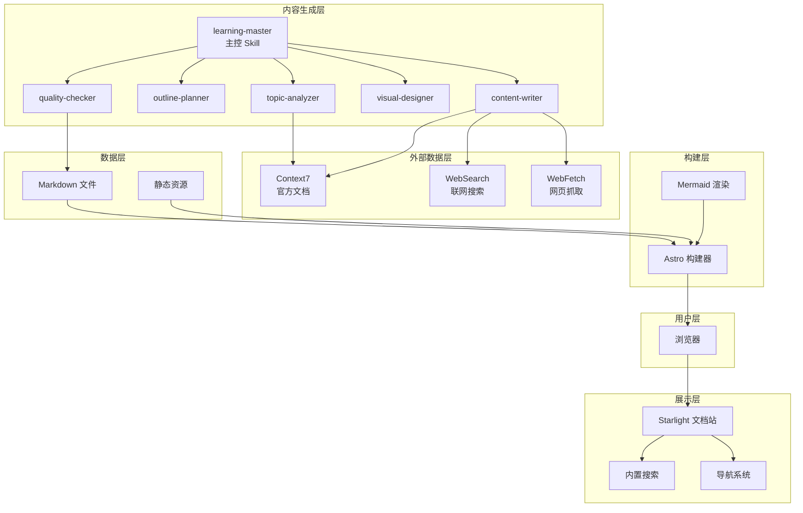
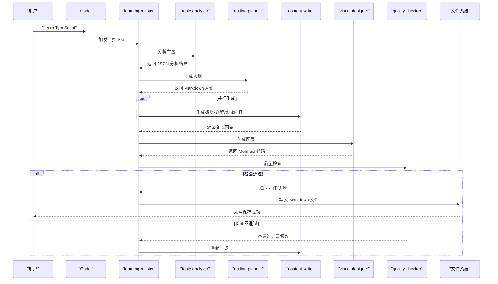
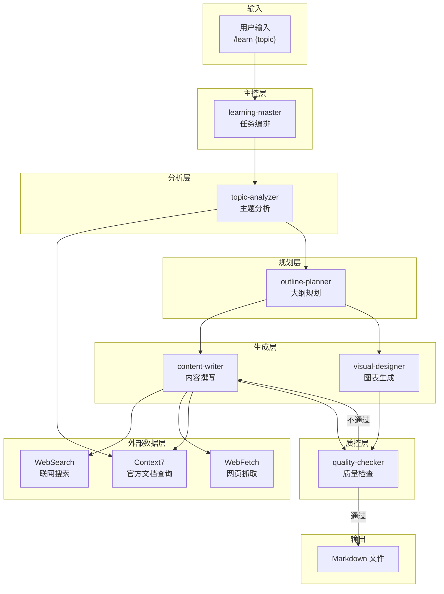
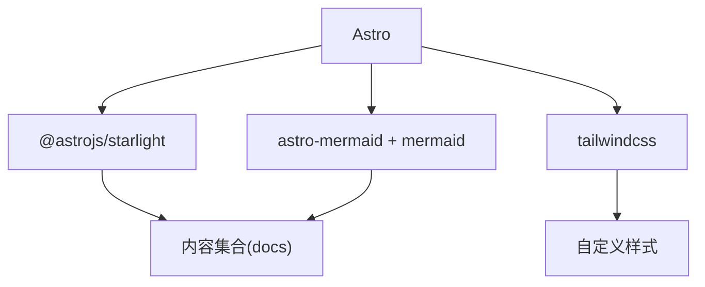
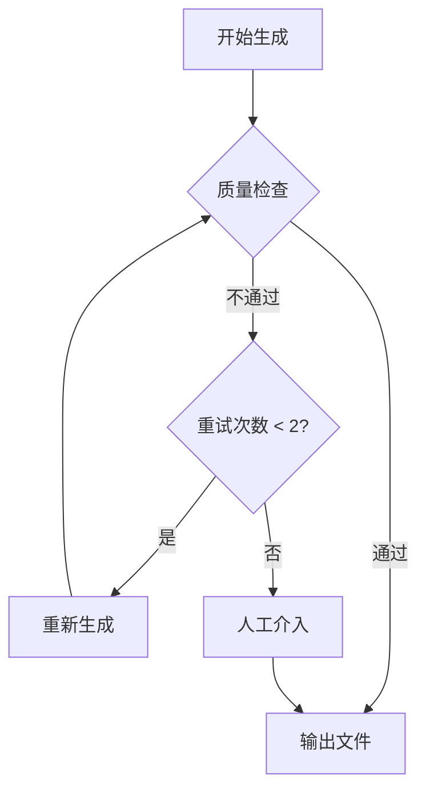

# 技术管理

<cite>
**本文引用的文件**
- [项目简介](file://docs/01-PROJECT-BRIEF.md)
- [技术架构设计](file://docs/03-ARCHITECTURE.md)
- [AI Skill 规格说明](file://docs/04-AI-SKILL-SPEC.md)
- [技术管理领域索引](file://src/content/docs/domains/management/index.md)
- [工具分类索引](file://src/content/docs/tools/index.md)
- [方法论分类索引](file://src/content/docs/methods/index.md)
- [Astro 配置](file://astro.config.mjs)
- [内容集合配置](file://src/content.config.ts)
- [包管理配置](file://package.json)
- [Docker 工具文档](file://src/content/docs/tools/efficiency/docker.md)
</cite>

## 目录
1. [引言](#引言)
2. [项目结构](#项目结构)
3. [核心组件](#核心组件)
4. [架构总览](#架构总览)
5. [详细组件分析](#详细组件分析)
6. [依赖分析](#依赖分析)
7. [性能考量](#性能考量)
8. [故障排除指南](#故障排除指南)
9. [结论](#结论)
10. [附录](#附录)

## 引言
本文件面向技术管理领域，围绕“AI 驱动的知识成长伙伴”这一目标，系统阐述技术管理的核心职能与领导力培养路径，结合项目的技术架构与 AI 工作流，给出组织架构、项目管理、产品开发流程、技术决策与风险评估、资源配置、敏捷与 DevOps 实践、质量保证、人才招聘与培养、绩效考核、技术战略与创新管理、跨部门协作以及团队建设与变革管理的实操指南。

## 项目结构
该项目采用静态文档站点（Astro + Starlight）承载知识内容，并通过 AI Skill 工作流自动化生成结构化学习材料。文档采用三层分类：工具、领域、方法论；技术栈强调“静态优先、性能极致、部署简单”，并以 Mermaid 图表增强可视化表达。

**图表来源**
- [技术架构设计](file://docs/03-ARCHITECTURE.md#L12-L69)

**章节来源**
- [技术架构设计](file://docs/03-ARCHITECTURE.md#L164-L221)
- [Astro 配置](file://astro.config.mjs#L9-L39)
- [内容集合配置](file://src/content.config.ts#L5-L7)

## 核心组件
- 展示与导航：Starlight 提供开箱即用的主题、搜索与导航，适配中文本地化。
- 内容生成：六技能协作的 AI 工作流，覆盖主题分析、大纲规划、内容撰写、图表生成与质量检查。
- 可视化：Mermaid 集成，支持多种图表类型，强化知识体系表达。
- 构建与优化：Astro 静态构建，配合图片优化与懒加载，确保站点性能与可访问性。
- 分类体系：工具/领域/方法论三层结构，便于技术管理者按需检索与组织学习。

**章节来源**
- [技术架构设计](file://docs/03-ARCHITECTURE.md#L242-L320)
- [AI Skill 规格说明](file://docs/04-AI-SKILL-SPEC.md#L19-L85)

## 架构总览
下图展示了从用户触发到最终输出 Markdown 的完整流程，体现“管理者视角”的知识生成范式：先整体、后细节；先框架、后落地；先检索、后生成。

**图表来源**
- [技术架构设计](file://docs/03-ARCHITECTURE.md#L86-L126)
- [AI Skill 规格说明](file://docs/04-AI-SKILL-SPEC.md#L159-L172)

## 详细组件分析

### 技术管理领域索引
技术管理作为三大分类之一，聚焦“在技术与业务之间找到最优平衡点”。其内容应围绕组织架构、项目管理、产品开发、技术决策、风险评估、资源配置、敏捷与 DevOps、质量保证、人才管理与绩效、技术战略与创新、跨部门协作与团队建设等维度展开。

**章节来源**
- [技术管理领域索引](file://src/content/docs/domains/management/index.md#L1-L7)
- [工具分类索引](file://src/content/docs/tools/index.md#L1-L13)
- [方法论分类索引](file://src/content/docs/methods/index.md#L1-L12)

### AI Skill 工作流（管理者视角）
- 主控编排：协调分析、规划、生成、设计与检查，控制生成时长与质量门槛。
- 主题分析：输出结构化元数据，指导后续大纲与内容生成。
- 大纲规划：遵循三阶段学习框架（概览→详解→实战），确保“管理者视角”的全局与实用。
- 内容撰写：分段生成，强调“是什么—为什么—怎么用”，并强制调用外部数据源确保时效性与准确性。
- 图表生成：为概览与实战章节生成思维导图与流程图，强化知识体系与应用路径。
- 质量检查：结构、内容、格式三维度评分，设定通过阈值与回退机制。

**图表来源**
- [AI Skill 规格说明](file://docs/04-AI-SKILL-SPEC.md#L19-L73)

**章节来源**
- [AI Skill 规格说明](file://docs/04-AI-SKILL-SPEC.md#L149-L202)
- [AI Skill 规格说明](file://docs/04-AI-SKILL-SPEC.md#L206-L277)
- [AI Skill 规格说明](file://docs/04-AI-SKILL-SPEC.md#L281-L386)
- [AI Skill 规格说明](file://docs/04-AI-SKILL-SPEC.md#L390-L531)
- [AI Skill 规格说明](file://docs/04-AI-SKILL-SPEC.md#L535-L605)
- [AI Skill 规格说明](file://docs/04-AI-SKILL-SPEC.md#L609-L715)

### Mermaid 集成与可视化
- 配置：通过 Astro 集成与 remark 插件启用 Mermaid 渲染。
- 支持类型：思维导图、流程图、时序图、类图、状态图等。
- 应用：在概览与实战章节插入图表，形成“可视化知识地图”。

**章节来源**
- [技术架构设计](file://docs/03-ARCHITECTURE.md#L244-L275)

### 本地开发与构建流程
- 开发：npm run dev 启动本地服务，热更新。
- 构建：npm run build 生成静态站点。
- 预览：npm run preview 本地预览构建结果。
- 使用流程：在 Qoder 中执行 /learn {topic} 生成文档，本地预览与浏览。

**章节来源**
- [技术架构设计](file://docs/03-ARCHITECTURE.md#L323-L363)

### 性能优化策略
- 构建优化：增量构建、图片优化、代码分割。
- 运行时优化：静态生成、CDN 缓存、懒加载图表。
- 目标：缩短文档生成时间与站点构建时间，提升 Lighthouse 分数。

**章节来源**
- [技术架构设计](file://docs/03-ARCHITECTURE.md#L366-L383)
- [项目简介](file://docs/01-PROJECT-BRIEF.md#L112-L120)

### 扩展性设计
- 新增分类：在 content/docs 下创建目录并在 sidebar 配置中添加入口。
- 新增 Skill：在 .qoder/skills 下创建目录，编写 SKILL.md 并在主控中注册。
- 自定义组件：在 src/components 下新增 .astro 文件并通过 MDX 语法引用。

**章节来源**
- [技术架构设计](file://docs/03-ARCHITECTURE.md#L386-L406)

## 依赖分析
- 框架与主题：Astro + Starlight，提供静态优先、开箱即用的文档站点能力。
- 可视化：Mermaid 与 astro-mermaid 插件，支持 Markdown 原生图表。
- 样式：TailwindCSS 与自定义 CSS，统一视觉风格。
- 外部数据：MCP 工具链（Context7、WebSearch、WebFetch）保障内容时效性与准确性。
- 开发与构建：Vite 插件链（Tailwind）与 Astro CLI。

**图表来源**
- [包管理配置](file://package.json#L12-L21)
- [Astro 配置](file://astro.config.mjs#L9-L39)
- [内容集合配置](file://src/content.config.ts#L5-L7)

**章节来源**
- [包管理配置](file://package.json#L1-L22)
- [Astro 配置](file://astro.config.mjs#L1-L39)

## 性能考量
- 生成性能：通过并行生成与质量检查回退机制，控制单篇文档生成时间与质量。
- 站点性能：静态生成 + CDN 缓存 + 图表懒加载，确保首屏速度与可访问性。
- 质量指标：以文档生成时间、站点构建时间、内容质量评分、Lighthouse 分数为目标进行持续优化。

**章节来源**
- [项目简介](file://docs/01-PROJECT-BRIEF.md#L112-L120)
- [技术架构设计](file://docs/03-ARCHITECTURE.md#L366-L383)

## 故障排除指南
- 生成超时：若超过阈值，返回部分结果并提示重试。
- 质量不达标：评分低于阈值时自动重试，最多两次；仍不通过则人工介入。
- 图表语法错误：简化图表结构，确保可渲染。
- 大纲不完整：自动补充缺失章节。
- 分析失败：提示用户细化主题。

**图表来源**
- [AI Skill 规格说明](file://docs/04-AI-SKILL-SPEC.md#L777-L800)

**章节来源**
- [AI Skill 规格说明](file://docs/04-AI-SKILL-SPEC.md#L777-L799)

## 结论
本项目以“管理者视角”为核心，通过 Astro 静态站点与 AI Skill 工作流，实现了知识体系的快速构建与可视化表达。技术管理领域的知识沉淀应以此为基础，结合组织实际，将“决策—执行—反馈—迭代”的闭环融入日常管理实践，持续优化团队能力与交付质量。

## 附录

### 技术管理实施要点（结合项目实践）
- 组织架构与角色
  - 明确技术管理者在“技术—业务—人”之间的桥梁职责，推动跨职能协作与知识共享。
  - 借鉴 AI Skill 的“主控编排”思想，将项目管理中的计划、执行、检查、改进（PDCA）流程化、可视化。
- 项目管理与产品开发
  - 采用三阶段框架（概览→详解→实战）组织迭代计划，确保高层理解、中层执行、基层落地。
  - 以“速查表”和“可视化图表”固化最佳实践，降低沟通成本与返工率。
- 技术决策与风险评估
  - 引入外部数据源（Context7/WebSearch/WebFetch）的思路，建立“权威数据优先”的决策机制。
  - 设定质量检查阈值与回退流程，将风险前置到生成环节。
- 资源配置
  - 以静态站点与 AI 工具链为例，优先选择“零运维、可移植、可扩展”的技术栈，降低基础设施成本。
- 敏捷与 DevOps
  - 采用增量构建与并行生成，缩短交付周期；结合 Docker 等容器化工具，统一开发与测试环境。
- 质量保证
  - 建立结构、内容、格式三维度检查清单，设定通过阈值与改进建议，持续提升内容质量。
- 人才招聘、培训与发展、绩效考核
  - 以“管理者视角”为导向，招聘与培养具备全局视野与跨部门协作能力的人才。
  - 培训内容可借鉴项目中的“三阶段学习法”，帮助员工快速建立知识体系。
  - 绩效考核关注“决策质量、知识贡献、跨部门影响力”等指标。
- 技术战略与创新管理
  - 以“零维护、可扩展”为目标选择技术栈，为创新留出空间与资源。
  - 借鉴 AI Skill 的“外部数据源优先”原则，建立对外部趋势与最佳实践的洞察机制。
- 跨部门协作与团队建设
  - 通过可视化知识地图与速查表，促进隐性知识显性化与共享。
  - 借鉴“主控编排”的协作模式，明确角色职责与接口契约，减少摩擦与重复劳动。
- 变革管理工具
  - 以“三阶段学习法”为模板，设计组织级变革的“认知—意愿—能力”三步走路径。
  - 通过可视化图表与速查表固化变革流程，降低变革阻力。

**章节来源**
- [项目简介](file://docs/01-PROJECT-BRIEF.md#L17-L58)
- [技术架构设计](file://docs/03-ARCHITECTURE.md#L323-L363)
- [AI Skill 规格说明](file://docs/04-AI-SKILL-SPEC.md#L19-L85)
- [Docker 工具文档](file://src/content/docs/tools/efficiency/docker.md#L1-L205)