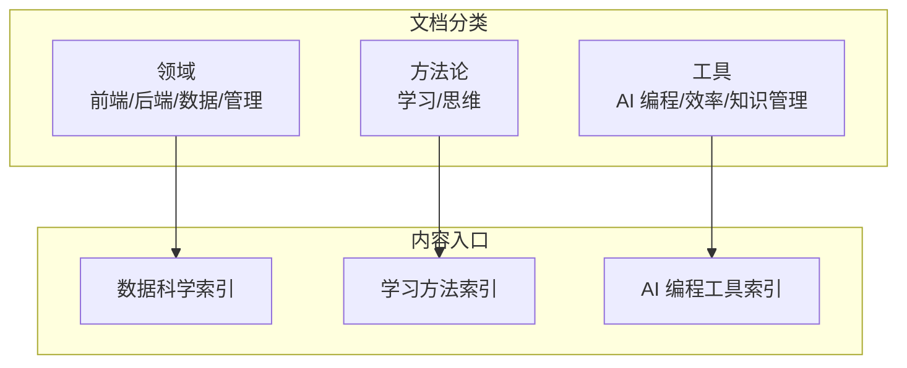
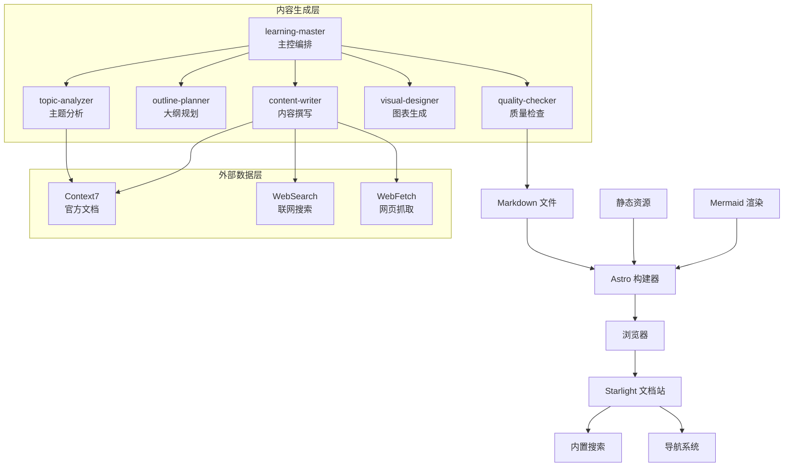
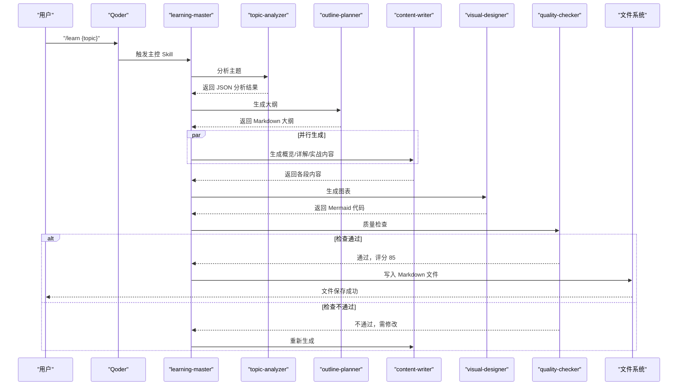
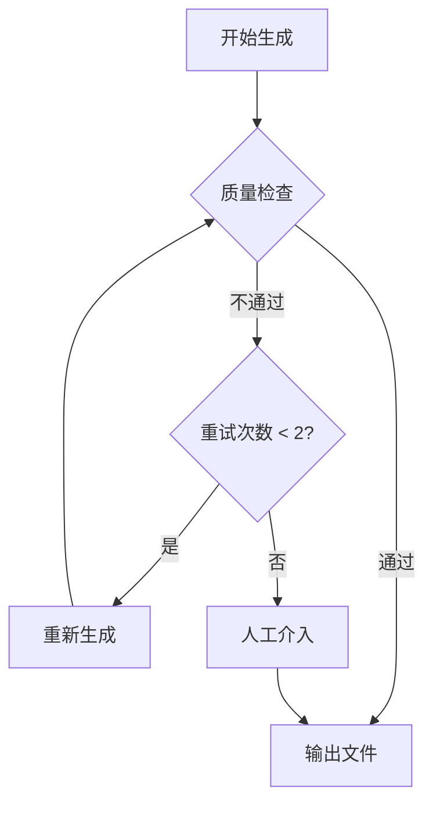
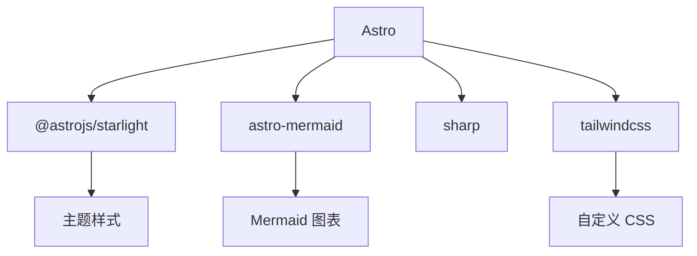

# 数据科学

<cite>
**本文引用的文件**
- [项目简介](file://docs/01-PROJECT-BRIEF.md)
- [技术架构设计](file://docs/03-ARCHITECTURE.md)
- [AI Skill 规格说明](file://docs/04-AI-SKILL-SPEC.md)
- [数据科学领域索引](file://src/content/docs/domains/data/index.md)
- [学习方法索引](file://src/content/docs/methods/learning/index.md)
- [AI 编程工具索引](file://src/content/docs/tools/ai-coding/index.md)
- [Astro 配置](file://astro.config.mjs)
- [包配置](file://package.json)
</cite>

## 目录
1. [简介](#简介)
2. [项目结构](#项目结构)
3. [核心组件](#核心组件)
4. [架构总览](#架构总览)
5. [详细组件分析](#详细组件分析)
6. [依赖分析](#依赖分析)
7. [性能考虑](#性能考虑)
8. [故障排除指南](#故障排除指南)
9. [结论](#结论)
10. [附录](#附录)

## 简介
本项目旨在为数据科学领域提供系统化的知识组织与学习路径，围绕“管理者视角”的方法论，帮助读者快速建立知识体系、理解应用场景，并通过可视化与速查表提升检索与应用效率。项目采用静态站点生成与 AI 协作生成相结合的方式，强调“从记忆转向检索、从深度转向广度、从线性转向网状、从执行转向管理”。

- 项目愿景与价值主张、目标用户与核心诉求详见项目简介。
- 技术栈与选型（Astro、Starlight、Mermaid、Qoder）在技术架构设计中有详细说明。

**章节来源**
- file://docs/01-PROJECT-BRIEF.md#L1-L124
- file://docs/03-ARCHITECTURE.md#L61-L71

## 项目结构
项目采用 Astro + Starlight 的静态站点结构，内容以 Markdown 为主，配合 Mermaid 图表与自定义组件，形成“知识体系 + 可视化 + 速查表”的学习材料。

- 文档分类体系：工具、领域、方法论三层结构，便于按主题检索与扩展。
- 数据科学领域位于 domains/data，作为知识体系的一个分类入口。
- AI 协作生成通过 Qoder 的 Skills 体系实现，形成“主控编排 + 子 Skill 协作”的工作流。

**章节来源**
- file://docs/03-ARCHITECTURE.md#L164-L240
- file://src/content/docs/domains/data/index.md#L1-L7
- file://src/content/docs/methods/learning/index.md#L1-L7
- file://src/content/docs/tools/ai-coding/index.md#L1-L7

## 核心组件
- 静态站点引擎：Astro，负责构建与渲染，强调零运行时 JS 与高性能。
- 文档主题：Starlight，提供开箱即用的导航、搜索与主题定制。
- 可视化：Mermaid，支持多种图表类型，便于知识体系与流程的可视化表达。
- AI 协作：Qoder Skills 体系，通过多个子 Skill 协同完成主题分析、大纲规划、内容撰写、图表生成与质量检查。
- 内容生成流程：从用户输入到最终 Markdown 输出，贯穿“分析—规划—并行生成—质控—输出”的闭环。

**章节来源**
- file://docs/03-ARCHITECTURE.md#L10-L70
- file://docs/04-AI-SKILL-SPEC.md#L19-L85
- file://astro.config.mjs#L9-L39

## 架构总览
下图展示了系统的分层架构与数据流：用户层通过浏览器访问；展示层由 Starlight 提供；内容生成层由多个 AI Skill 协同完成；外部数据层通过 MCP 工具接入 Context7、WebSearch、WebFetch；构建层由 Astro 完成 Markdown 解析、Mermaid 渲染与静态资源优化。

**图示来源**
- file://docs/03-ARCHITECTURE.md#L10-L69
- file://docs/04-AI-SKILL-SPEC.md#L19-L73

**章节来源**
- file://docs/03-ARCHITECTURE.md#L10-L69
- file://docs/04-AI-SKILL-SPEC.md#L19-L73

## 详细组件分析

### 数据科学领域入口与定位
- 数据科学作为“领域”分类的一部分，提供知识体系入口与概览性描述，强调“能力边界与应用场景”的理解。
- 该入口与“方法论”“工具”共同构成学习路径的三大支柱：先建立体系（方法论），再掌握工具（AI 编程等），最后深入领域（数据科学）。

**章节来源**
- file://src/content/docs/domains/data/index.md#L1-L7

### 学习方法与速查表
- 学习方法索引强调“用更少的时间掌握更多的知识”，并通过速查表与可视化帮助快速检索与应用。
- 速查表组件在技术架构中已有实现，可用于数据科学中的关键命令、参数与流程的快速查阅。

**章节来源**
- file://src/content/docs/methods/learning/index.md#L1-L7
- file://docs/03-ARCHITECTURE.md#L276-L320

### AI 编程工具与数据科学结合
- AI 编程工具索引强调“了解工具的能力边界与最佳应用场景”，这与数据科学中“何时用何种方法/工具”高度契合。
- 在数据科学实践中，可借助 AI 工具进行自动化探索、可视化与文档生成，提升从数据到洞察的效率。

**章节来源**
- file://src/content/docs/tools/ai-coding/index.md#L1-L7

### Mermaid 可视化在数据科学中的应用
- 技术架构中明确支持多种图表类型（思维导图、流程图、时序图、类图、状态图），适用于数据科学中的知识体系梳理、流程建模与交互分析。
- 可视化组件通过 Astro 配置启用，确保在文档中直接渲染。

**章节来源**
- file://docs/03-ARCHITECTURE.md#L244-L275
- file://astro.config.mjs#L9-L39

### AI Skill 体系与数据科学文档生成
- 主控 Skill（learning-master）负责接收用户输入并协调各子 Skill 完成主题分析、大纲规划、内容撰写、图表生成与质量检查。
- 主题分析（topic-analyzer）输出结构化元数据，指导后续内容与图表生成。
- 大纲规划（outline-planner）遵循“概览—详解—实战”的三阶段框架，确保学习路径清晰。
- 内容撰写（content-writer）分段生成内容，强调“一句话定义 + 类比 + 最小示例 + 速查表”的结构。
- 图表生成（visual-designer）根据大纲生成 Mermaid 代码，支撑知识体系与流程可视化。
- 质量检查（quality-checker）对结构、内容与格式进行评分与反馈，保证输出质量。

**图示来源**
- file://docs/03-ARCHITECTURE.md#L86-L126
- file://docs/04-AI-SKILL-SPEC.md#L149-L202

**章节来源**
- file://docs/04-AI-SKILL-SPEC.md#L149-L202
- file://docs/04-AI-SKILL-SPEC.md#L206-L277
- file://docs/04-AI-SKILL-SPEC.md#L281-L386
- file://docs/04-AI-SKILL-SPEC.md#L390-L531
- file://docs/04-AI-SKILL-SPEC.md#L535-L605
- file://docs/04-AI-SKILL-SPEC.md#L609-L715

### 数据流与质量控制
- 数据流从用户输入开始，经过分析、规划、并行生成与质量检查，最终输出 Markdown 文件。
- 质量检查包含结构、内容与格式三个维度，评分标准明确，支持问题定位与改进建议输出。
- 若质量不达标，系统支持最多两次重试；若仍不通过，则建议人工介入。

**图示来源**
- file://docs/04-AI-SKILL-SPEC.md#L777-L800

**章节来源**
- file://docs/04-AI-SKILL-SPEC.md#L719-L774
- file://docs/04-AI-SKILL-SPEC.md#L777-L800

## 依赖分析
- 框架与主题：Astro 与 Starlight 提供静态站点与文档体验。
- 可视化：Mermaid 与 astro-mermaid 插件支持图表渲染。
- 样式：TailwindCSS 与自定义 CSS 提供主题与组件样式。
- 构建与插件：Vite 集成 Tailwind 插件，Astro 负责内容解析与静态输出。

**图示来源**
- file://package.json#L12-L20
- file://astro.config.mjs#L9-L39

**章节来源**
- file://package.json#L1-L22
- file://astro.config.mjs#L1-L39

## 性能考虑
- 构建优化：Astro 默认支持增量构建、图片优化与代码分割，显著减少构建时间与首屏 JS。
- 运行时优化：静态生成、CDN 缓存与懒加载图表，确保低延迟与高可用。
- 本地使用：提供开发、构建与预览的完整流程，便于快速迭代与验证。

**章节来源**
- file://docs/03-ARCHITECTURE.md#L366-L383
- file://docs/03-ARCHITECTURE.md#L323-L363

## 故障排除指南
- 质量检查未通过：根据检查清单逐项核对结构、内容与格式；依据改进建议调整内容与图表。
- 图表渲染失败：简化图表结构，确保语法正确且节点文字简洁。
- 生成超时：返回部分结果，优先保障关键信息可用。
- 人工介入：当多次重试仍无法通过时，由人工审阅并修正后输出。

**章节来源**
- file://docs/04-AI-SKILL-SPEC.md#L777-L800
- file://docs/04-AI-SKILL-SPEC.md#L609-L715

## 结论
本项目以“管理者视角”为核心，结合静态站点与 AI 协作生成，为数据科学领域提供了可检索、可可视化的知识体系与学习路径。通过 Mermaid 图表、速查表与三阶段学习框架，帮助读者在有限时间内建立高效的知识检索与应用能力。同时，完善的质量控制与性能优化策略确保了内容质量与访问体验。

## 附录
- 本地使用流程：在 Qoder 中执行学习指令，启动本地开发服务器，浏览生成的文档。
- 扩展性设计：新增分类、Skill 或自定义组件均可通过现有配置与目录结构快速落地。

**章节来源**
- file://docs/03-ARCHITECTURE.md#L323-L363
- file://docs/03-ARCHITECTURE.md#L386-L406