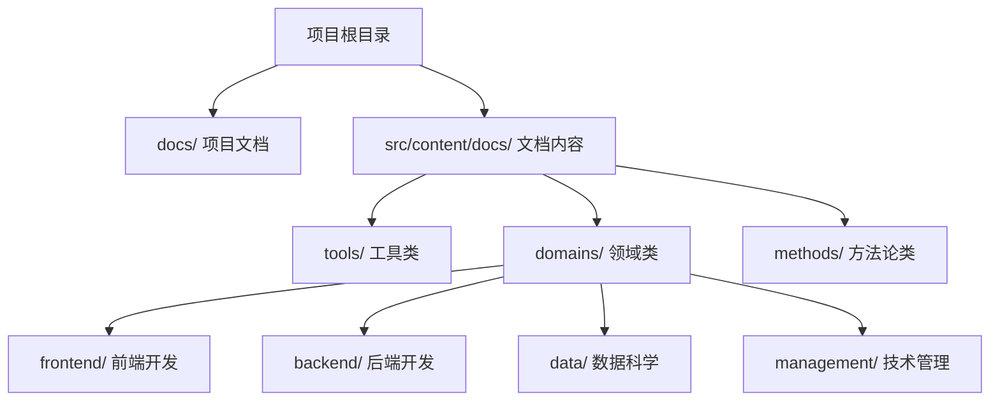
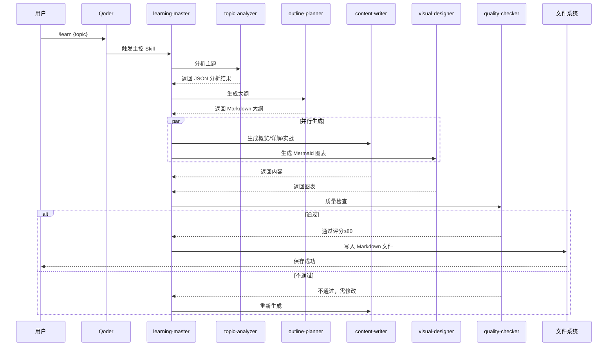
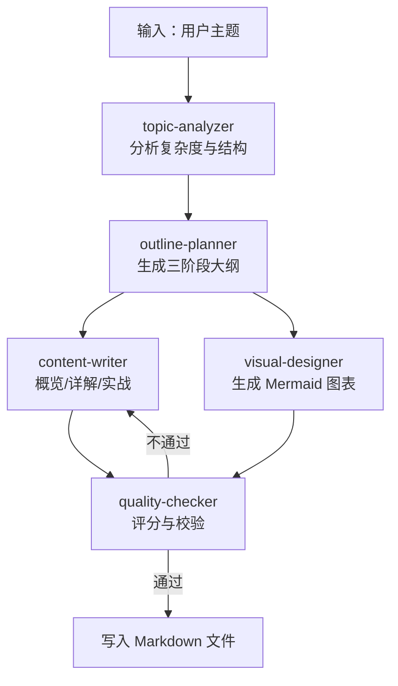
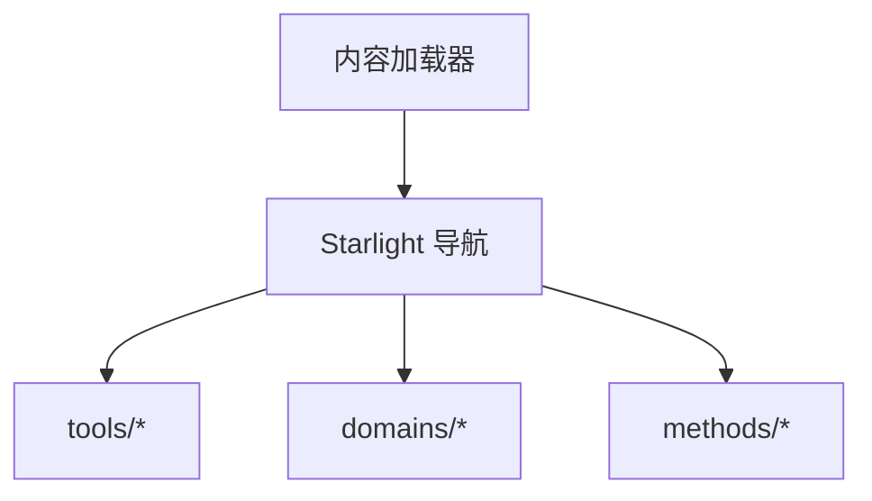
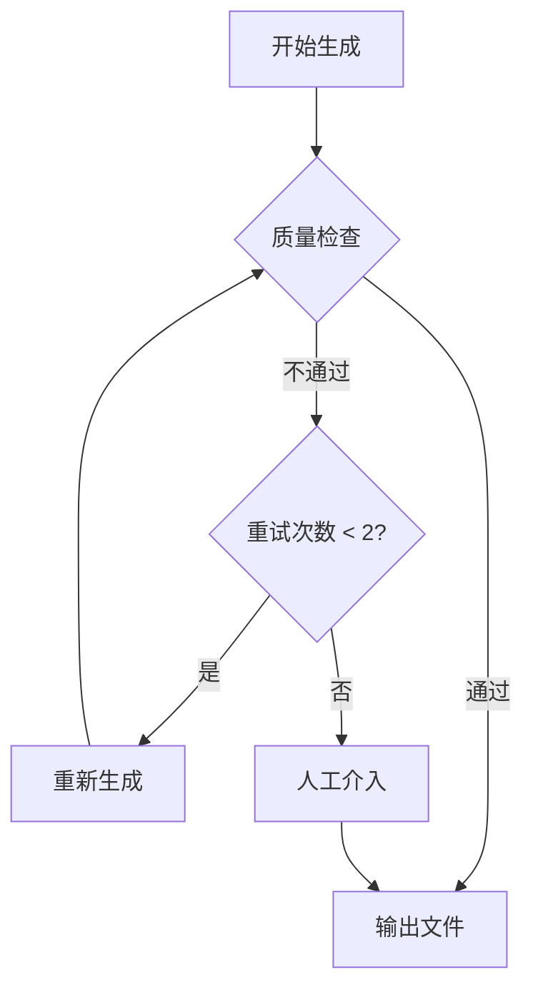

# 领域类文档

<cite>
**本文引用的文件**
- [src/content.config.ts](file://src/content.config.ts)
- [astro.config.mjs](file://astro.config.mjs)
- [docs/01-PROJECT-BRIEF.md](file://docs/01-PROJECT-BRIEF.md)
- [docs/03-ARCHITECTURE.md](file://docs/03-ARCHITECTURE.md)
- [docs/04-AI-SKILL-SPEC.md](file://docs/04-AI-SKILL-SPEC.md)
- [src/content/docs/domains/index.md](file://src/content/docs/domains/index.md)
- [src/content/docs/domains/frontend/index.md](file://src/content/docs/domains/frontend/index.md)
- [src/content/docs/domains/backend/index.md](file://src/content/docs/domains/backend/index.md)
- [src/content/docs/domains/data/index.md](file://src/content/docs/domains/data/index.md)
- [src/content/docs/domains/management/index.md](file://src/content/docs/domains/management/index.md)
- [src/content/docs/methods/learning/index.md](file://src/content/docs/methods/learning/index.md)
- [src/content/docs/methods/thinking/index.md](file://src/content/docs/methods/thinking/index.md)
- [src/content/docs/tools/ai-coding/index.md](file://src/content/docs/tools/ai-coding/index.md)
- [src/content/docs/tools/efficiency/docker.md](file://src/content/docs/tools/efficiency/docker.md)
- [src/content/docs/tools/efficiency/index.md](file://src/content/docs/tools/efficiency/index.md)
- [src/content/docs/tools/knowledge/index.md](file://src/content/docs/tools/knowledge/index.md)
- [src/content/docs/tools/index.md](file://src/content/docs/tools/index.md)
</cite>

## 目录
1. [引言](#引言)
2. [项目结构](#项目结构)
3. [核心组件](#核心组件)
4. [架构总览](#架构总览)
5. [详细组件分析](#详细组件分析)
6. [依赖分析](#依赖分析)
7. [性能考虑](#性能考虑)
8. [故障排除指南](#故障排除指南)
9. [结论](#结论)
10. [附录](#附录)

## 引言
本文件面向 StudyBuddy 的“领域类文档”，系统阐述其分类标准、知识结构与学习路径，并结合项目的技术栈与 AI 生成工作流，给出面向技术管理者的学习范式与实践建议。StudyBuddy 的核心理念是以“管理者视角”组织知识，强调“何时用、为何用、如何选”，并通过 AI 多代理协作实现结构化、可视化、可检索的学习文档生成。

## 项目结构
StudyBuddy 采用 Astro + Starlight 的静态文档站点，内容以纯 Markdown 组织，分为三大类：工具、领域、方法论。领域类文档覆盖前端、后端、数据、技术管理四大方向，旨在帮助读者建立对各技术方向的全局认知与应用判断力。

**图表来源**
- [docs/03-ARCHITECTURE.md](file://docs/03-ARCHITECTURE.md#L164-L221)

**章节来源**
- [docs/03-ARCHITECTURE.md](file://docs/03-ARCHITECTURE.md#L164-L221)
- [astro.config.mjs](file://astro.config.mjs#L16-L29)

## 核心组件
- 文档分类体系：工具/领域/方法论三层结构，由 Starlight 自动导航生成，便于按需检索。
- AI 生成工作流：由 learning-master 协调 topic-analyzer、outline-planner、content-writer、visual-designer、quality-checker 六个子 Skill，形成“分析—规划—撰写—绘图—校验”的闭环。
- 可视化与检索：Mermaid 图表原生支持，配合 Starlight 的搜索与侧边栏导航，实现“快速理解—快速检索”的学习闭环。

**章节来源**
- [docs/04-AI-SKILL-SPEC.md](file://docs/04-AI-SKILL-SPEC.md#L19-L71)
- [docs/04-AI-SKILL-SPEC.md](file://docs/04-AI-SKILL-SPEC.md#L159-L172)
- [astro.config.mjs](file://astro.config.mjs#L8-L31)

## 架构总览
下图展示了从用户输入到最终文档落盘的端到端流程，体现 StudyBuddy 的“管理者视角”：先判断“是否需要学、学什么、如何用”，再进入“分章节详解—实战—速查”的结构化学习。

**图表来源**
- [docs/03-ARCHITECTURE.md](file://docs/03-ARCHITECTURE.md#L82-L126)
- [docs/04-AI-SKILL-SPEC.md](file://docs/04-AI-SKILL-SPEC.md#L159-L172)

## 详细组件分析

### 领域类文档的分类标准与知识结构
- 分类标准
  - 问题域导向：围绕“解决什么问题、何时使用、生态关键角色”三个维度组织。
  - 管理者视角：强调“何时用、为何用、如何选”，避免陷入实现细节。
  - 结构化输出：遵循“概览—详解—实战—速查—扩展”的三阶段框架。
- 知识结构
  - 概览：一句话定义、核心问题、适用场景、前置知识、思维导图。
  - 详解：核心概念拆解（是什么、为什么、怎么用），配套速查表与常见陷阱。
  - 实战：初级（单一特性）、中级（2-3 特性组合）、高级（完整项目）三级任务。
  - 速查：关键命令/参数/流程的清单化呈现。
  - 扩展：参考链接与进一步阅读建议。

**章节来源**
- [src/content/docs/domains/index.md](file://src/content/docs/domains/index.md#L6-L13)
- [docs/04-AI-SKILL-SPEC.md](file://docs/04-AI-SKILL-SPEC.md#L281-L344)

### 前端开发（domains/frontend）
- 核心定位：Web 前端技术栈与框架，帮助管理者理解主流框架的定位与适用场景。
- 学习要点
  - 从“问题域”出发：SPA 体验、组件化、状态管理、构建与部署。
  - 从“选型”出发：根据团队规模、性能要求、生态成熟度选择合适框架。
  - 从“工程化”出发：模块化、打包、测试、可观测性。
- 速查与实践
  - 速查：常用指令、生命周期、状态管理模式对比。
  - 实践：从“单一特性应用”到“端到端项目”的渐进任务。

**章节来源**
- [src/content/docs/domains/frontend/index.md](file://src/content/docs/domains/frontend/index.md#L1-L7)

### 后端开发（domains/backend）
- 核心定位：服务端架构与技术方案，关注架构选型与系统设计。
- 学习要点
  - 从“可靠性”出发：可用性、一致性、分区容忍性权衡。
  - 从“扩展性”出发：水平扩展、微服务、事件驱动、缓存策略。
  - 从“运维成本”出发：监控、日志、灰度发布、故障恢复。
- 速查与实践
  - 速查：常见架构模式、协议与中间件选择。
  - 实践：从“单体服务”到“分布式系统”的演进任务。

**章节来源**
- [src/content/docs/domains/backend/index.md](file://src/content/docs/domains/backend/index.md#L1-L7)

### 数据科学（domains/data）
- 核心定位：数据分析与机器学习领域的核心概念与工具。
- 学习要点
  - 从“数据治理”出发：数据采集、清洗、存储、质量评估。
  - 从“建模与评估”出发：特征工程、模型选择、A/B 实验、可解释性。
  - 从“工程化落地”出发：流水线、版本化、可复现性、可解释性。
- 速查与实践
  - 速查：统计指标、评估方法、常见算法适用场景。
  - 实践：从“探索性分析”到“可上线的预测系统”。

**章节来源**
- [src/content/docs/domains/data/index.md](file://src/content/docs/domains/data/index.md#L1-L7)

### 技术管理（domains/management）
- 核心定位：团队管理、项目管理与架构决策相关知识。
- 学习要点
  - 从“技术与业务平衡”出发：技术选型的商业影响与风险评估。
  - 从“组织能力”出发：跨职能协作、知识沉淀、能力建设。
  - 从“决策框架”出发：成本-收益分析、风险矩阵、权衡取舍。
- 速查与实践
  - 速查：常见管理模型、沟通与汇报模板。
  - 实践：从“单点优化”到“系统性改进”的项目。

**章节来源**
- [src/content/docs/domains/management/index.md](file://src/content/docs/domains/management/index.md#L1-L7)

### 方法论类（methods）
- 学习方法（methods/learning）
  - 关注“如何学得更快、记得更牢、用得更准”，强调“检索优于记忆”“网状知识优于线性知识”。
- 思维框架（methods/thinking）
  - 提供决策与分析的思维模型，帮助在复杂问题中快速找到关键切入点。

**章节来源**
- [src/content/docs/methods/learning/index.md](file://src/content/docs/methods/learning/index.md#L1-L7)
- [src/content/docs/methods/thinking/index.md](file://src/content/docs/methods/thinking/index.md#L1-L7)

### 工具类（tools）
- AI 编程工具（tools/ai-coding）
  - 以管理者视角理解 AI 工具的能力边界与最佳应用场景，避免盲目依赖。
- 效率工具（tools/efficiency）
  - Docker：容器化平台，统一环境、标准化部署、微服务与 CI/CD。
  - Git：版本控制与协作流程。
- 知识管理工具（tools/knowledge）
  - 构建个人知识体系，实现“可检索、可复用、可积累”。

**章节来源**
- [src/content/docs/tools/ai-coding/index.md](file://src/content/docs/tools/ai-coding/index.md#L1-L7)
- [src/content/docs/tools/efficiency/docker.md](file://src/content/docs/tools/efficiency/docker.md#L1-L205)
- [src/content/docs/tools/efficiency/index.md](file://src/content/docs/tools/efficiency/index.md#L1-L7)
- [src/content/docs/tools/knowledge/index.md](file://src/content/docs/tools/knowledge/index.md#L1-L7)
- [src/content/docs/tools/index.md](file://src/content/docs/tools/index.md#L1-L13)

### 领域类文档的生成与可视化
- 生成流程
  - learning-master 作为主控，协调各子 Skill 完成主题分析、大纲规划、内容撰写、图表生成与质量检查。
  - 输出为结构化的 Markdown，包含标题、描述、分类、标签、时长等元数据。
- 可视化
  - Mermaid 支持思维导图、流程图、时序图等，满足“快速理解—快速检索”的需求。

**图表来源**
- [docs/04-AI-SKILL-SPEC.md](file://docs/04-AI-SKILL-SPEC.md#L719-L774)

**章节来源**
- [docs/04-AI-SKILL-SPEC.md](file://docs/04-AI-SKILL-SPEC.md#L19-L71)
- [docs/04-AI-SKILL-SPEC.md](file://docs/04-AI-SKILL-SPEC.md#L719-L774)

## 依赖分析
- 技术栈依赖
  - 框架与主题：Astro + Starlight，提供静态优先、性能极致与开箱即用的文档站点能力。
  - 图表与样式：Mermaid 原生支持，Starlight 主题 + 自定义 CSS 降低复杂度。
  - 内容格式：纯 Markdown，利于版本控制与可移植性。
- 导航与索引
  - Astro 配置中通过 sidebar 自动扫描 tools/domains/methods 三类目录，形成统一导航与搜索入口。

**图表来源**
- [astro.config.mjs](file://astro.config.mjs#L16-L29)
- [src/content.config.ts](file://src/content.config.ts#L5-L7)

**章节来源**
- [astro.config.mjs](file://astro.config.mjs#L1-L33)
- [src/content.config.ts](file://src/content.config.ts#L1-L8)

## 性能考虑
- 构建优化：Astro 默认支持增量构建、图片优化、代码分割，显著缩短构建与首屏加载时间。
- 运行时优化：静态生成、CDN 边缘缓存、懒加载图表，确保低延迟与高可用。
- 可扩展性：新增分类/技能/组件只需在指定目录创建并更新配置，保持文档体系持续演进。

**章节来源**
- [docs/03-ARCHITECTURE.md](file://docs/03-ARCHITECTURE.md#L366-L406)

## 故障排除指南
- 常见问题与处理
  - 分析失败：主题过于模糊，提示细化主题。
  - 大纲不完整：自动补充缺失章节。
  - 内容质量低：评分低于阈值时自动重试，最多两次。
  - 图表语法错误：简化图表结构后重试。
  - 超时：超过时限返回部分结果，保证可用性。
- 回退流程

**图表来源**
- [docs/04-AI-SKILL-SPEC.md](file://docs/04-AI-SKILL-SPEC.md#L777-L800)

**章节来源**
- [docs/04-AI-SKILL-SPEC.md](file://docs/04-AI-SKILL-SPEC.md#L777-L800)

## 结论
StudyBuddy 的领域类文档以“管理者视角”为核心，通过 AI 多代理协作与结构化输出，帮助技术管理者在有限时间内建立对技术领域的全局认知与应用判断力。结合工具与方法论，形成“理解—检索—应用”的闭环，既适合作为个人知识体系的入口，也可作为团队知识沉淀的基座。

## 附录

### 领域专家指南
- 前端专家
  - 关注用户体验与工程化，擅长在“组件化、模块化、构建工具链”之间做取舍。
  - 建议：以“问题域—选型—工程化”为主线，避免陷入框架细节。
- 后端专家
  - 关注系统可靠性与扩展性，擅长在 CAP 权衡与运维成本之间做取舍。
  - 建议：以“架构模式—中间件—可观测性”为主线，强调可演进性。
- 数据专家
  - 关注数据治理与可复现性，擅长在“特征工程—模型—工程化落地”之间做取舍。
  - 建议：以“数据—模型—流水线”为主线，强调可解释性与可审计性。
- 管理专家
  - 关注技术与业务平衡，擅长在“成本—收益—风险”之间做取舍。
  - 建议：以“决策模型—组织能力—能力建设”为主线，强调系统性改进。

### 进阶学习资源
- 在线课程与书籍
  - 架构与工程化：系统性学习微服务、事件驱动、可观测性。
  - 数据与机器学习：从统计学到可复现实验的完整路径。
  - 管理与方法论：决策模型、项目管理、知识管理。
- 实践项目
  - 前端：从“组件库”到“中后台管理系统”的工程化演进。
  - 后端：从“单体服务”到“微服务”的架构迁移。
  - 数据：从“探索性分析”到“可上线的预测系统”的全流程。
  - 管理：从“单点优化”到“组织能力提升”的系统性改进。

### 跨领域知识整合与应用
- 以“问题域”为牵引，识别前端/后端/数据/管理的边界与耦合点。
- 以“选型”为杠杆，用“成本—收益—风险”评估驱动技术决策。
- 以“工程化”为保障，用“可复现—可审计—可演进”确保交付质量。
- 以“可视化”为手段，用“思维导图—流程图—时序图”提升理解效率。

### 领域发展动态与趋势
- 前端：组件化与低代码、可访问性与性能优化、跨端融合。
- 后端：Serverless 与边缘计算、可观测性与混沌工程、多云与混合架构。
- 数据：大模型与数据治理、自动化特征工程、可解释 AI。
- 管理：敏捷与混沌工程、知识管理与能力建设、技术领导力。