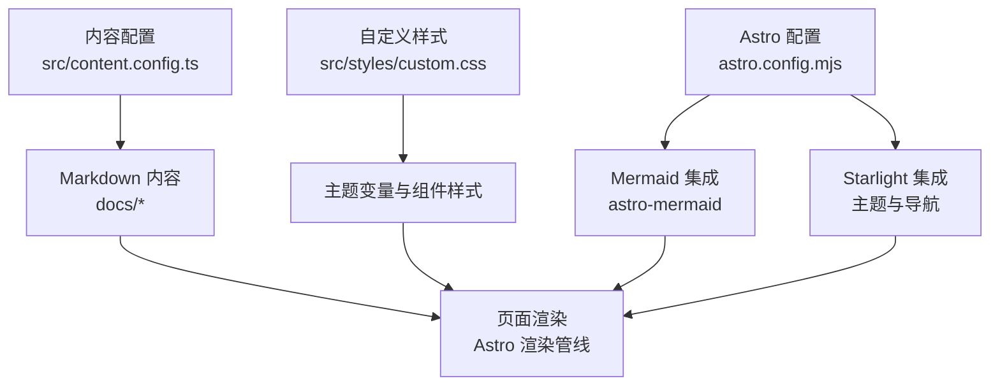
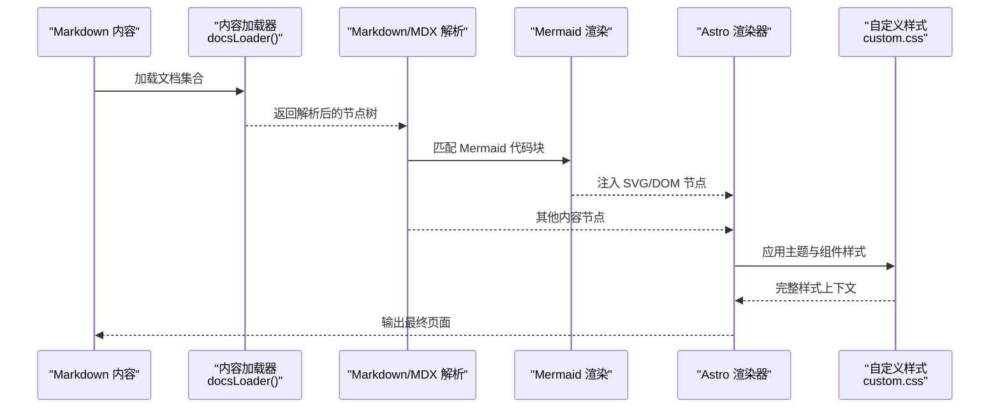
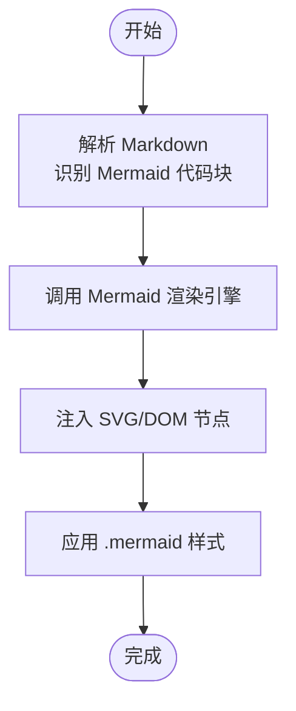
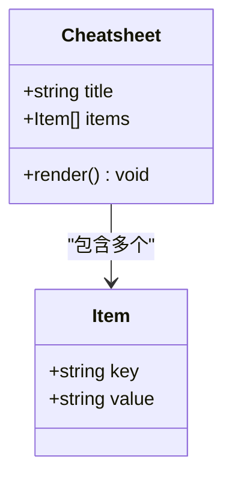
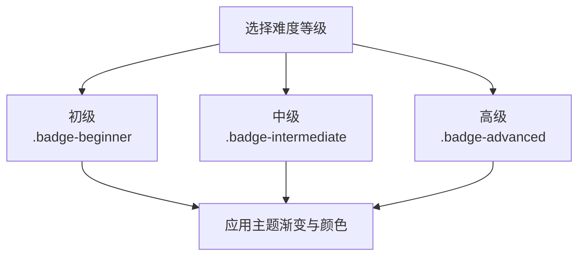
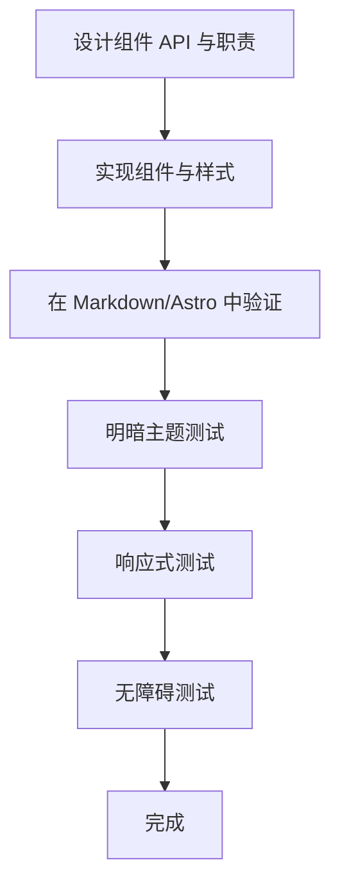
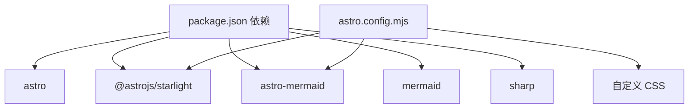

# 自定义组件开发

<cite>
**本文引用的文件**
- [package.json](file://package.json)
- [astro.config.mjs](file://astro.config.mjs)
- [src/content.config.ts](file://src/content.config.ts)
- [src/styles/custom.css](file://src/styles/custom.css)
- [docs/01-PROJECT-BRIEF.md](file://docs/01-PROJECT-BRIEF.md)
- [docs/03-ARCHITECTURE.md](file://docs/03-ARCHITECTURE.md)
- [src/content/docs/tools/ai-coding/index.md](file://src/content/docs/tools/ai-coding/index.md)
- [src/content/docs/methods/learning/index.md](file://src/content/docs/methods/learning/index.md)
- [src/content/docs/domains/backend/index.md](file://src/content/docs/domains/backend/index.md)
</cite>

## 目录
1. [引言](#引言)
2. [项目结构](#项目结构)
3. [核心组件](#核心组件)
4. [架构总览](#架构总览)
5. [详细组件分析](#详细组件分析)
6. [依赖分析](#依赖分析)
7. [性能考虑](#性能考虑)
8. [故障排除指南](#故障排除指南)
9. [结论](#结论)
10. [附录](#附录)

## 引言
本指南面向希望在 StudyBuddy 项目中开发自定义 Astro 组件的开发者，目标是帮助你从设计到实现再到测试，系统地掌握组件开发流程，并基于现有项目中的 Mermaid 图表、速查表与难度等级标签等组件经验，形成可复用、可扩展的组件体系。文档同时覆盖组件 API 规范、样式定制与主题适配、响应式与无障碍支持、以及组件复用与组合的高级技巧。

## 项目结构
StudyBuddy 是基于 Astro 与 Starlight 的静态文档站点，Mermaid 图表通过 astro-mermaid 集成，样式由自定义 CSS 提供主题与视觉一致性。内容采用 Markdown 结构组织，按“工具/领域/方法论”三大分类自动导航生成。

**图表来源**
- [astro.config.mjs](file://astro.config.mjs#L7-L33)
- [src/content.config.ts](file://src/content.config.ts#L1-L8)
- [src/styles/custom.css](file://src/styles/custom.css#L1-L402)

**章节来源**
- [astro.config.mjs](file://astro.config.mjs#L1-L34)
- [src/content.config.ts](file://src/content.config.ts#L1-L8)
- [src/styles/custom.css](file://src/styles/custom.css#L1-L402)

## 核心组件
- Mermaid 图表组件：通过 astro-mermaid 在 Markdown 中原生渲染多种图表类型，配合自定义样式统一视觉风格。
- 速查表组件：以 Astro 组件形式封装表格化信息展示，便于在文档中插入结构化的“要点清单”。
- 难度等级标签组件：以 CSS 类名区分不同等级，结合主题变量实现明暗主题一致的视觉反馈。

上述组件均体现了“内容即组件”的理念：在 Markdown 中直接使用图表语法，在 Astro 页面中通过 props 传递数据，最终由样式系统统一呈现。

**章节来源**
- [docs/03-ARCHITECTURE.md](file://docs/03-ARCHITECTURE.md#L244-L365)
- [src/styles/custom.css](file://src/styles/custom.css#L261-L344)

## 架构总览
下图展示了从内容到渲染的关键路径：内容加载 → Markdown 渲染 → Mermaid 解析 → AST 渲染 → 样式注入 → 最终页面输出。

**图表来源**
- [astro.config.mjs](file://astro.config.mjs#L7-L33)
- [src/content.config.ts](file://src/content.config.ts#L1-L8)
- [src/styles/custom.css](file://src/styles/custom.css#L261-L269)

## 详细组件分析

### Mermaid 图表组件
- 集成方式：在 Astro 配置中启用 astro-mermaid，使 Markdown 中的 Mermaid 代码块可被原生渲染。
- 支持类型：思维导图、流程图、时序图、类图、状态图等。
- 样式定制：通过自定义 CSS 为 .mermaid 提供统一的背景、圆角、阴影与边框，确保与站点主题一致。
- 使用建议：
  - 在 Markdown 中使用标准 Mermaid 语法，避免在 Astro 组件中重复实现解析逻辑。
  - 对复杂图表，建议拆分为多个小图，提升可读性与加载性能。
  - 利用主题变量控制颜色与阴影，保证明暗主题一致性。

**图表来源**
- [astro.config.mjs](file://astro.config.mjs#L31-L31)
- [src/styles/custom.css](file://src/styles/custom.css#L261-L269)

**章节来源**
- [astro.config.mjs](file://astro.config.mjs#L1-L34)
- [src/styles/custom.css](file://src/styles/custom.css#L261-L269)
- [docs/03-ARCHITECTURE.md](file://docs/03-ARCHITECTURE.md#L244-L274)

### 速查表组件
- 设计思路：以 Astro 组件封装表格，接收标题与键值对列表，渲染为卡片化表格，突出“键”与“值”的对应关系。
- API 规范（Props）：
  - title: 字符串，用于显示分组标题
  - items: 数组，元素为 { key: string; value: string }，用于展示每一条目
- 样式策略：继承站点的玻璃态背景与圆角，表格去除外阴影，内部行悬停高亮，最后一行取消底部边框，提升阅读体验。
- 使用场景：在方法论或工具类文档中，快速列出操作步骤、参数对照或最佳实践清单。

**图表来源**
- [docs/03-ARCHITECTURE.md](file://docs/03-ARCHITECTURE.md#L276-L319)

**章节来源**
- [docs/03-ARCHITECTURE.md](file://docs/03-ARCHITECTURE.md#L276-L319)
- [src/styles/custom.css](file://src/styles/custom.css#L271-L302)

### 难度等级标签组件
- 设计思路：通过 CSS 类名区分初级、中级、高级三个等级，使用渐变背景与对比色文字，确保在明暗主题下均有良好可读性。
- 类名约定：
  - badge：基础标签容器
  - badge-beginner：初级
  - badge-intermediate：中级
  - badge-advanced：高级
- 主题适配：明暗主题分别提供不同的渐变与文字颜色，保证对比度与可读性。
- 使用场景：在卡片、标签云或技能矩阵中标识内容难度，辅助用户选择合适的学习路径。

**图表来源**
- [src/styles/custom.css](file://src/styles/custom.css#L303-L344)

**章节来源**
- [src/styles/custom.css](file://src/styles/custom.css#L303-L344)

### 组件开发流程（从设计到测试）
- 设计阶段
  - 明确组件职责与输入输出（Props 与事件）
  - 选择实现方式：纯 Markdown（如 Mermaid）、Astro 组件（如速查表、标签）
  - 设计 API 规范与默认行为
- 实现阶段
  - 在 Astro 配置中启用必要的集成（如 Mermaid）
  - 编写组件代码与样式，遵循现有主题变量与命名约定
  - 在 Markdown 中验证渲染效果
- 测试阶段
  - 在明暗主题下检查样式一致性
  - 验证响应式布局在不同屏幕尺寸下的表现
  - 进行可访问性检查（ARIA、键盘导航、对比度）

[本图为概念流程图，不直接映射具体源码文件，故无图表来源]

## 依赖分析
- 运行时依赖
  - Astro：框架核心
  - @astrojs/starlight：文档站点主题与导航
  - astro-mermaid：Mermaid 图表渲染
  - mermaid：Mermaid 核心库
  - sharp：图像处理（用于构建优化）
- 配置依赖
  - astro.config.mjs：启用 Starlight 与 Mermaid 集成，设置自定义 CSS
  - src/content.config.ts：定义文档集合加载器与 Schema

**图表来源**
- [package.json](file://package.json#L12-L18)
- [astro.config.mjs](file://astro.config.mjs#L7-L33)

**章节来源**
- [package.json](file://package.json#L1-L20)
- [astro.config.mjs](file://astro.config.mjs#L1-L34)

## 性能考虑
- Mermaid 图表
  - 将复杂图表拆分为多个小图，减少一次性渲染压力
  - 控制图表数量与层级，避免过度嵌套导致的 DOM 节点膨胀
- 样式与主题
  - 使用 CSS 变量统一管理阴影、圆角与透明背景，减少重复计算
  - 在自定义 CSS 中合并与压缩规则，降低样式体积
- 构建与缓存
  - 利用 Astro 的静态生成与缓存机制，缩短构建时间
  - 对图片使用合适的格式与尺寸，结合 sharp 进行优化

[本节为通用性能建议，不直接分析具体文件，故无章节来源]

## 故障排除指南
- Mermaid 图表未渲染
  - 检查 astro.config.mjs 是否正确启用 astro-mermaid
  - 确认 Markdown 中的代码块语言为 mermaid
  - 验证自定义 CSS 中 .mermaid 样式是否生效
- 样式异常或主题不一致
  - 检查 :root 与 [data-theme='dark'] 下的主题变量是否正确
  - 确认自定义 CSS 的加载顺序与优先级
- 导航与内容生成问题
  - 检查 src/content.config.ts 的集合定义与 docsLoader/schema
  - 确认目录结构与文件命名符合 Starlight 的自动导航要求

**章节来源**
- [astro.config.mjs](file://astro.config.mjs#L7-L33)
- [src/content.config.ts](file://src/content.config.ts#L1-L8)
- [src/styles/custom.css](file://src/styles/custom.css#L1-L402)

## 结论
通过将内容与组件解耦（Markdown 原生语法 + Astro 组件），StudyBuddy 在保持简洁的同时实现了强大的可视化与信息组织能力。Mermaid 图表、速查表与难度标签等组件，共同构成了以“结构化知识”为核心的文档体系。遵循本文的 API 规范、样式策略与测试流程，你可以高效地扩展新的组件并融入现有生态。

[本节为总结性内容，不直接分析具体文件，故无章节来源]

## 附录

### 组件 API 规范（速查表）
- Props
  - title: string
  - items: Array<{ key: string; value: string }>
- 事件
  - 无（只读展示组件）
- 样式类
  - .cheatsheet：容器
  - .cheatsheet table：表格
  - .cheatsheet td.key：键列
  - .cheatsheet td.value：值列

**章节来源**
- [docs/03-ARCHITECTURE.md](file://docs/03-ARCHITECTURE.md#L276-L319)
- [src/styles/custom.css](file://src/styles/custom.css#L271-L302)

### 组件 API 规范（难度等级标签）
- 类名
  - .badge：基础标签
  - .badge-beginner：初级
  - .badge-intermediate：中级
  - .badge-advanced：高级
- 主题适配
  - 明/暗主题分别提供渐变与文字颜色

**章节来源**
- [src/styles/custom.css](file://src/styles/custom.css#L303-L344)

### 响应式设计与无障碍支持
- 响应式
  - 使用媒体查询适配不同断点，确保在移动端与桌面端均具有良好阅读体验
- 无障碍
  - 为交互元素提供键盘可达性
  - 保持足够的对比度，尤其在明暗主题切换时
  - 为图表提供替代文本或摘要，便于屏幕阅读器理解

[本节为通用指导，不直接分析具体文件，故无章节来源]

### 扩展与创建新组件的建议
- 优先使用 Markdown 原生语法（如 Mermaid）承载内容型组件
- 对需要交互或复杂布局的场景，采用 Astro 组件封装
- 严格遵守现有命名约定与样式变量，确保主题一致性
- 在文档中提供使用示例与 API 说明，便于团队复用

**章节来源**
- [docs/03-ARCHITECTURE.md](file://docs/03-ARCHITECTURE.md#L276-L365)
- [src/styles/custom.css](file://src/styles/custom.css#L1-L402)