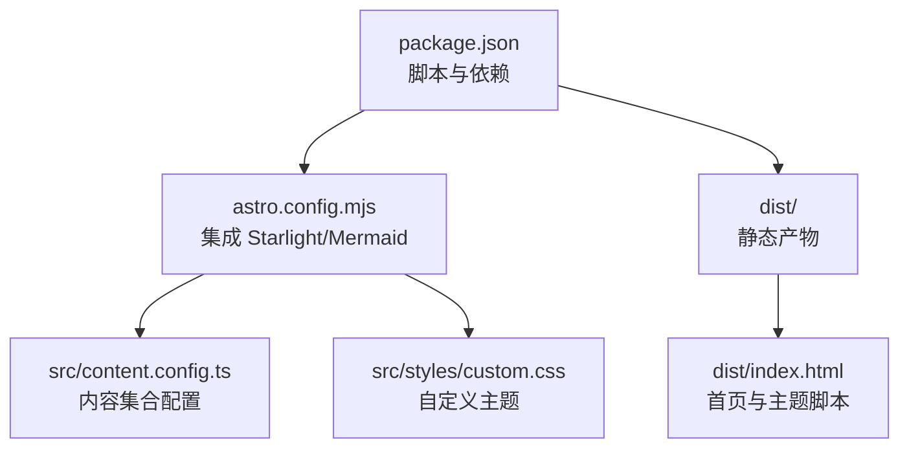
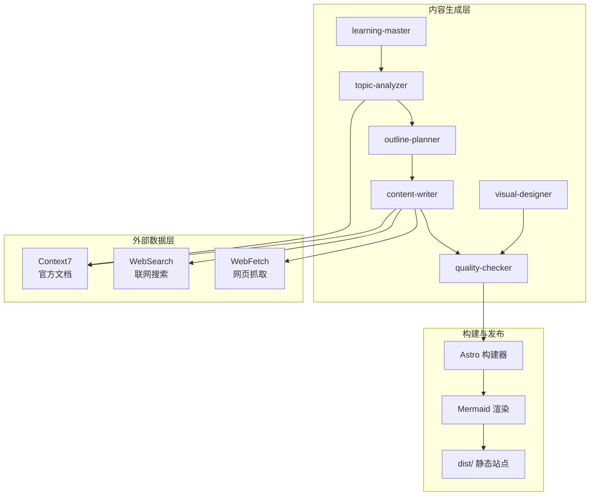
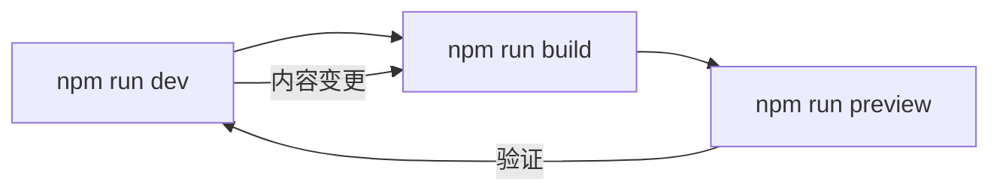
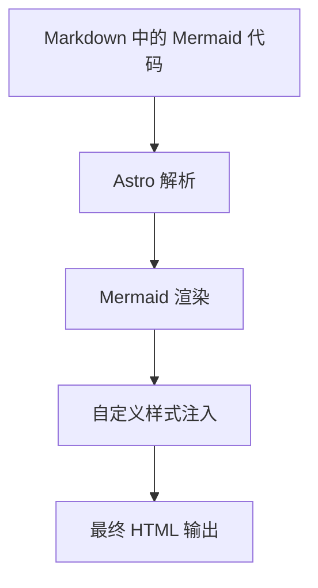
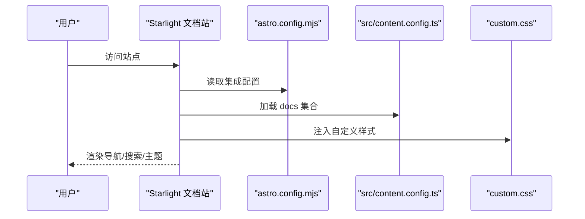
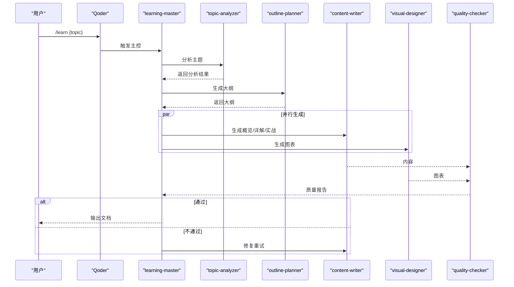
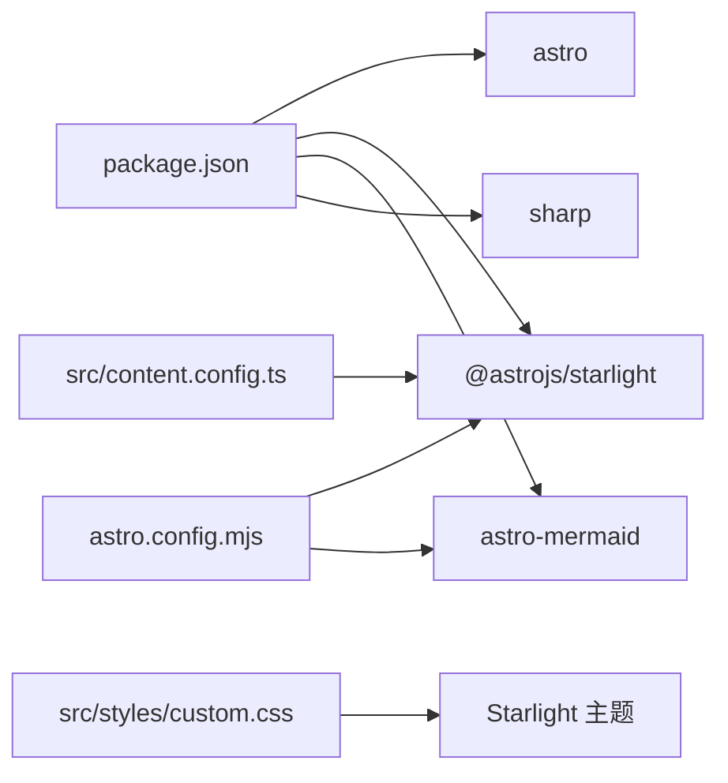

# 部署与运维

<cite>
**本文引用的文件**
- [package.json](file://package.json)
- [astro.config.mjs](file://astro.config.mjs)
- [src/content.config.ts](file://src/content.config.ts)
- [src/styles/custom.css](file://src/styles/custom.css)
- [dist/index.html](file://dist/index.html)
- [docs/01-PROJECT-BRIEF.md](file://docs/01-PROJECT-BRIEF.md)
- [docs/03-ARCHITECTURE.md](file://docs/03-ARCHITECTURE.md)
- [docs/04-AI-SKILL-SPEC.md](file://docs/04-AI-SKILL-SPEC.md)
</cite>

## 目录
1. [简介](#简介)
2. [项目结构](#项目结构)
3. [核心组件](#核心组件)
4. [架构总览](#架构总览)
5. [详细组件分析](#详细组件分析)
6. [依赖分析](#依赖分析)
7. [性能考量](#性能考量)
8. [故障排除指南](#故障排除指南)
9. [结论](#结论)
10. [附录](#附录)

## 简介
本文件面向运维与平台工程团队，提供 StudyBuddy 项目的部署与运维指南。项目采用 Astro + Starlight 静态站点生成，结合 Mermaid 图表与本地 AI 工具链（Qoder Skills），目标是“本地优先、零运维、可扩展”。本文涵盖本地部署、生产优化、CI/CD、监控与日志、备份与灾备、版本升级与回滚、以及日常运维实践。

## 项目结构
- 构建与运行：通过 Astro CLI 管理开发、构建与预览。
- 内容与主题：Starlight 提供开箱即用的文档站点与导航；自定义 CSS 实现现代化主题。
- 图表与可视化：Mermaid 通过 Astro 集成渲染，Markdown 中原生支持。
- AI 工具链：Qoder Skills 作为本地 AI 工作流引擎，负责内容生成与质量检查。

**图表来源**
- [package.json](file://package.json#L1-L20)
- [astro.config.mjs](file://astro.config.mjs#L1-L34)
- [src/content.config.ts](file://src/content.config.ts#L1-L8)
- [src/styles/custom.css](file://src/styles/custom.css#L1-L402)
- [dist/index.html](file://dist/index.html#L1-L55)

**章节来源**
- [package.json](file://package.json#L1-L20)
- [astro.config.mjs](file://astro.config.mjs#L1-L34)
- [src/content.config.ts](file://src/content.config.ts#L1-L8)
- [src/styles/custom.css](file://src/styles/custom.css#L1-L402)
- [docs/03-ARCHITECTURE.md](file://docs/03-ARCHITECTURE.md#L164-L221)

## 核心组件
- 构建与脚本
  - 开发：npm run dev（本地热更新）
  - 构建：npm run build（生成静态站点）
  - 预览：npm run preview（本地预览构建产物）
- 配置集成
  - Starlight：标题、默认语言、侧边栏自动生成、自定义 CSS 注入
  - Mermaid：通过 Astro 集成渲染
- 内容加载
  - 使用 Starlight 的 docsLoader 与 schema 加载 Markdown 文档集合
- 主题与样式
  - 自定义 CSS 提供现代玻璃拟态风格与暗/亮主题适配

**章节来源**
- [package.json](file://package.json#L5-L11)
- [astro.config.mjs](file://astro.config.mjs#L7-L32)
- [src/content.config.ts](file://src/content.config.ts#L5-L7)
- [src/styles/custom.css](file://src/styles/custom.css#L1-L402)

## 架构总览
下图展示从内容生成到静态站点发布的端到端路径，以及与外部工具（MCP）的协作关系。

**图表来源**
- [docs/03-ARCHITECTURE.md](file://docs/03-ARCHITECTURE.md#L8-L68)
- [docs/04-AI-SKILL-SPEC.md](file://docs/04-AI-SKILL-SPEC.md#L19-L73)

**章节来源**
- [docs/03-ARCHITECTURE.md](file://docs/03-ARCHITECTURE.md#L82-L160)
- [docs/04-AI-SKILL-SPEC.md](file://docs/04-AI-SKILL-SPEC.md#L1-L126)

## 详细组件分析

### 组件一：本地开发与构建流水
- 开发模式：启动本地服务器，支持热更新，便于实时调试与预览。
- 构建流程：解析 Markdown、渲染 Mermaid、生成 HTML/JS/资源并进行优化。
- 预览模式：本地预览构建产物，验证生产环境表现。

**图表来源**
- [docs/03-ARCHITECTURE.md](file://docs/03-ARCHITECTURE.md#L323-L343)
- [package.json](file://package.json#L5-L11)

**章节来源**
- [docs/03-ARCHITECTURE.md](file://docs/03-ARCHITECTURE.md#L323-L356)
- [package.json](file://package.json#L5-L11)

### 组件二：Mermaid 图表渲染
- 集成方式：通过 Astro 配置启用 Mermaid 渲染。
- 支持类型：mindmap、flowchart、sequenceDiagram、classDiagram、stateDiagram-v2。
- 样式：自定义 CSS 为图表提供统一的玻璃拟态与边框。

**图表来源**
- [astro.config.mjs](file://astro.config.mjs#L1-L34)
- [src/styles/custom.css](file://src/styles/custom.css#L261-L269)

**章节来源**
- [astro.config.mjs](file://astro.config.mjs#L1-L34)
- [src/styles/custom.css](file://src/styles/custom.css#L261-L269)

### 组件三：内容加载与导航
- 内容集合：使用 Starlight 的 docsLoader 与 schema 自动加载 Markdown。
- 导航与侧边栏：通过配置自动生成工具/领域/方法论三类导航入口。
- 主题与搜索：Starlight 提供内置搜索与主题切换，配合自定义 CSS。

**图表来源**
- [astro.config.mjs](file://astro.config.mjs#L8-L31)
- [src/content.config.ts](file://src/content.config.ts#L5-L7)
- [src/styles/custom.css](file://src/styles/custom.css#L1-L402)

**章节来源**
- [astro.config.mjs](file://astro.config.mjs#L8-L31)
- [src/content.config.ts](file://src/content.config.ts#L5-L7)
- [src/styles/custom.css](file://src/styles/custom.css#L38-L132)

### 组件四：AI 工具链与质量控制
- 主控编排：learning-master 协调分析、规划、写作、绘图、检查。
- 外部数据：Context7、WebSearch、WebFetch 保障内容时效与准确性。
- 质量检查：结构、内容、格式三维度评分，不通过则重试或人工介入。

**图表来源**
- [docs/04-AI-SKILL-SPEC.md](file://docs/04-AI-SKILL-SPEC.md#L149-L202)
- [docs/04-AI-SKILL-SPEC.md](file://docs/04-AI-SKILL-SPEC.md#L19-L73)

**章节来源**
- [docs/04-AI-SKILL-SPEC.md](file://docs/04-AI-SKILL-SPEC.md#L19-L126)
- [docs/04-AI-SKILL-SPEC.md](file://docs/04-AI-SKILL-SPEC.md#L777-L800)

## 依赖分析
- 运行时依赖
  - Astro：静态站点生成器
  - Starlight：文档站主题与导航
  - Mermaid + astro-mermaid：图表渲染
  - sharp：图片处理（用于构建优化）
- 开发与构建
  - 通过 npm scripts 统一管理开发、构建与预览
- 配置耦合
  - astro.config.mjs 与 src/content.config.ts 共同决定内容加载与主题行为
  - 自定义 CSS 与主题脚本共同影响页面外观与交互

**图表来源**
- [package.json](file://package.json#L12-L18)
- [astro.config.mjs](file://astro.config.mjs#L3-L31)
- [src/content.config.ts](file://src/content.config.ts#L1-L7)
- [src/styles/custom.css](file://src/styles/custom.css#L1-L402)

**章节来源**
- [package.json](file://package.json#L12-L18)
- [astro.config.mjs](file://astro.config.mjs#L3-L31)
- [src/content.config.ts](file://src/content.config.ts#L1-L7)

## 性能考量
- 构建优化
  - 增量构建：减少重复构建时间
  - 图片优化：利用 sharp 降低体积
  - 代码分割：自动按需加载
- 运行时优化
  - 零运行时 JS：静态生成，提升首屏性能
  - CDN 缓存：边缘节点就近分发
  - 图表懒加载：Intersection Observer 延迟渲染，提升首屏速度

**章节来源**
- [docs/03-ARCHITECTURE.md](file://docs/03-ARCHITECTURE.md#L366-L383)

## 故障排除指南
- 构建失败
  - 检查 Markdown 语法与 frontmatter 格式
  - 确认 Mermaid 语法正确且未超出渲染限制
- 预览异常
  - 使用 npm run preview 验证本地产物
  - 核对 dist/index.html 中主题脚本与样式是否加载
- 主题与样式问题
  - 确认自定义 CSS 已注入
  - 检查主题切换逻辑与 localStorage 存储
- 内容加载问题
  - 确认 docs 集合路径与文件命名规范
  - 检查 astro.config.mjs 的 sidebar 与 autogenerate 配置

**章节来源**
- [dist/index.html](file://dist/index.html#L1-L55)
- [src/styles/custom.css](file://src/styles/custom.css#L2-L28)
- [astro.config.mjs](file://astro.config.mjs#L16-L29)
- [docs/03-ARCHITECTURE.md](file://docs/03-ARCHITECTURE.md#L164-L240)

## 结论
StudyBuddy 以 Astro + Starlight 为核心，辅以 Mermaid 图表与本地 AI 工具链，形成“零运维、可扩展”的静态文档站点。通过标准化的构建与预览流程、完善的性能优化策略、以及清晰的质量控制闭环，能够稳定支撑本地使用与生产发布。

## 附录

### 本地部署与配置
- 环境准备
  - Node.js 与包管理器
  - 项目根目录包含 package.json、astro.config.mjs、src/content.config.ts、src/styles/custom.css
- 本地开发
  - npm run dev 启动本地服务器
  - 修改 Markdown 或样式后热更新生效
- 构建与预览
  - npm run build 生成静态站点
  - npm run preview 本地预览构建产物
- 内容与导航
  - 在 src/content/docs 下新增 Markdown 文件
  - 在 astro.config.mjs 的 sidebar 中添加对应入口

**章节来源**
- [package.json](file://package.json#L5-L11)
- [astro.config.mjs](file://astro.config.mjs#L16-L29)
- [docs/03-ARCHITECTURE.md](file://docs/03-ARCHITECTURE.md#L323-L356)

### 生产环境配置与安全
- 静态托管
  - 推荐使用支持静态托管的平台（如 Vercel、Netlify、GitHub Pages）
  - 配置自动构建与预览分支
- 安全建议
  - 仅托管静态资源，避免在站点中嵌入敏感信息
  - 使用 HTTPS 强制跳转与安全响应头
  - 定期更新依赖，关注安全公告

**章节来源**
- [docs/03-ARCHITECTURE.md](file://docs/03-ARCHITECTURE.md#L71-L78)
- [docs/01-PROJECT-BRIEF.md](file://docs/01-PROJECT-BRIEF.md#L61-L71)

### CI/CD 流水线与自动化部署
- 建议流水线步骤
  - 安装依赖
  - 运行构建脚本
  - 上传构建产物至托管平台
- 触发条件
  - 主分支合并或 tag 推送
- 预览环境
  - 为 Pull Request 创建预览部署，便于审查

**章节来源**
- [package.json](file://package.json#L5-L11)
- [docs/03-ARCHITECTURE.md](file://docs/03-ARCHITECTURE.md#L71-L78)

### 性能监控、日志与可观测性
- 性能指标
  - 首屏时间（TTFB）、LCP、INP 等
- 日志
  - 构建日志：记录依赖安装、构建时间、警告与错误
  - 运行日志：浏览器控制台与网络面板
- 可观测性
  - 使用平台自带分析工具或第三方监控（如 Lighthouse）

**章节来源**
- [docs/01-PROJECT-BRIEF.md](file://docs/01-PROJECT-BRIEF.md#L112-L119)

### 备份策略与灾难恢复
- 备份对象
  - 源码仓库（含 Markdown 与配置）
  - 构建产物（可选，便于回溯）
- 灾备
  - 通过版本控制快速回滚到稳定提交
  - 重建环境：重新安装依赖并执行构建

**章节来源**
- [docs/03-ARCHITECTURE.md](file://docs/03-ARCHITECTURE.md#L84-L126)

### 版本升级与回滚
- 升级流程
  - 更新依赖：npm install
  - 运行构建与预览，验证功能
- 回滚流程
  - 切换到上一个稳定提交
  - 重新构建并发布

**章节来源**
- [package.json](file://package.json#L12-L18)
- [docs/03-ARCHITECTURE.md](file://docs/03-ARCHITECTURE.md#L84-L126)

### 日常维护与问题处理
- 维护清单
  - 定期更新依赖与主题
  - 检查 Mermaid 语法与图表渲染
  - 校验导航与侧边栏自动生成
- 常见问题
  - 构建失败：检查 Markdown 与 frontmatter
  - 主题异常：确认自定义 CSS 注入与主题脚本
  - 内容未显示：核对 docs 集合与路径

**章节来源**
- [src/content.config.ts](file://src/content.config.ts#L5-L7)
- [src/styles/custom.css](file://src/styles/custom.css#L2-L28)
- [astro.config.mjs](file://astro.config.mjs#L16-L29)