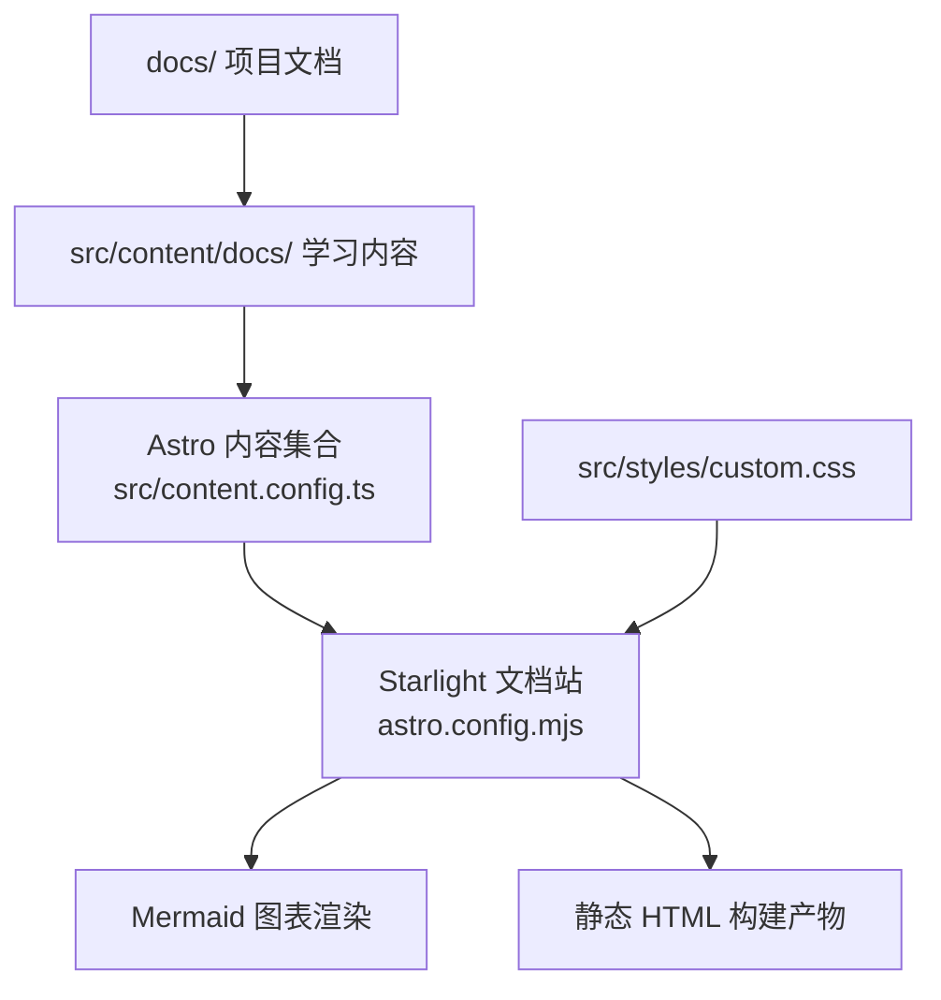
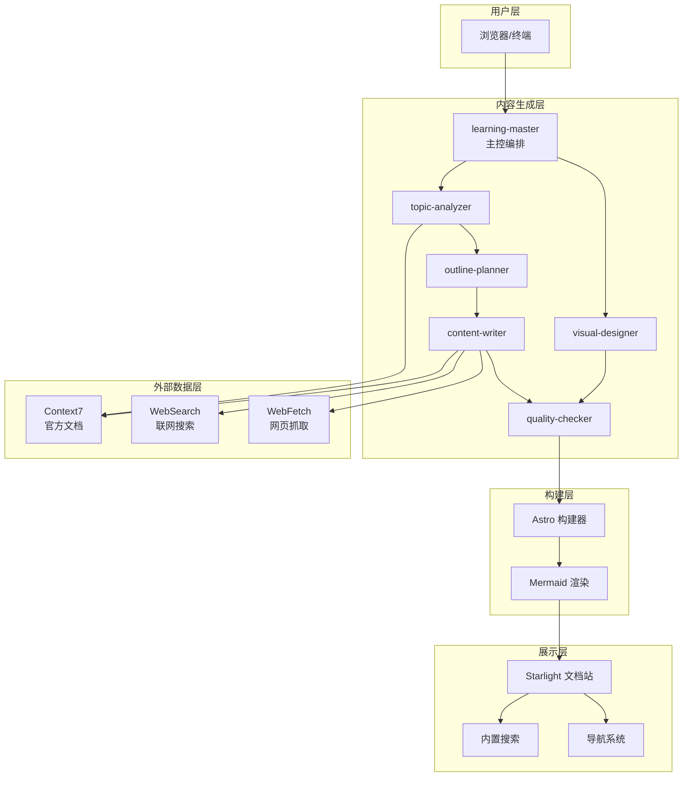
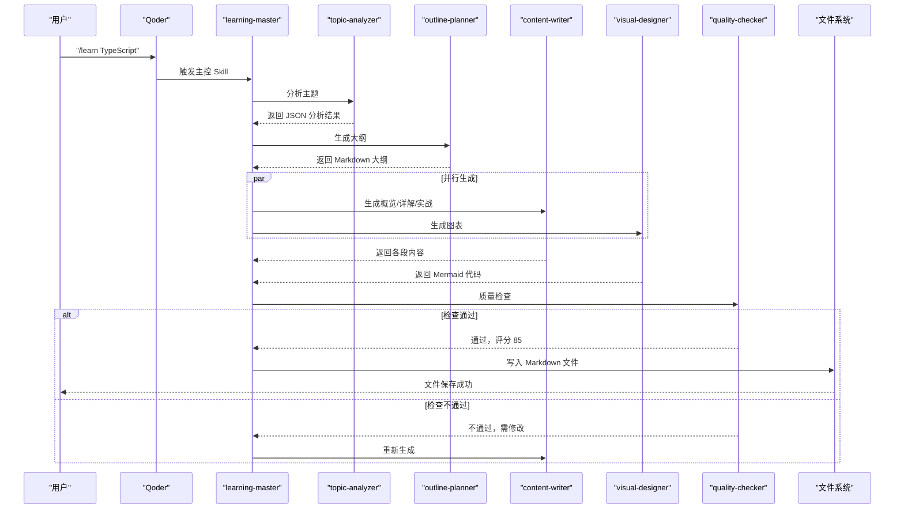
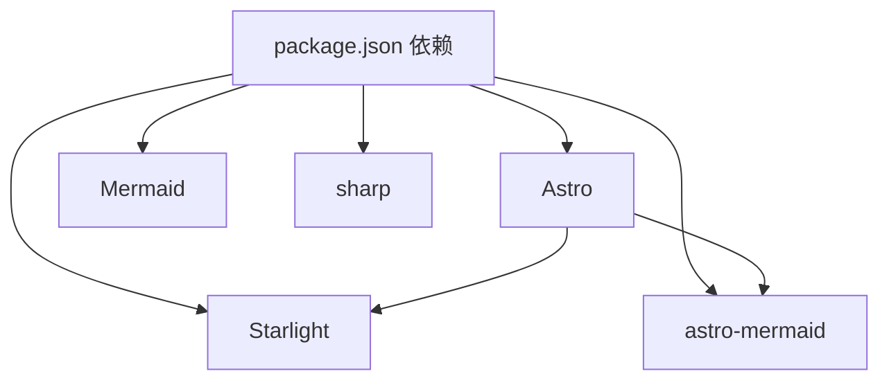

# 项目概述

<cite>
**本文引用的文件**
- [package.json](file://package.json)
- [astro.config.mjs](file://astro.config.mjs)
- [src/content.config.ts](file://src/content.config.ts)
- [src/styles/custom.css](file://src/styles/custom.css)
- [docs/01-PROJECT-BRIEF.md](file://docs/01-PROJECT-BRIEF.md)
- [docs/02-REQUIREMENTS.md](file://docs/02-REQUIREMENTS.md)
- [docs/03-ARCHITECTURE.md](file://docs/03-ARCHITECTURE.md)
- [docs/04-AI-SKILL-SPEC.md](file://docs/04-AI-SKILL-SPEC.md)
- [src/content/docs/project/requirements.md](file://src/content/docs/project/requirements.md)
- [src/content/docs/project/architecture.md](file://src/content/docs/project/architecture.md)
- [src/content/docs/tools/getting-started.md](file://src/content/docs/tools/getting-started.md)
- [src/content/docs/domains/frontend/index.md](file://src/content/docs/domains/frontend/index.md)
- [src/content/docs/methods/learning/index.md](file://src/content/docs/methods/learning/index.md)
</cite>

## 更新摘要
**所做更改**
- 新增完整的项目设计文档体系，包括需求规格、架构设计和AI技能规格
- 建立标准化的文档组织结构和分类体系
- 完善技术架构和AI生成管道的详细设计
- 增强项目范围和成功标准的量化指标

## 目录
1. [引言](#引言)
2. [项目结构](#项目结构)
3. [核心组件](#核心组件)
4. [架构总览](#架构总览)
5. [详细组件分析](#详细组件分析)
6. [依赖分析](#依赖分析)
7. [性能考量](#性能考量)
8. [故障排查指南](#故障排查指南)
9. [结论](#结论)
10. [附录](#附录)

## 引言
StudyBuddy 是一个融合"静态网站生成"与"AI 内容生成"的复合型知识工程系统。它既是基于 Astro + Starlight 的现代化文档站点，也是一个由多智能体协作驱动的 AI 工具链，能够自动生成结构化的学习文档，并以静态站点的形式进行高效展示与检索。

- 核心使命：将碎片化学习转化为结构化知识体系，帮助技术管理者以"管理者视角"快速理解与检索知识。
- 愿景：打造"零维护、可扩展、AI 驱动"的个人知识成长伙伴。
- 价值主张：用三阶段学习法（概览→详解→实战）与可视化图表，实现"从记忆转向检索、从深度转向广度、从线性转向网状"的学习范式升级。

**更新** 新增完整的项目设计文档体系，包括需求规格、架构设计和AI技能规格，建立了标准化的项目管理体系。

## 项目结构
项目采用"文档即代码"的纯 Markdown 结构，配合 Astro 的静态生成能力与 Starlight 的文档主题，形成"内容生成 + 站点展示"的双引擎架构。核心目录与职责如下：

- docs/：项目文档与规格说明（项目简介、架构设计、AI Skill 规格）
- src/content/docs/：学习内容（tools/工具、domains/领域、methods/方法论），由 Astro 内容集合加载
- src/styles/custom.css：自定义主题样式（覆盖 Accent 色彩与速查表、难度标签等组件样式）
- astro.config.mjs：Astro 配置，启用 Starlight 文档站与 Mermaid 图表渲染
- src/content.config.ts：Astro 内容集合定义，使用 Starlight 的加载器与 Schema
- package.json：脚本与依赖（Astro、Starlight、Mermaid、sharp）

**图表来源**
- [astro.config.mjs](file://astro.config.mjs#L7-L33)
- [src/content.config.ts](file://src/content.config.ts#L1-L8)
- [src/styles/custom.css](file://src/styles/custom.css#L1-L78)

**章节来源**
- [astro.config.mjs](file://astro.config.mjs#L1-L34)
- [src/content.config.ts](file://src/content.config.ts#L1-L8)
- [package.json](file://package.json#L1-L20)

## 核心组件
- 文档生成链路（AI 工具链）：由多个 Skill 协同完成，包括主题分析、大纲规划、内容撰写、图表设计与质量检查，形成闭环的自动化内容生产流水线。
- 文档展示链路（静态站点）：基于 Astro 的内容加载与渲染，结合 Starlight 的导航、搜索与 Mermaid 图表渲染，提供高性能、可检索的知识站点。
- 内容组织：采用"工具/领域/方法论"三层分类，辅以难度标签与速查表组件，提升知识的可检索性与实用性。
- 视觉表达：统一的 Accent 色彩与自定义样式，配合 Mermaid 图表（思维导图、流程图、时序图等）强化知识体系的可视化表达。

**更新** 新增标准化的需求规格和架构设计文档，完善了项目的设计文档体系。

**章节来源**
- [docs/04-AI-SKILL-SPEC.md](file://docs/04-AI-SKILL-SPEC.md#L1-L838)
- [docs/03-ARCHITECTURE.md](file://docs/03-ARCHITECTURE.md#L1-L410)
- [src/styles/custom.css](file://src/styles/custom.css#L1-L78)

## 架构总览
系统分为三层：内容生成层、构建层与展示层。内容生成层由多智能体协作，围绕"主题分析—大纲规划—内容撰写—图表设计—质量检查"闭环工作；构建层由 Astro 负责解析 Markdown、渲染 Mermaid、生成 HTML 与优化资源；展示层由 Starlight 提供导航、搜索与主题样式。

**图表来源**
- [docs/03-ARCHITECTURE.md](file://docs/03-ARCHITECTURE.md#L10-L69)
- [docs/04-AI-SKILL-SPEC.md](file://docs/04-AI-SKILL-SPEC.md#L19-L73)

## 详细组件分析

### 文档生成链路（AI 工具链）
- 主控编排：接收用户输入，协调各子 Skill 完成主题分析、大纲规划、内容撰写、图表生成与质量检查。
- 主题分析：输出结构化元数据（主题、slug、一句话定义、前置知识、复杂度、建议图表类型等），指导后续生成。
- 大纲规划：依据三阶段框架（概览/详解/实战）生成 Markdown 大纲，标注图表插入位置。
- 内容撰写：分段生成概览、详解与实战内容，严格遵循"管理者视角"，避免实现细节，强调应用场景与速查要点。
- 图表设计：生成 Mermaid 代码（思维导图、流程图等），用于知识体系与使用流程的可视化表达。
- 质量检查：对结构、内容与格式进行评分与校验，不通过则触发重试或人工介入。

**图表来源**
- [docs/03-ARCHITECTURE.md](file://docs/03-ARCHITECTURE.md#L86-L126)
- [docs/04-AI-SKILL-SPEC.md](file://docs/04-AI-SKILL-SPEC.md#L149-L202)

**章节来源**
- [docs/04-AI-SKILL-SPEC.md](file://docs/04-AI-SKILL-SPEC.md#L149-L716)

### 文档展示链路（静态站点）
- 内容加载：Astro 通过内容集合加载 Markdown 文档，Starlight Schema 校验 Frontmatter，确保结构一致性。
- 导航与搜索：Starlight 提供侧边栏导航与内置搜索，支持按标题、关键词快速检索。
- Mermaid 渲染：Astro 集成 Mermaid 插件，在构建阶段将 Mermaid 代码渲染为 SVG，保证零运行时 JS。
- 主题与样式：自定义 Accent 色彩与组件样式（速查表、难度标签），提升可读性与记忆点。

**图表来源**
- [docs/03-ARCHITECTURE.md](file://docs/03-ARCHITECTURE.md#L128-L160)
- [astro.config.mjs](file://astro.config.mjs#L7-L33)
- [src/content.config.ts](file://src/content.config.ts#L1-L8)

**章节来源**
- [astro.config.mjs](file://astro.config.mjs#L1-L34)
- [src/content.config.ts](file://src/content.config.ts#L1-L8)
- [src/styles/custom.css](file://src/styles/custom.css#L1-L78)

### 内容组织与分类
- 分类体系：工具（AI 编程、效率工具、知识管理）、领域（前端、后端、数据、管理）、方法论（学习方法、思维框架）。
- 命名规范：kebab-case、主题明确、避免缩写、单词数控制在 1-3 个，便于检索与维护。
- 示例内容：工具类、领域类、方法论类的首页摘要，体现"管理者视角"的知识组织方式。

**更新** 新增标准化的项目设计文档，包括需求规格和架构设计，建立了完整的项目管理体系。

**章节来源**
- [docs/03-ARCHITECTURE.md](file://docs/03-ARCHITECTURE.md#L164-L240)
- [src/content/docs/tools/getting-started.md](file://src/content/docs/tools/getting-started.md#L1-L66)
- [src/content/docs/domains/frontend/index.md](file://src/content/docs/domains/frontend/index.md#L1-L7)
- [src/content/docs/methods/learning/index.md](file://src/content/docs/methods/learning/index.md#L1-L7)

## 依赖分析
- 框架与主题：Astro 作为静态生成器，Starlight 提供开箱即用的文档站点能力（导航、搜索、代码高亮、主题）。
- 图表渲染：Mermaid 与 astro-mermaid 插件，使 Markdown 中的 Mermaid 语法在构建期渲染为 SVG。
- 图像优化：sharp 用于图片处理与优化。
- 本地开发与构建：通过 npm scripts 提供 dev/build/preview 命令，支持热更新与静态预览。

**图表来源**
- [package.json](file://package.json#L12-L18)

**章节来源**
- [package.json](file://package.json#L1-L20)

## 性能考量
- 构建性能：Astro 默认支持增量构建，显著减少重复构建时间；图片优化与代码分割进一步降低首屏 JS 与资源体积。
- 运行时性能：静态生成站点零运行时 JS，CDN 加速可将 TTFB 控制在 50ms 以内；Mermaid 图表懒加载提升首屏速度。
- 搜索与导航：Starlight 内置搜索与侧边栏导航，结合 Mermaid 图表与速查表，提升知识检索效率。

**更新** 新增详细的性能优化策略，包括构建优化和运行时优化的具体实现方案。

**章节来源**
- [docs/03-ARCHITECTURE.md](file://docs/03-ARCHITECTURE.md#L366-L383)

## 故障排查指南
- 构建失败或 Mermaid 渲染异常：检查 Mermaid 语法是否正确，确认图表标记与渲染插件配置一致。
- 内容未显示或导航缺失：核对内容集合配置与 Frontmatter 结构，确保路径与分类正确。
- 性能不达标：启用 Astro 增量构建与图片优化，减少不必要的图表数量与层级。
- AI 生成质量不达标：根据质量检查报告逐项修正，必要时调整 Prompt 或引入外部数据源（Context7/WebSearch/WebFetch）。

**更新** 基于新的需求规格和架构设计，完善了故障排查指南，增加了AI生成质量检查的具体标准。

**章节来源**
- [docs/04-AI-SKILL-SPEC.md](file://docs/04-AI-SKILL-SPEC.md#L777-L800)
- [docs/03-ARCHITECTURE.md](file://docs/03-ARCHITECTURE.md#L366-L383)

## 结论
StudyBuddy 以"静态站点 + AI 工具链"的双引擎架构，实现了从"知识生成"到"知识展示"的全链路自动化。其核心创新在于：以管理者视角重构学习框架、以 Mermaid 图表强化知识可视化、以多智能体协作保障内容质量与时效性。对于初学者，它提供了清晰的三阶段学习路径与速查工具；对于有经验的开发者，它提供了可扩展的技能体系与稳定的构建性能。

**更新** 通过建立完整的项目设计文档体系，包括需求规格、架构设计和AI技能规格，项目具备了更完善的管理体系和标准化的工作流程。

## 附录
- 目标用户：技术管理者与终身学习者，偏好简洁美观、快速理解、拒绝信息过载。
- 核心诉求：快速建立知识体系、实用导向、视觉记忆点、速查能力、知识关联。
- 成功标准：文档生成时间 < 30 秒/篇，站点构建时间 < 1 分钟，内容质量评分 ≥ 7/10，Lighthouse 分数 ≥ 90。

**更新** 基于新的需求规格，明确了项目的成功标准和验收指标，包括文档生成时间、站点构建时间和内容质量评分的具体量化要求。

**章节来源**
- [docs/01-PROJECT-BRIEF.md](file://docs/01-PROJECT-BRIEF.md#L37-L124)
- [docs/02-REQUIREMENTS.md](file://docs/02-REQUIREMENTS.md#L70-L109)