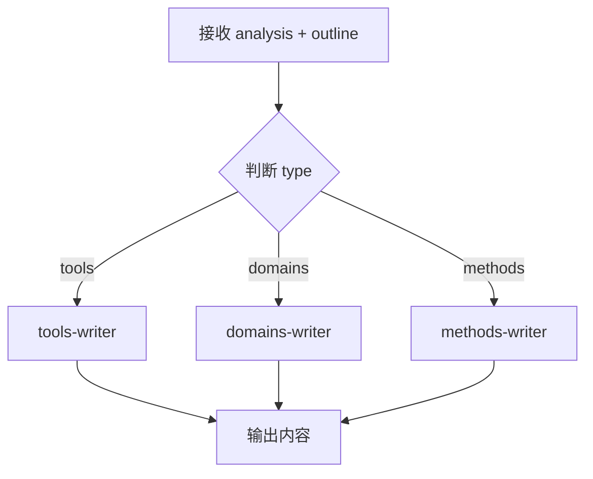

# content-writer

内容撰写主入口，负责根据类型调度对应子 Skill 生成内容。

## 职责

1. 接收 analysis 和 outline
2. 根据 `analysis.type` 判断类型
3. 调用对应的子 Skill 撰写内容
4. 输出统一格式的内容

## 调用方式

由 `learning-master` 并行调用，不可单独触发。

## 输入

```yaml
# 新建模式
analysis: JSON          # topic-analyzer 输出的完整分析结果
outline: Markdown       # 大纲内容
section: string         # 段落类型：overview | details | practices

# 修正模式（可选）
mode: fix               # 标识为修正模式
fix_scope:              # 修正范围
  sections: ["详解/常见坑"]  # 只修正指定章节
  reason: "缺少常见坑章节"   # 修正原因
existing_content: Markdown  # 已通过的章节内容（需保留）
```

---

## 上下文复用规则

**必须**直接引用 `analysis` 中的字段，不可重新生成：

| 概览内容 | 对应 analysis 字段 | 复用规则 |
|----------|-------------------|----------|
| 一句话定义 | `one_sentence` | 直接引用，可适度润色但保持原意 |
| 核心问题 | `problem_solved` | 直接引用 |
| 适用场景 | `use_cases` | 基于 3-5 个场景扩展为判断标准 |
| 前置知识 | `prerequisites` | 直接引用 |
| 核心概念 | `key_concepts` | 按此顺序撰写详解 |

---

## 调度逻辑



---

## 执行步骤

### 新建模式

1. 接收 analysis 和 outline
2. 根据 `analysis.type` 确定类型
3. **根据类型读取并执行对应的辅助指令文件**：
   - tools 类型 → 读取 `./tools-writer.md`，执行其中的写作指令
   - domains 类型 → 读取 `./domains-writer.md`，执行其中的写作指令
   - methods 类型 → 读取 `./methods-writer.md`，执行其中的写作指令
4. 输出内容

### 修正模式（mode: fix）

1. 接收 analysis、outline、existing_content
2. 根据 `analysis.type` 确定类型，读取对应辅助指令文件
3. 解析 `fix_scope.sections`，确定需要修正的章节
4. **增量生成**：
   - 识别 existing_content 中已通过的章节
   - 只生成 fix_scope 指定的章节
   - 保留已有章节的原始内容和格式
5. 合并输出：已有内容 + 新生成内容

---

## 辅助指令文件

| 类型 | 文件 | 说明 |
|------|------|------|
| tools | [tools-writer.md](./tools-writer.md) | 工具类写作：手把手操作指南 |
| domains | [domains-writer.md](./domains-writer.md) | 领域类写作：案例分析为主 |
| methods | [methods-writer.md](./methods-writer.md) | 方法论写作：场景应用为主 |

---

## 通用写作风格

- **语言**：专业但易懂，避免术语堆砌
- **类比**：用已知解释未知
- **表格**：对比、速查使用 Markdown 表格
- **信息层次**：先管理者视角总结，再补 1-2 个关键细节
- **注释风格**：避免语法旁白，注释应说明意图或场景

---

## MCP 调用要求

生成内容前，**必须**调用 MCP 获取最新信息：

| 工具 | 用途 | 调用时机 |
|------|------|----------|
| Context7 | 查询官方文档 | 撰写任何技术内容前 |
| WebSearch | 搜索最新版本、最佳实践 | 撰写实战案例时 |
| WebFetch | 抓取官方示例代码 | 需要完整代码参考时 |

### 禁止仅依赖模型训练数据生成：
- 版本号和发布日期
- API 参数和返回值
- 安装/配置命令
- 官方推荐写法

---

## 约束

- 必须根据 `analysis.type` 调用对应子 Skill
- 必须复用 analysis 中的字段，不可另起炉灶
- 内容必须标注数据来源
- **静默执行**：只输出 Markdown，不要解释性文字（如"内容如下"、"撰写完成"）
