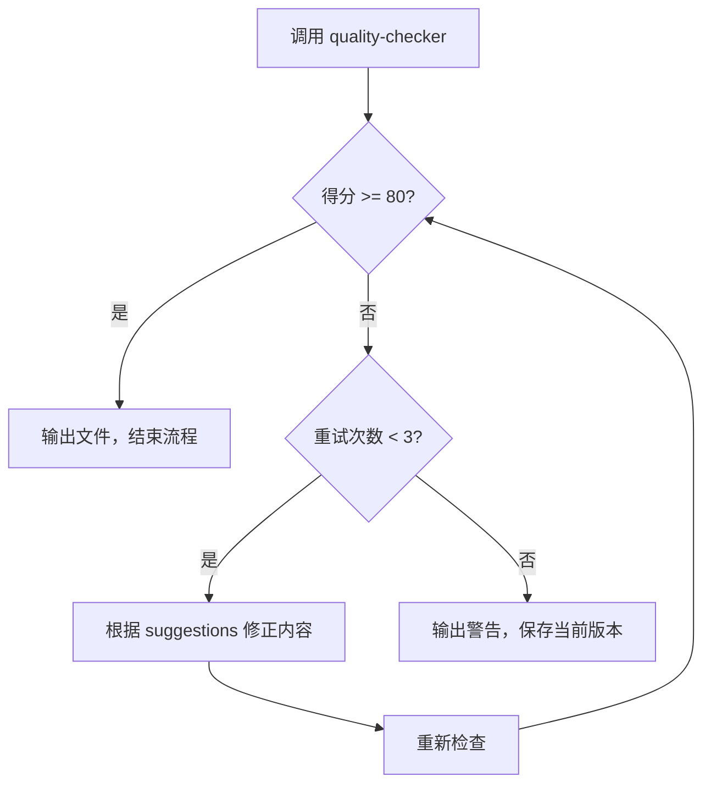

# learning-master

学习文档生成的主控协调者，负责编排所有子 Skill 完成高质量学习文档生成。

## 触发方式

```
/learning-master {主题}
```

---

## 架构

主 Skill 调度 + 子 Skill 专业化：每个阶段根据类型调用对应子 Skill（tools/domains/methods）。

---

## 入口判断（三重检查，静默执行）

在进入主流程前，**静默执行**三项检查。

**核心原则**：任何无法确定的情况，都调用 `ask_user_question` 向用户确认。

### 检查 1：歧义判断（静默）

判断输入主题是否有多种可能含义：

| 输入示例 | 可能歧义 | 处理方式 |
|----------|----------|----------|
| React | React 框架 / React Native / React 18 | 调用 ask_user_question |
| Vue | Vue 2 / Vue 3 / Vue Router | 调用 ask_user_question |
| Swift | Swift 语言 / SwiftUI | 调用 ask_user_question |
| Docker | Docker 基础 / Docker Compose | 无歧义，继续 |
| TypeScript | TypeScript 语言 | 无歧义，继续 |

**执行逻辑**：
```
if 主题无歧义:
    静默继续下一检查
if 主题存在多种常见含义 或 无法确定是否有歧义:
    调用 ask_user_question，让用户选择
```

**ask_user_question 调用示例**：
```
ask_user_question({
  questions: [{
    question: "检测到 'React' 可能有多种含义，请选择你想学习的内容：",
    header: "主题确认",
    options: [
      { label: "React 前端框架", description: "核心概念、组件、Hooks" },
      { label: "React Native", description: "移动端开发" },
      { label: "React 18 新特性", description: "并发、Suspense 等新功能" }
    ]
  }]
})
```

---

### 检查 2：知识新鲜度（静默）

判断主题是否为训练数据外的新知识或版本更新：

**执行逻辑**：
```
if 主题是成熟技术:
    静默继续下一检查
if 主题涉及较新技术/版本 或 无法确定是否为新知识:
    调用 WebSearch 搜索最新信息
    调用 ask_user_question，确认主题定义
```

**ask_user_question 调用示例**：
```
ask_user_question({
  questions: [{
    question: "'Bun' 是较新的 JavaScript 运行时，搜索到以下信息。确认学习主题？",
    header: "新知确认",
    options: [
      { label: "确认学习 Bun", description: "Bun v1.0+，新一代 JS 运行时，主打速度" },
      { label: "取消", description: "不学习此主题" }
    ]
  }]
})
```

---

### 检查 3：已有文档判断（静默，复习优先）

检查项目中是否已存在相关文档：

**执行逻辑**：
```
搜索 src/content/docs/ 下是否存在主题相关的 .md 文件
匹配规则：文件名包含主题关键词（忽略大小写）

if 不存在:
    静默进入【新建模式】→ 开始主流程
if 存在:
    输出文档摘要 + 链接
    流程结束（不调用 ask_user_question）
```

**已有文档时的输出**：
```
📄 已有学习文档：[主题名]

| 属性 | 值 |
|------|------|
| 类型 | xxx |
| 难度 | xxx |
| 学习时长 | xxx |
| 核心模块 | xxx |

📖 查看：[文档链接]

💡 如需更新，请说「更新 [主题名]」或「重新学习 [主题名]」
```

**重要**：已有文档时，**不主动询问用户选择**。用户如需更新，会主动提出。

---

### 用户主动要求更新时

当用户说「更新 xxx」或「重新学习 xxx」时，才调用 `ask_user_question`：

```
ask_user_question({
  questions: [{
    question: "已有文档 xxx.md，请选择更新方式：",
    header: "更新方式",
    options: [
      { label: "更新迭代", description: "补充新知识，保留现有内容" },
      { label: "重新生成", description: "完全覆盖原文件" }
    ]
  }]
})
```

**更新迭代的执行步骤**：
1. 读取现有文档内容
2. 分析已有章节结构
3. 对比主题应有的知识范围
4. 只补充缺失章节或更新过时内容
5. 保留用户自定义的修改和笔记

---

## 工作流程

```
入口判断 → topic-analyzer → outline-planner → content-writer → visual-designer → quality-checker → 输出
                    ↓                ↓                 ↓
              判断 mode        根据 mode          根据 mode
                              生成大纲           组织内容
```

**核心流程**：入口判断 → 分析 → 大纲 → 撰写 → 图表 → 检查 → 闭环修正 → 输出

---

## 质量闭环机制

quality-checker 检查后必须形成闭环，确保最终输出达标：



### 闭环执行规则

| 轮次 | 得分范围 | 处理方式 |
|------|----------|----------|
| 第 1 次检查 | >= 80 | 直接输出 |
| 第 1 次检查 | 70-79 | 自动修正后重新检查 |
| 第 1 次检查 | < 70 | 重新生成内容后检查 |
| 第 2 次检查 | >= 80 | 输出 |
| 第 2 次检查 | 70-79 | 自动修正后重新检查 |
| 第 2 次检查 | < 70 | 输出警告，保存当前版本 |
| 第 3 次检查 | >= 80 | 输出 |
| 第 3 次检查 | < 80 | 输出警告，保存当前版本 |

### 修正策略

根据 `quality-checker` 输出的 `issues` 和 `suggestions` 定向修正：

| 问题类型 | 修正动作 |
|----------|----------|
| 结构问题 | 调用 content-writer 补充缺失章节 |
| 内容问题 | 调用 content-writer 重写对应段落 |
| 格式问题 | 直接修复 Markdown/Mermaid 语法 |
| 类型专属问题 | 读取对应的 checker 辅助文件，按建议修正 |

### 修正时的调用方式

修正时调用 content-writer，需明确指定增量模式：

```yaml
# 修正模式下的 content-writer 输入
analysis: JSON           # 原始分析结果
outline: Markdown        # 大纲结构
mode: fix                # 标识为修正模式
fix_scope:               # 修正范围
  sections: ["详解/常见坑"]  # 只修正指定章节
  reason: "缺少常见坑章节"   # 修正原因
existing_content: Markdown  # 已通过的章节内容（需保留）
```

**修正时的 content-writer 行为**：
1. 读取 `existing_content`，识别已通过的章节
2. 只生成 `fix_scope.sections` 指定的章节
3. 合并输出：已有内容 + 新生成内容
4. 保留原有的 Markdown 结构和格式

### 修正时的上下文保留

修正时必须保留：
- `analysis` - 原始分析结果
- `outline` - 大纲结构
- 已通过的章节内容 - 只修正问题部分，不重写全部

### 输出示例

```
📄 文档已保存：src/content/docs/{category}/{slug}.md

📄 文档已保存：src/content/docs/{category}/{slug}/
├── index.md
├── {sub_topic_1}.md
└── {sub_topic_2}.md
```

**已有文档时**：输出文档摘要 + 链接，提示用户可主动要求更新。

---

## 上下文传递链路

各 Skill 之间的数据必须完整传递：

```
topic-analyzer 输出（JSON）
    ↓ 完整传递
outline-planner ← analysis
    ↓ 完整传递
content-writer ← analysis + outline
visual-designer ← analysis + outline
    ↓ 完整传递
quality-checker ← analysis + full_content
```

**关键规则**：
- analysis 是后续所有 Skill 的唯一来源
- 不允许任何 Skill "另起炉灶"重新生成已定义的内容

---

## 三种类型差异化处理

| 类型 | 学习目标 | 详解结构 | 实战形式 |
|------|----------|----------|----------|
| tools | 会用、能操作 | 是什么/为什么/怎么用（命令） | 手把手操作 |
| domains | 懂全局、能决策 | 是什么/对比/选型依据 | 案例分析 |
| methods | 会思考、能迁移 | 是什么/步骤/误区 | 场景应用 |

---

## 三阶段学习框架

| 阶段 | 时长 | 目标 |
|------|------|------|
| 概览 | 5 分钟 | 鸟瞰全局，建立印象 |
| 详解 | 60 分钟 | 深入理解核心概念 |
| 实战 | 25 分钟 | 动手练习，巩固应用 |

---

## MCP 工具依赖

| 工具 | 用途 |
|------|------|
| Context7 | 查询官方文档 |
| WebSearch | 搜索最新资讯 |
| WebFetch | 抓取网页内容 |

---

## 内容组织方式

根据 `analysis.content_structure.mode` 决定输出结构：

### single 模式

单个 md 文件，直接输出到：
```
src/content/docs/{category}/{slug}.md
```

### multi_file 模式

主文件 + 子文件结构：
```
src/content/docs/{category}/{slug}/
├── index.md          # 概览 + 导航
├── {sub_topic_1}.md  # 子主题 1
├── {sub_topic_2}.md  # 子主题 2
└── {sub_topic_3}.md  # 子主题 3
```

**主文件（index.md）内容**：
- 完整的概览部分
- 子主题导航（带链接）
- 速查表

**子文件内容**：
- 对应子主题的详解 + 实战
- 独立可阅读

### directory 模式

目录 + 多个独立文件：
```
src/content/docs/{category}/{slug}/
├── index.md          # 领域概述 + 学习路径
├── {sub_topic_1}.md  # 独立子主题 1
├── {sub_topic_2}.md  # 独立子主题 2
└── {sub_topic_3}.md  # 独立子主题 3
```

**index.md 内容**：
- 领域概述
- 各子主题简介（带链接）
- 学习路径建议

**子文件内容**：
- 完整的三阶段结构（概览 + 详解 + 实战）
- 独立可阅读

### 输出时的自动处理

```
if content_structure.mode == "single":
    输出单个文件
elif content_structure.mode == "multi_file":
    创建目录
    生成 index.md（概览 + 导航）
    for sub_topic in sub_topics:
        生成 {sub_topic.slug}.md（详解 + 实战）
elif content_structure.mode == "directory":
    创建目录
    生成 index.md（领域概述 + 学习路径）
    for sub_topic in sub_topics:
        生成 {sub_topic.slug}.md（完整三阶段）
```

---

## 约束

- 入口判断静默执行，只在需要确认时调用 ask_user_question
- 子 Skill 之间传递纯数据，不要有解释性文字
- 最终输出简洁：只输出文件路径或文档摘要
- 不要输出进度信息（如"[1/9] 分析主题"）
- 不要输出内部过程（如"质量检查得分 72，自动修正中"）
- 不要输出检查过程的描述（如"我将开始..."、"检查文档是否存在..."）
