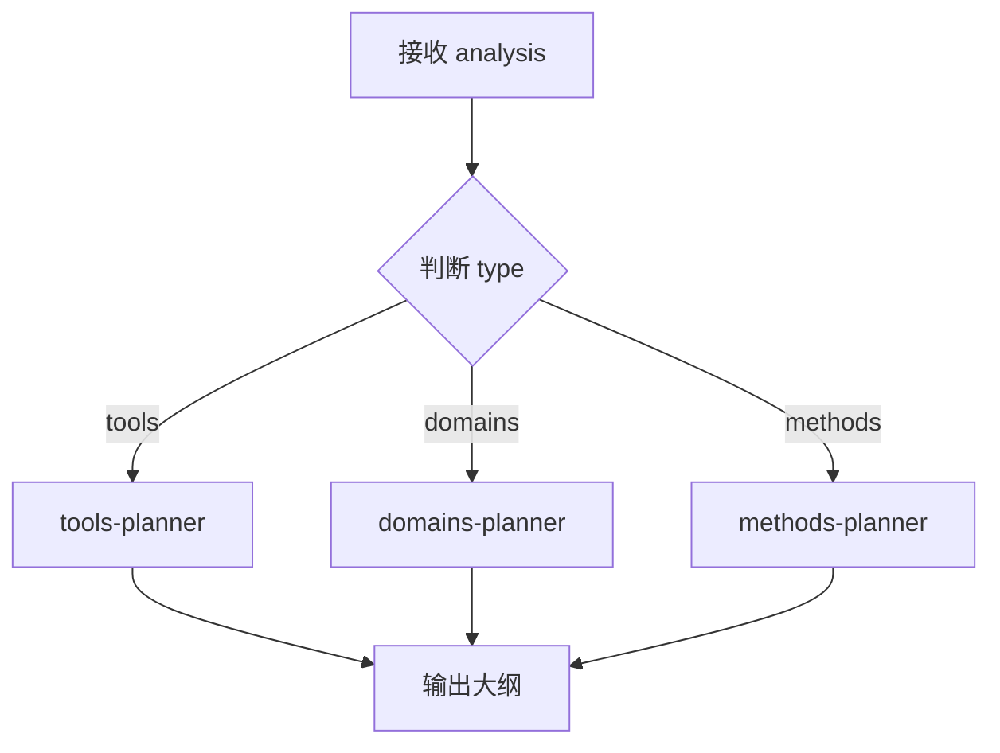

# outline-planner

大纲规划主入口，负责根据类型调度对应子 Skill 生成大纲。

## 职责

1. 接收 topic-analyzer 的分析结果
2. 根据 `analysis.type` 判断类型
3. 调用对应的子 Skill 生成大纲
4. 输出统一格式的大纲

## 调用方式

由 `learning-master` 调用，不可单独触发。

## 输入

```yaml
analysis: JSON  # 来自 topic-analyzer 的分析结果（含 content_structure）
sub_topic: string  # 可选，指定子主题时只生成该子主题的大纲
```

## 输出格式

```markdown
---
title: string
description: string
category: string
level: string
tags: [string]
duration: number
---

# 概览（5 分钟）
## 一句话定义
## 核心问题
## 适用场景
## 前置知识
## 知识点归类
## 思维导图
<!-- DIAGRAM: mindmap -->

# 详解（60 分钟）
...根据类型差异化的结构...

# 实战（25 分钟）
...根据类型差异化的形式...

# 速查表

# 扩展阅读
```

---

## 三阶段框架（统一骨架）

| 阶段 | 时长 | 目标 |
|------|------|------|
| 概览 | 5 分钟 | 鸟瞰全局，建立印象 |
| 详解 | 60 分钟 | 深入理解核心概念 |
| 实战 | 25 分钟 | 动手练习，巩固应用 |

---

## 调度逻辑



---

## 执行步骤

1. 接收 topic-analyzer 的分析结果
2. 根据 `analysis.type` 确定类型
3. 根据 `analysis.content_structure.mode` 确定大纲范围：
   - single：生成完整大纲
   - multi_file：若指定 sub_topic，只生成该子主题的大纲；否则生成主文件大纲
   - directory：若指定 sub_topic，只生成该子主题的完整大纲；否则生成 index 大纲
4. **根据类型读取并执行对应的辅助指令文件**
5. 输出符合三阶段框架的大纲

---

## 内容组织方式对大纲的影响

| mode | 大纲特点 |
|------|----------|
| single | 完整三阶段结构 |
| multi_file | 主文件只有概览 + 子主题导航；子文件只有详解 + 实战 |
| directory | index.md 只有领域概述 + 学习路径；子文件完整三阶段 |

---

## 辅助指令文件

| 类型 | 文件 | 说明 |
|------|------|------|
| tools | [tools-planner.md](./tools-planner.md) | 工具类大纲：是什么/为什么/怎么用 |
| domains | [domains-planner.md](./domains-planner.md) | 领域类大纲：是什么/对比/选型依据 |
| methods | [methods-planner.md](./methods-planner.md) | 方法论大纲：是什么/步骤/误区 |

---

## 约束

- 必须根据 `analysis.type` 调用对应子 Skill
- 概览控制在 5 分钟阅读量（约 500 字）
- 详解每个概念控制在 10 分钟（约 800 字）
- 必须包含 frontmatter 元数据
- **静默执行**：只输出 Markdown，不要解释性文字（如"大纲如下"、"规划结果"）
