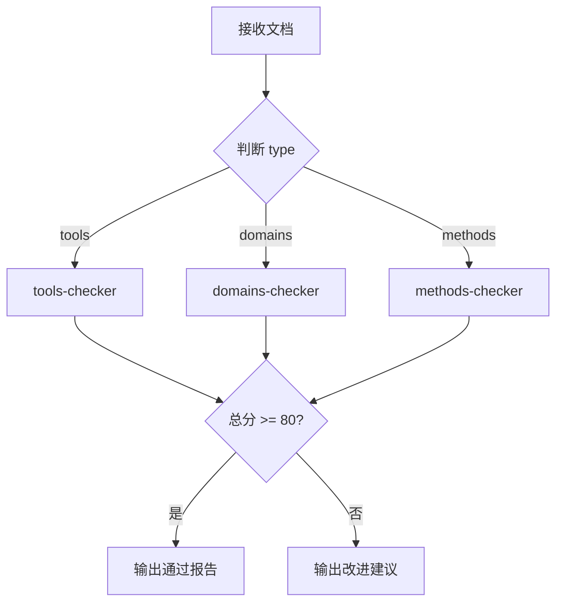

# quality-checker

质量检查主入口，负责根据类型调度对应子 Skill 检查质量。

## 职责

1. 接收 analysis 和文档内容
2. 根据 `analysis.type` 判断类型
3. 调用对应的子 Skill 执行检查
4. 输出评分和改进建议

## 调用方式

由 `learning-master` 调用，不可单独触发。

## 输入

```yaml
analysis: JSON          # topic-analyzer 输出（含 type 字段）
full_content: Markdown  # 完整的文档内容
```

---

## 调度逻辑



---

## 执行步骤

1. 接收 analysis 和文档内容
2. 根据 `analysis.type` 确定类型
3. **根据类型读取并执行对应的辅助指令文件**：
   - tools 类型 → 读取 `./tools-checker.md`，执行其中的检查指令
   - domains 类型 → 读取 `./domains-checker.md`，执行其中的检查指令
   - methods 类型 → 读取 `./methods-checker.md`，执行其中的检查指令
4. 输出评分和改进建议

---

## 辅助指令文件

| 类型 | 文件 | 说明 |
|------|------|------|
| tools | [tools-checker.md](./tools-checker.md) | 工具类检查：命令准确性、操作可行性 |
| domains | [domains-checker.md](./domains-checker.md) | 领域类检查：概念准确性、对比全面性 |
| methods | [methods-checker.md](./methods-checker.md) | 方法论检查：步骤完整性、场景适用性 |

---

## 通用检查（所有类型）

### 结构检查（20 分）

| 检查项 | 分值 | 标准 |
|--------|------|------|
| 三阶段完整 | 10 | 概览、详解、实战三部分齐全 |
| 章节结构匹配类型 | 10 | 详解结构符合类型要求 |

### 内容检查（30 分）

| 检查项 | 分值 | 标准 |
|--------|------|------|
| 一句话定义通俗 | 10 | 无术语堆砌，可用类比 |
| 类比恰当 | 10 | 用已知解释未知 |
| 信息差补全 | 10 | 有 1-2 个可落地的关键细节 |

### 格式检查（25 分）

| 检查项 | 分值 | 标准 |
|--------|------|------|
| Markdown 语法 | 10 | 无格式错误 |
| 表格规范 | 5 | 对齐、有表头 |
| Mermaid 语法 | 10 | 可正确渲染 |

---

## 输出格式

```json
{
  "score": 85,
  "passed": true,
  "type": "tools",
  "breakdown": {
    "structure": 18,
    "content": 28,
    "format": 22,
    "type_specific": 17
  },
  "issues": [],
  "suggestions": []
}
```

---

## 评分标准

| 分数段 | 评级 | 处理方式 |
|--------|------|----------|
| 90-100 | 优秀 | 可直接发布 |
| 80-89 | 良好 | 允许输出 |
| 70-79 | 一般 | 需要修改 |
| < 70 | 不合格 | 需重新生成 |

---

## 约束

- 必须根据 `analysis.type` 调用对应子 Skill
- 总分 >= 80 才允许输出
- 问题描述要具体
- 改进建议不超过 3 条
- **静默执行**：只输出 JSON，不要解释性文字（如"检查结果"、"评分如下"）
