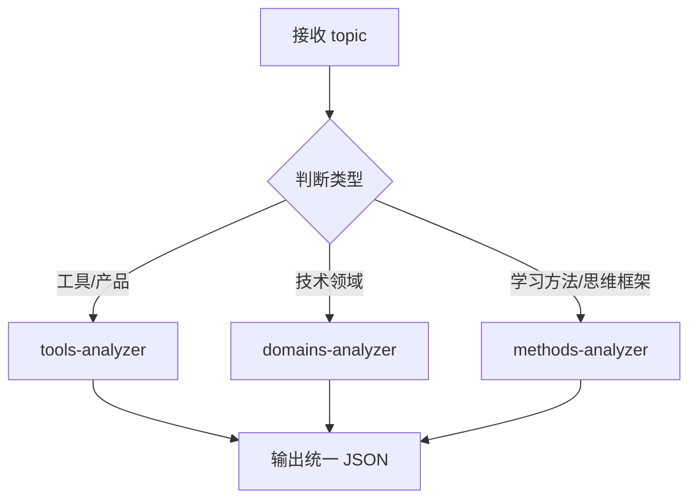

# topic-analyzer

主题分析主入口，负责判断类型并调度对应子 Skill 执行分析。

## 职责

1. 判断主题属于哪种类型（tools / domains / methods）
2. 调用对应的子 Skill 执行分析
3. 输出统一格式的分析结果

## 调用方式

由 `learning-master` 调用，不可单独触发。

## 输入

```yaml
topic: string  # 学习主题，如 "Docker"、"前端开发"、"费曼学习法"
```

## 输出格式

```json
{
  "topic": "string",
  "slug": "string",
  "type": "tools | domains | methods",
  "one_sentence": "string",
  "problem_solved": "string",
  "use_cases": ["string"],
  "prerequisites": ["string"],
  "complexity": "beginner | intermediate | advanced",
  "estimated_sections": 5,
  "key_concepts": ["string"],
  "category": "string",
  "mindmap_structure": {
    "root": "string",
    "branches": ["string"]
  },
  "content_structure": {
    "mode": "single | multi_file | directory",
    "reason": "string",
    "sub_topics": [
      { "title": "string", "slug": "string", "scope": "string" }
    ]
  },
  "type_specific": { },
  "suggested_diagrams": ["string"]
}
```

---

## content_structure 字段说明

根据知识点大小自动判断内容组织方式：

| mode | 适用场景 | 输出结构 |
|------|----------|----------|
| single | 单一知识点，内容适中 | 一个 md 文件 |
| multi_file | 大知识点，内容过多 | 主文件 + 子文件（如概览在主文件，详解拆分） |
| directory | 知识领域，包含多个子主题 | 目录 + 多个独立 md 文件 |

### 判断规则

```
if key_concepts <= 5 且 estimated_sections <= 6:
    mode = "single"
elif key_concepts <= 8 且是单一主题:
    mode = "multi_file"
else:
    mode = "directory"
```

---

## 类型判断规则

| 判断问题 | 类型 |
|----------|------|
| 是否围绕一个工具/产品的使用与配置？ | **tools** |
| 是否讨论某个技术领域的整体知识？ | **domains** |
| 是否讲"如何学习/如何思考/如何解决问题"？ | **methods** |

**无法确定类型时**：调用 `ask_user_question` 让用户选择。

```
ask_user_question({
  questions: [{
    question: "无法确定 '[主题]' 的类型，请选择：",
    header: "类型确认",
    options: [
      { label: "工具类", description: "围绕工具/产品的使用与配置" },
      { label: "领域类", description: "某个技术领域的整体知识" },
      { label: "方法论", description: "学习/思考/解决问题的方法" }
    ]
  }]
})
```

---

## 调度逻辑



---

## 执行步骤

1. 根据「类型判断规则」确定主题类型
2. **根据类型读取并执行对应的辅助指令文件**：
   - tools 类型 → 读取 `./tools-analyzer.md`，执行其中的分析指令
   - domains 类型 → 读取 `./domains-analyzer.md`，执行其中的分析指令
   - methods 类型 → 读取 `./methods-analyzer.md`，执行其中的分析指令
3. 输出统一 JSON 格式结果

---

## 辅助指令文件

| 类型 | 文件 | 说明 |
|------|------|------|
| tools | [tools-analyzer.md](./tools-analyzer.md) | 工具类分析指令：命令、配置、常见坑 |
| domains | [domains-analyzer.md](./domains-analyzer.md) | 领域类分析指令：概念、关系、选型依据 |
| methods | [methods-analyzer.md](./methods-analyzer.md) | 方法论分析指令：步骤、场景、误区 |

---

## category 字段格式（对应项目目录）

**工具类子分类**：
- `tools/ai-coding` — AI 编程工具
- `tools/efficiency` — 效率工具
- `tools/knowledge` — 知识管理工具

**领域类子分类**：
- `domains/frontend` — 前端开发
- `domains/backend` — 后端开发
- `domains/data` — 数据科学
- `domains/management` — 技术管理

**方法论子分类**：
- `methods/learning` — 学习方法
- `methods/thinking` — 思维框架
- `methods/problem-solving` — 问题解决策略

---

## 约束

- 必须先判断类型，再调用对应子 Skill
- 子 Skill 输出必须符合统一 JSON 格式
- 管理者视角，不涉及实现细节
- **静默执行**：只输出 JSON，不要解释性文字（如"分析结果如下"、"主题类型是"）
