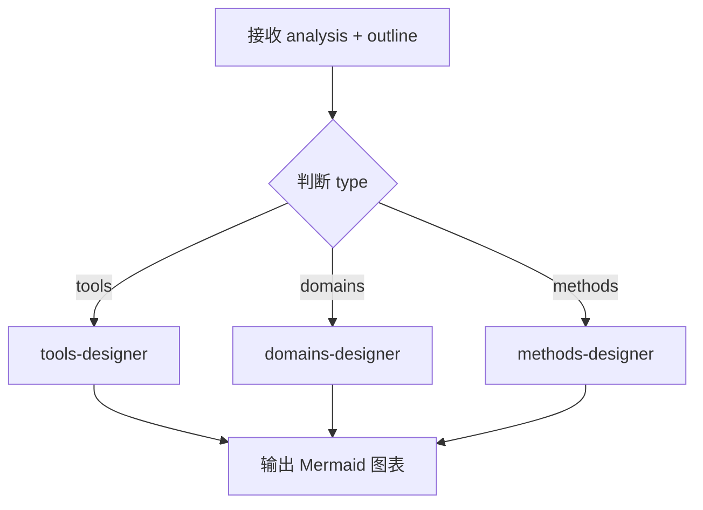

# visual-designer

图表设计主入口，负责根据类型调度对应子 Skill 生成图表。

## 职责

1. 接收 analysis 和 outline
2. 根据 `analysis.type` 判断类型
3. 调用对应的子 Skill 设计图表
4. 输出 Mermaid 图表代码

## 调用方式

由 `learning-master` 调用，不可单独触发。

## 输入

```yaml
analysis: JSON          # topic-analyzer 输出（含 mindmap_structure）
outline: Markdown       # 大纲内容（含 DIAGRAM 标记）
```

---

## 数据源优先级

生成图表时必须优先使用 `analysis` 中的结构化数据：

| 图表类型 | 数据来源 |
|----------|----------|
| 全貌 mindmap | `analysis.mindmap_structure` |
| 操作流程图 | `analysis.type_specific.core_commands` 或 `steps` |
| 决策流程图 | `analysis.type_specific.decision_factors` |

---

## 调度逻辑



---

## 执行步骤

1. 接收 analysis 和 outline
2. 根据 `analysis.type` 确定类型
3. **根据类型读取并执行对应的辅助指令文件**：
   - tools 类型 → 读取 `./tools-designer.md`，执行其中的图表设计指令
   - domains 类型 → 读取 `./domains-designer.md`，执行其中的图表设计指令
   - methods 类型 → 读取 `./methods-designer.md`，执行其中的图表设计指令
4. 输出 Mermaid 图表代码

---

## 辅助指令文件

| 类型 | 文件 | 说明 |
|------|------|------|
| tools | [tools-designer.md](./tools-designer.md) | 工具类图表：操作流程、命令关系 |
| domains | [domains-designer.md](./domains-designer.md) | 领域类图表：技术栈关系、决策流程 |
| methods | [methods-designer.md](./methods-designer.md) | 方法论图表：方法步骤、应用场景 |

---

## 图表类型差异

| 类型 | 核心图表 | 图表重点 |
|------|----------|----------|
| tools | mindmap + flowchart | 操作流程、命令关系 |
| domains | mindmap + flowchart | 技术栈关系、决策流程 |
| methods | flowchart + mindmap | 方法步骤、应用场景 |

---

## 输出格式

````markdown
<!-- 图表说明 -->

````

---

## 约束

- 必须根据 `analysis.type` 调用对应子 Skill
- 必须使用 `analysis.mindmap_structure` 作为脑图骨架
- 每个主题至少生成 2 个图表
- 节点文字不超过 10 字
- mindmap 最多 3 层
- **静默执行**：只输出 Mermaid 代码，不要解释性文字（如"图表如下"、"设计完成"）
