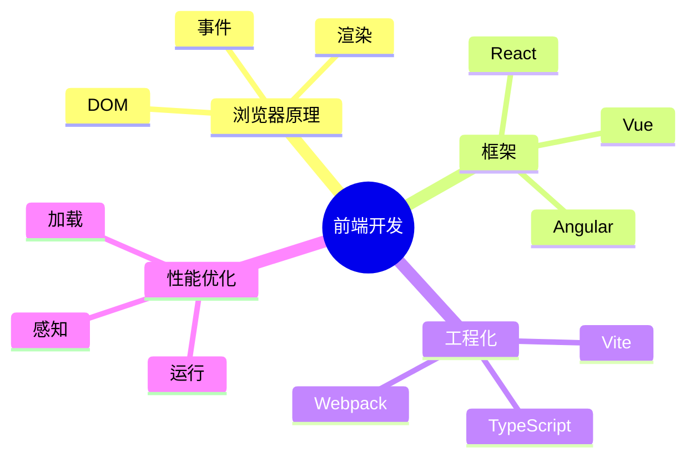
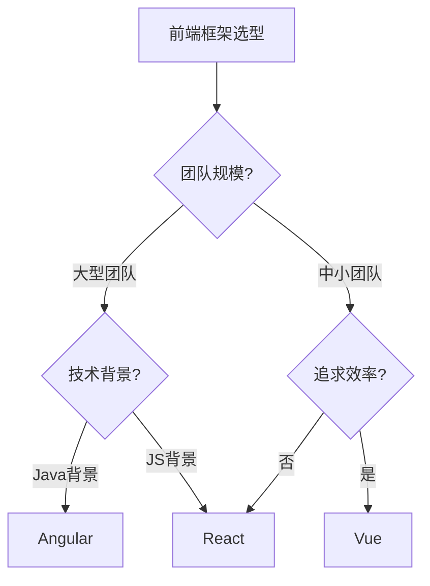
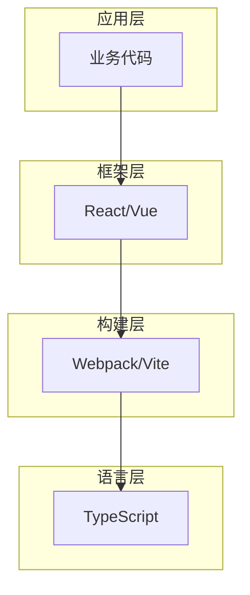
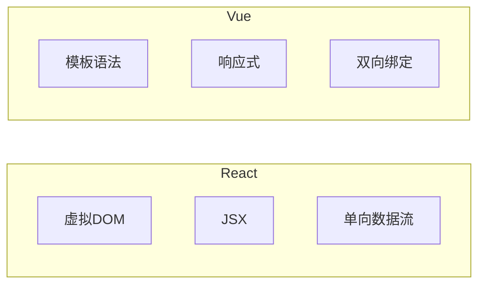

# domains-designer

领域类图表设计专家，专注设计"技术关系"相关的图表。

## 适用范围

领域类主题（domains/*），如前端开发、后端开发、技术管理等。

## 图表重点

| 图表类型 | 用途 | 位置 |
|----------|------|------|
| mindmap | 技术栈关系、知识体系 | 概览 |
| flowchart | 决策流程、技术层次 | 详解 |

---

## 必须图表

### 1. 技术栈关系图（概览）

展示该领域涉及的技术及其关系：

### 2. 决策流程图（详解）

展示技术选型或架构决策的流程：

---

## 可选图表

### 技术栈分层图

展示技术的层次关系：

### 对比关系图

展示不同方案的对比：

---

## 设计要点

### 脑图设计
- 按技术层次组织分支
- 展示技术栈关系
- 突出核心概念

### 流程图设计
- 决策节点用 `{}` 
- 分支要有判断条件
- 展示权衡取舍

---

## 约束

- 脑图必须展示技术栈关系
- 流程图必须有决策判断
- 分支要标注判断条件
