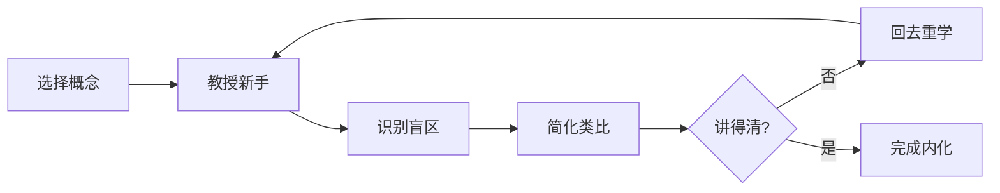
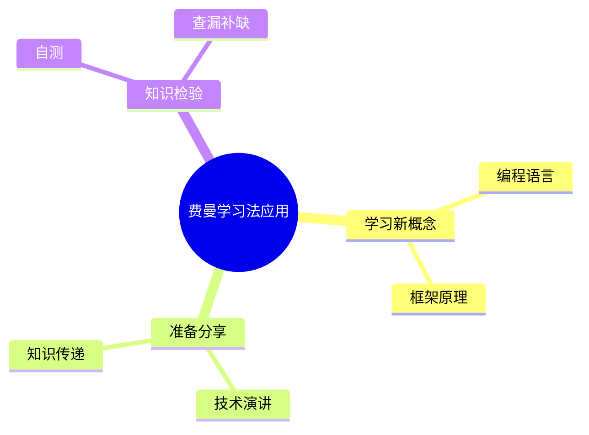
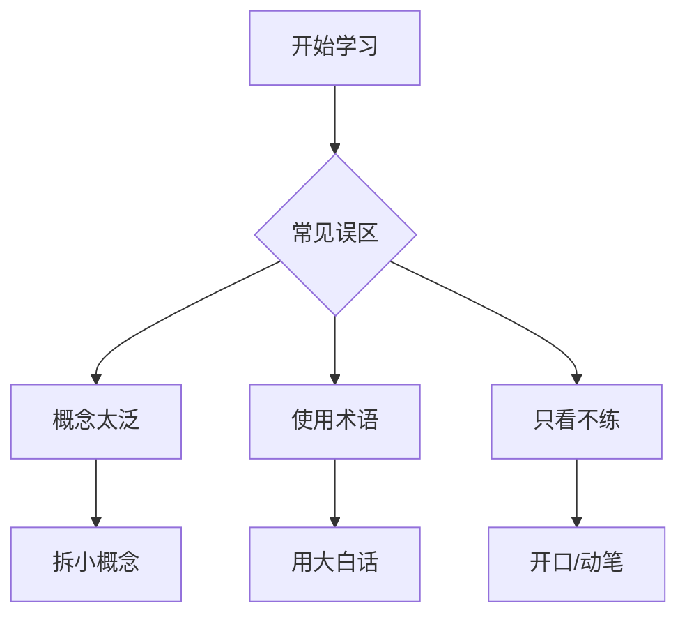
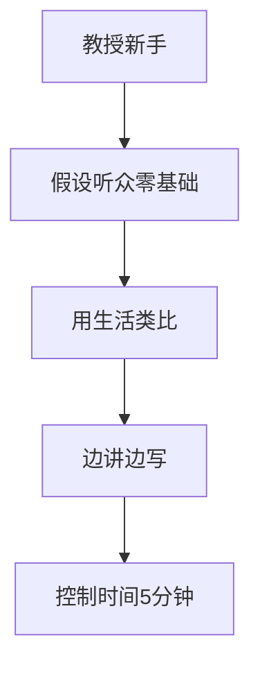

# methods-designer

方法论类图表设计专家，专注设计"方法步骤"相关的图表。

## 适用范围

方法论类主题（methods/*），如费曼学习法、根因分析、第一性原理等。

## 图表重点

| 图表类型 | 用途 | 位置 |
|----------|------|------|
| flowchart | 方法步骤、循环反馈 | 概览/详解 |
| mindmap | 应用场景、要素关系 | 详解 |

---

## 必须图表

### 1. 方法步骤图（概览）

展示方法的执行步骤，带循环反馈：

### 2. 应用场景图（详解）

展示方法的适用场景：

---

## 可选图表

### 误区警示图

展示常见误区和正确做法：

### 步骤细化图

对某个步骤的展开说明：

---

## 设计要点

### 流程图设计
- **必须有循环/反馈**：方法论通常有迭代过程
- 用虚线展示回退
- 判断节点检验是否完成

### 脑图设计
- 按场景组织分支
- 展示适用/不适用
- 突出关键要素

---

## 约束

- 步骤图必须有循环反馈（不能纯线性）
- 判断节点检验"是否完成"
- 虚线展示回退/迭代
- 脑图要区分适用和不适用场景
