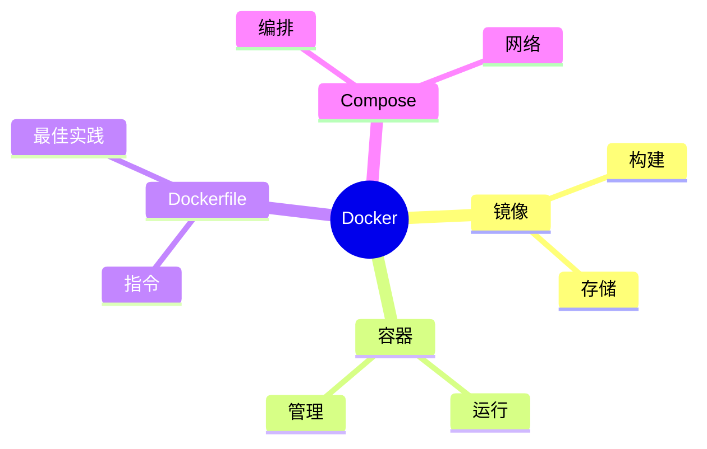
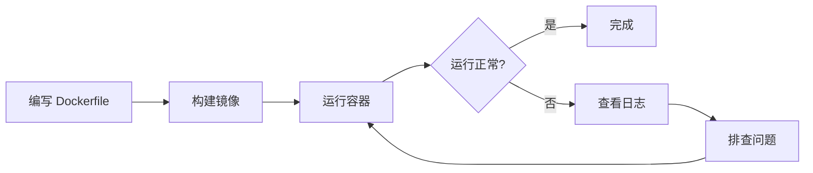
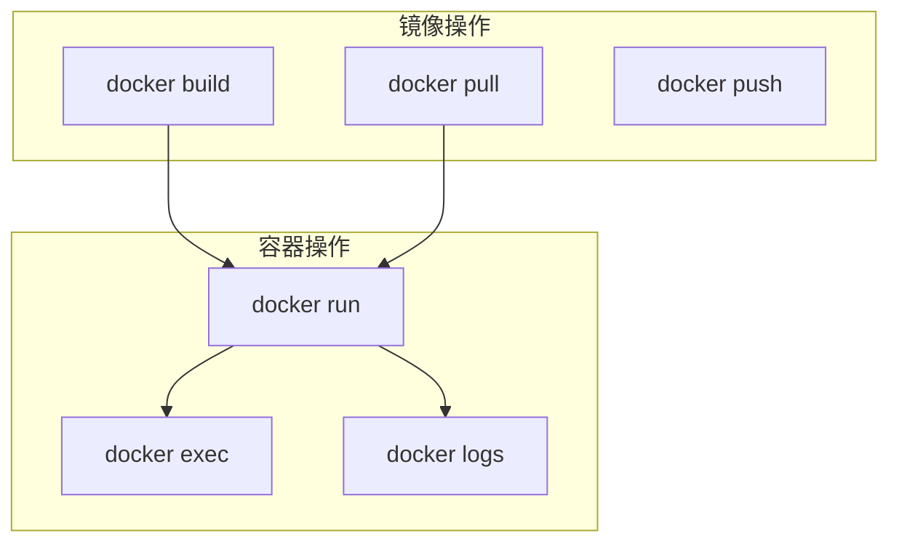

# tools-designer

工具类图表设计专家，专注设计"操作流程"相关的图表。

## 适用范围

工具类主题（tools/*），如 Docker、Git、VS Code 等。

## 图表重点

| 图表类型 | 用途 | 位置 |
|----------|------|------|
| mindmap | 知识体系/命令关系 | 概览 |
| flowchart | 操作流程、排查步骤 | 详解/实战 |

---

## 必须图表

### 1. 知识体系脑图（概览）

展示工具的核心概念和命令关系：

### 2. 操作流程图（详解/实战）

展示使用步骤，带判断分支：

---

## 可选图表

### 命令关系图

展示核心命令之间的关系：

---

## 设计要点

### 流程图设计
- 用判断节点 `{}` 展示分支
- 用虚线 `-.->` 展示回退/重试
- 标注常见问题分支

### 脑图设计
- 按操作流程组织分支
- 每个分支对应一组命令
- 最多 3 层深度

---

## 约束

- 流程图必须有判断分支（不能纯线性）
- 脑图按操作流程组织
- 命令用英文，说明用中文
