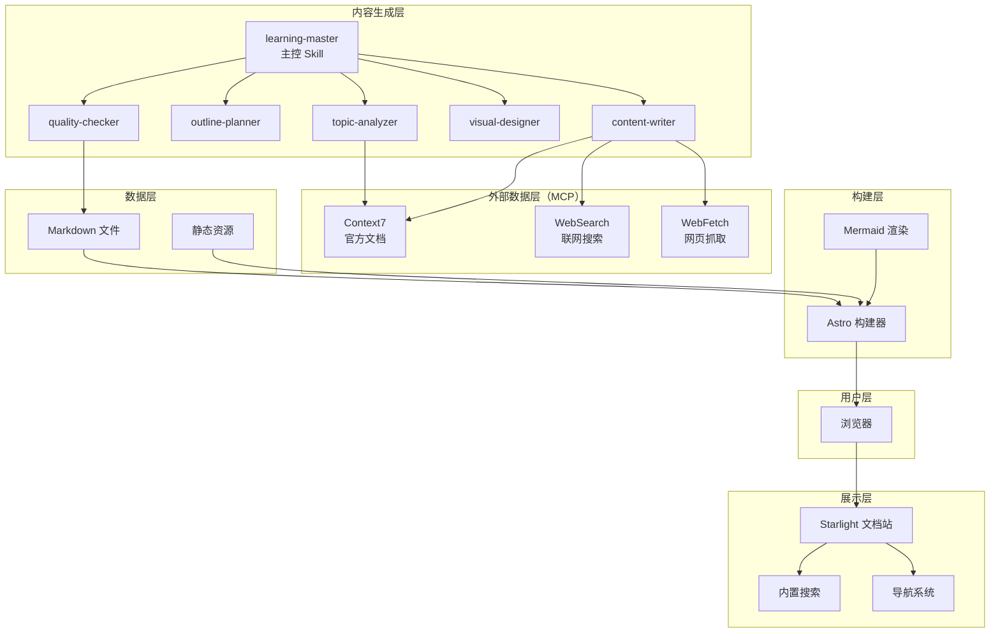
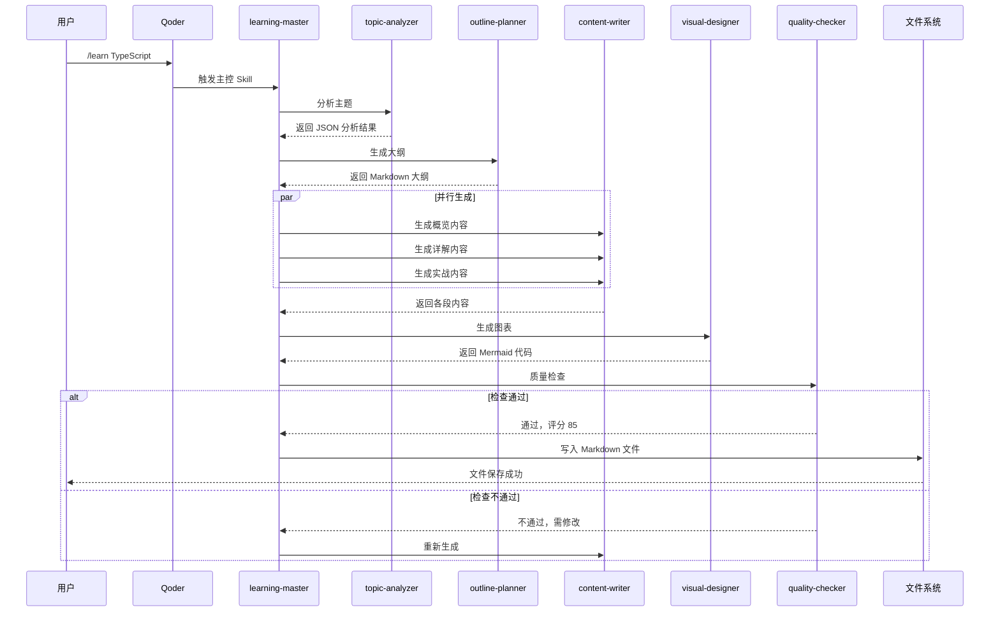
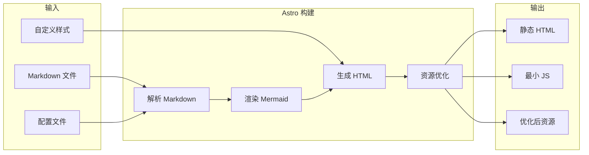
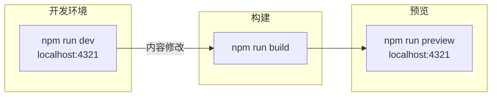

# StudyBuddy 技术架构设计

> 版本：v1.0  
> 更新日期：2026-02-24

---

## 1. 系统架构概览

### 1.1 分层架构图



### 1.2 技术选型决策

| 层级 | 技术选择 | 备选方案 | 选择理由 |
|------|----------|----------|----------|
| 框架 | Astro | Next.js, Gatsby | 零 JS 默认、构建速度快 |
| 主题 | Starlight | Docusaurus | 开箱即用、MIT 协议 |
| 图表 | Mermaid | D3.js, Chart.js | Markdown 原生、AI 友好 |
| 部署 | Vercel | Netlify, GitHub Pages | 自动部署、预览环境 |

---

## 2. 数据流设计

### 2.1 文档生成流程



### 2.2 站点构建流程



---

## 3. 目录结构设计

### 3.1 项目结构

```
study-buddy/
├── docs/                          # 项目文档（你正在看的）
│   ├── 01-PROJECT-BRIEF.md
│   ├── 02-REQUIREMENTS.md
│   ├── 03-ARCHITECTURE.md
│   └── 04-AI-SKILL-SPEC.md
│
├── src/
│   ├── content/
│   │   └── docs/                  # 学习文档（纯 Markdown）
│   │       ├── tools/             # 工具类
│   │       │   ├── ai-coding/     # AI 编程工具（Qoder、Cursor）
│   │       │   ├── efficiency/    # 效率工具（Docker、Git）
│   │       │   └── knowledge/     # 知识管理工具（Obsidian）
│   │       ├── domains/           # 领域类
│   │       │   ├── frontend/      # 前端开发
│   │       │   ├── backend/       # 后端开发
│   │       │   ├── data/          # 数据科学
│   │       │   └── management/    # 技术管理
│   │       └── methods/           # 方法论类
│   │           ├── learning/      # 学习方法
│   │           └── thinking/      # 思维框架
│   │
│   ├── components/                # 自定义组件
│   │   ├── MermaidDiagram.astro   # Mermaid 图表组件
│   │   ├── Cheatsheet.astro       # 速查表样式组件
│   │   └── SkillLevel.astro       # 难度等级标签
│   │
│   └── styles/
│       └── custom.css             # 自定义主题样式
│
├── public/
│   └── images/                    # 静态资源
│
├── .qoder/
│   └── skills/                    # Qoder Skills
│       ├── learning-master/
│       │   └── SKILL.md
│       ├── topic-analyzer/
│       │   └── SKILL.md
│       ├── outline-planner/
│       │   └── SKILL.md
│       ├── content-writer/
│       │   └── SKILL.md
│       ├── visual-designer/
│       │   └── SKILL.md
│       └── quality-checker/
│           └── SKILL.md
│
├── astro.config.mjs               # Astro 配置
├── package.json
└── tsconfig.json
```

### 3.2 文档分类体系

| 分类 | 路径 | 内容范围 | 子分类示例 |
|------|------|----------|------------|
| **工具** | `/docs/tools/` | 各类软件工具的使用 | AI 编程、效率工具、知识管理 |
| **领域** | `/docs/domains/` | 技术领域知识体系 | 前端、后端、数据、管理 |
| **方法论** | `/docs/methods/` | 学习方法与思维框架 | 学习方法、思维框架 |

### 3.3 文档命名规范

| 规则 | 示例 |
|------|------|
| 使用 kebab-case | `typescript-basics.md` |
| 主题明确 | `react-hooks.md` 而非 `react.md` |
| 避免缩写 | `kubernetes.md` 而非 `k8s.md` |
| 单词数 1-3 个 | `design-patterns.md` |

---

## 4. 关键模块设计

### 4.1 Mermaid 集成

**配置方式**（astro.config.mjs）：

```javascript
import { defineConfig } from 'astro/config';
import starlight from '@astrojs/starlight';

export default defineConfig({
  integrations: [
    starlight({
      title: 'StudyBuddy',
      // Mermaid 通过 remark 插件集成
      customCss: ['./src/styles/custom.css'],
    }),
  ],
  markdown: {
    remarkPlugins: ['remark-mermaid'],
  },
});
```

**支持的图表类型**：

| 类型 | 语法 | 用途 |
|------|------|------|
| 思维导图 | `mindmap` | 知识体系概览 |
| 流程图 | `flowchart` | 使用步骤、决策流程 |
| 时序图 | `sequenceDiagram` | 交互过程、API 调用 |
| 类图 | `classDiagram` | 数据结构、类关系 |
| 状态图 | `stateDiagram-v2` | 状态机、生命周期 |

### 4.2 速查表组件

**组件设计**（Cheatsheet.astro）：

```astro
---
interface Props {
  title: string;
  items: { key: string; value: string; }[];
}
const { title, items } = Astro.props;
---

<div class="cheatsheet">
  <h4>{title}</h4>
  <table>
    <tbody>
      {items.map(item => (
        <tr>
          <td class="key"><code>{item.key}</code></td>
          <td class="value">{item.value}</td>
        </tr>
      ))}
    </tbody>
  </table>
</div>

<style>
  .cheatsheet {
    background: var(--sl-color-bg-nav);
    border-radius: 8px;
    padding: 1rem;
    margin: 1rem 0;
  }
  .cheatsheet table {
    width: 100%;
    border-collapse: collapse;
  }
  .key {
    width: 40%;
    font-weight: 600;
  }
</style>
```

---

## 5. 本地使用方案

### 5.1 开发与预览



### 5.2 常用命令

```bash
# 开发模式（热更新）
npm run dev

# 构建静态站点
npm run build

# 预览构建结果
npm run preview
```

### 5.3 使用流程

1. **生成文档**：在 Qoder 中执行 `/learn {topic}` 生成学习文档
2. **本地预览**：执行 `npm run dev` 启动本地服务器
3. **浏览学习**：在浏览器访问 `localhost:4321` 查看文档

---

## 6. 性能优化策略

### 6.1 构建优化

| 策略 | 实现方式 | 预期效果 |
|------|----------|----------|
| 增量构建 | Astro 默认支持 | 减少 50% 构建时间 |
| 图片优化 | `@astrojs/image` | 减少 70% 图片体积 |
| 代码分割 | 自动 | 减少首屏 JS |

### 6.2 运行时优化

| 策略 | 实现方式 | 预期效果 |
|------|----------|----------|
| 静态生成 | Astro 默认 | 零运行时 JS |
| CDN 缓存 | Vercel Edge | < 50ms TTFB |
| 懒加载图表 | Intersection Observer | 提升首屏速度 |

---

## 7. 扩展性设计

### 7.1 新增分类

添加新分类只需：
1. 在 `src/content/docs/` 下创建目录
2. 在 `astro.config.mjs` 的 sidebar 配置中添加入口

### 7.2 新增 Skill

添加新 Skill 只需：
1. 在 `.qoder/skills/` 下创建目录
2. 编写 `SKILL.md` 定义
3. 在 `learning-master` 中注册调用

### 7.3 自定义组件

添加新组件只需：
1. 在 `src/components/` 下创建 `.astro` 文件
2. 在 Markdown 中通过 MDX 语法引用

---

**文档结束**
