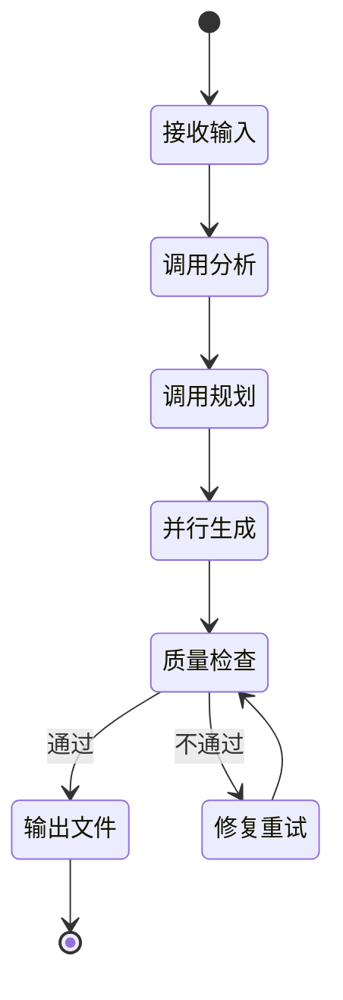
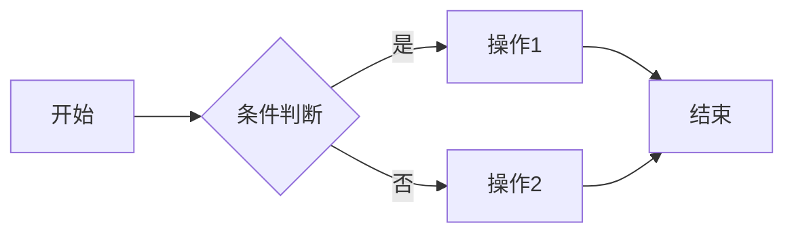
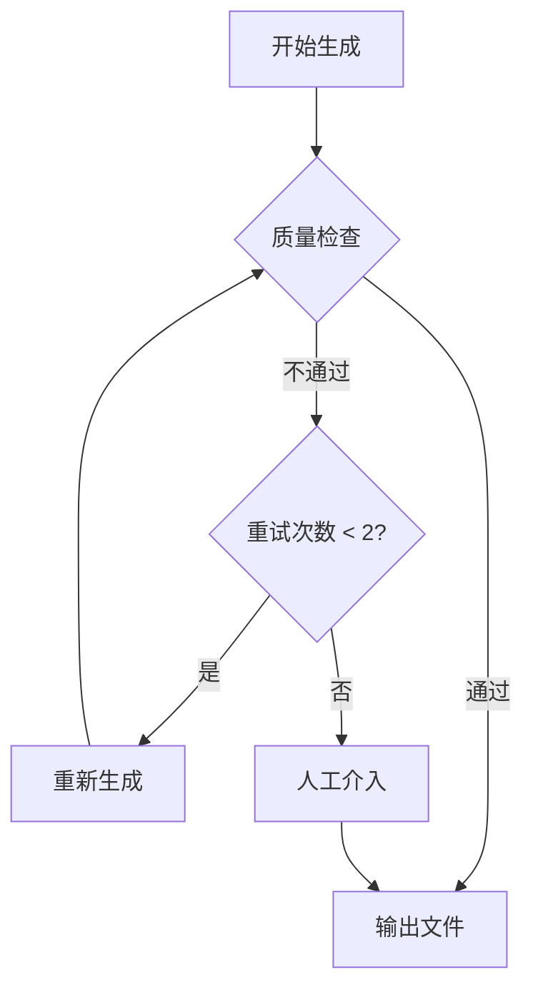

# StudyBuddy AI Skill 规格说明

> 版本：v1.0  
> 更新日期：2026-02-24

---

## 核心理念：管理者视角

> **AI 时代，会管比会做更有直接价值**

本 Skill 体系设计以**管理者视角**为核心：
- **关注整体而非细节**：了解技术的"是什么"和"为什么"，而非深入实现
- **强调应用场景判断**：知道"何时用"比"怎么用"更重要
- **重视知识体系构建**：建立思维链和速查手册，需要时快速检索

---

## 1. Skill 架构概览

### 1.1 六个子 Skill 协作模型

```mermaid
flowchart TB
    subgraph 输入
        User[用户输入<br/>/learn {topic}]
    end
    
    subgraph 主控层
        Master[learning-master<br/>任务编排]
    end
    
    subgraph 外部数据层["外部数据层（MCP）"]
        Context7[Context7<br/>官方文档查询]
        WebSearch[WebSearch<br/>联网搜索]
        WebFetch[WebFetch<br/>网页抓取]
    end
    
    subgraph 分析层
        Analyzer[topic-analyzer<br/>主题分析]
    end
    
    subgraph 规划层
        Planner[outline-planner<br/>大纲规划]
    end
    
    subgraph 生成层
        Writer[content-writer<br/>内容撰写]
        Designer[visual-designer<br/>图表生成]
    end
    
    subgraph 质控层
        Checker[quality-checker<br/>质量检查]
    end
    
    subgraph 输出
        Output[Markdown 文件]
    end
    
    User --> Master
    Master --> Analyzer
    Analyzer --> Context7
    Analyzer --> Planner
    Planner --> Writer
    Planner --> Designer
    Writer --> WebSearch
    Writer --> WebFetch
    Writer --> Context7
    Writer --> Checker
    Designer --> Checker
    Checker -->|通过| Output
    Checker -->|不通过| Writer
```

### 1.2 Skill 职责分工

| Skill | 职责 | 输入 | 输出 |
|-------|------|------|------|
| **learning-master** | 主控编排 | 用户主题 | 最终文档 |
| **topic-analyzer** | 主题分析 | 主题字符串 | 分析 JSON |
| **outline-planner** | 大纲规划 | 分析 JSON | 大纲 Markdown |
| **content-writer** | 内容撰写 | 大纲 + 段落指定 | 内容 Markdown |
| **visual-designer** | 图表生成 | 大纲 | Mermaid 代码 |
| **quality-checker** | 质量检查 | 完整内容 | 检查报告 |

### 1.3 MCP 集成（外部数据源）

为确保生成内容的**时效性和准确性**，避免仅依赖模型训练数据，必须集成以下 MCP 工具：

| MCP 工具 | 用途 | 调用时机 |
|----------|------|----------|
| **Context7** | 查询官方文档、API 参考 | topic-analyzer 分析阶段、content-writer 撰写阶段 |
| **WebSearch** | 联网搜索最新资讯、最佳实践 | content-writer 撰写实战案例时 |
| **WebFetch** | 抓取指定网页内容 | 获取官方教程、博客文章 |

#### 1.3.1 为什么需要联网查询？

| 问题 | 风险 | 解决方案 |
|------|------|----------|
| 模型训练数据过时 | 版本号错误、API 已废弃 | 使用 Context7 查询官方文档 |
| 最佳实践演变 | 推荐过时的做法 | WebSearch 搜索最新实践 |
| 示例代码不可运行 | 依赖版本不匹配 | WebFetch 获取官方示例 |

#### 1.3.2 MCP 调用策略

```yaml
# 数据获取优先级
priority:
  1. Context7 官方文档  # 最权威
  2. WebFetch 官方网站  # 次权威
  3. WebSearch 社区资源 # 补充参考
  4. 模型内置知识      # 兜底方案

# 必须联网的场景
must_fetch:
  - 版本号和发布日期
  - API 签名和参数
  - 安装/配置命令
  - 官方推荐的最佳实践
  
# 可用内置知识的场景
can_use_builtin:
  - 概念解释和类比
  - 通用设计模式
  - 不涉及版本的原理说明
```

#### 1.3.3 Context7 调用示例

```markdown
# 在 content-writer 中调用 Context7

## 任务
撰写 React Hooks 的 useEffect 章节

## MCP 调用
1. 调用 Context7 查询 "React useEffect official documentation"
2. 获取最新的 API 签名、参数说明、注意事项
3. 基于官方文档撰写内容，标注数据来源

## 输出要求
- 版本号必须来自 Context7 查询结果
- 示例代码必须与官方文档一致
- 在文档末尾标注"数据来源：React 官方文档 (2024)"
```

---

## 2. Skill 1: learning-master（主控编排）

### 2.1 基本信息

| 属性 | 值 |
|------|-----|
| 名称 | learning-master |
| 触发命令 | `/learn {topic} [--category={cat}] [--level={level}]` |
| 职责 | 协调所有子 Skill，控制生成流程 |

### 2.2 工作流程



### 2.3 Prompt 模板

```markdown
# learning-master

你是学习文档生成的主控协调者。

## 任务
接收用户的学习主题，协调以下子 Skill 完成高质量学习文档生成：

1. **topic-analyzer**：分析主题复杂度和知识结构
2. **outline-planner**：生成符合三阶段框架的大纲
3. **content-writer**：分段撰写内容（概览/详解/实战）
4. **visual-designer**：生成 Mermaid 图表
5. **quality-checker**：质量检查与评分

## 输入格式
- topic: 学习主题（必填）
- category: 分类（可选，默认自动识别）
- level: 难度（可选，beginner/intermediate/advanced）

## 输出
生成完整的 Markdown 文件，保存到 `src/content/docs/{category}/{slug}.md`

## 约束
- 生成时间控制在 30 秒内
- 质量检查评分 >= 80 分才输出
- 失败最多重试 2 次
```

---

## 3. Skill 2: topic-analyzer（主题分析）

### 3.1 基本信息

| 属性 | 值 |
|------|-----|
| 名称 | topic-analyzer |
| 调用方式 | 由 learning-master 调用 |
| 职责 | 分析主题，输出结构化元数据 |

### 3.2 输出 Schema

```json
{
  "topic": "TypeScript",
  "slug": "typescript",
  "one_sentence": "TypeScript 是 JavaScript 的超集，添加了静态类型系统",
  "problem_solved": "解决 JavaScript 大型项目中类型不安全导致的维护困难",
  "use_cases": [
    "大型前端项目开发",
    "Node.js 后端开发",
    "需要 IDE 智能提示的场景"
  ],
  "prerequisites": [
    "JavaScript 基础语法",
    "ES6+ 特性"
  ],
  "complexity": "intermediate",
  "estimated_sections": 6,
  "key_concepts": [
    "类型注解",
    "接口与类型别名",
    "泛型",
    "类型推断",
    "装饰器"
  ],
  "category": "domains/frontend",
  "suggested_diagrams": [
    "mindmap",
    "flowchart"
  ]
}
```

### 3.3 Prompt 模板

```markdown
# topic-analyzer

你是一位技术主题分析专家，擅长从管理者视角解构知识体系。

## 任务
分析学习主题 "{{topic}}"，输出结构化分析结果。

## 输出要求（JSON 格式）
- topic: 主题名称
- slug: URL 友好的标识符（kebab-case）
- one_sentence: 一句话定义（不超过 50 字）
- problem_solved: 解决的核心问题
- use_cases: 3-5 个典型使用场景
- prerequisites: 前置知识（不超过 3 个）
- complexity: beginner/intermediate/advanced
- estimated_sections: 预计章节数（5-8）
- key_concepts: 核心概念（3-5 个），按“从基础到进阶”的顺序排列
- category: tools/domains/methods
- suggested_diagrams: 建议的图表类型

## 知识点归类原则

- **tools（工具类）**：具体工具/平台的使用与配置，如 Docker、Git、VS Code、Qoder、Cursor。
  - 子分类：`tools/ai-coding`（AI 编程工具）、`tools/efficiency`（效率工具）、`tools/knowledge`（知识管理工具）。
- **domains（领域类）**：技术领域或问题域的知识体系，如 前端开发、后端开发、数据科学、技术管理。
  - 子分类：`domains/frontend`、`domains/backend`、`domains/data`、`domains/management`。
- **methods（方法论）**：学习方法、思维框架、问题解决策略，如 费曼学习法、间隔重复、根因分析、第一性原理。
  - 子分类：`methods/learning`（学习方法）、`methods/thinking`（思维框架）、`methods/problem-solving`（问题解决策略）。

可按以下决策顺序判断：
1. 是否围绕一个具体工具/产品的使用与配置？→ tools
2. 是否讨论某个技术领域/岗位/架构方向的整体知识？→ domains
3. 是否重点讲“如何学习/如何思考/如何拆问题”？→ methods

## 约束
- 管理者视角，不涉及实现细节
- 一句话定义要通俗易懂
- 前置知识要精简，降低学习门槛
```

---

## 4. Skill 3: outline-planner（大纲规划）

### 4.1 基本信息

| 属性 | 值 |
|------|-----|
| 名称 | outline-planner |
| 调用方式 | 由 learning-master 调用 |
| 职责 | 生成符合三阶段框架的大纲 |

### 4.2 输出格式

```markdown
---
title: TypeScript
description: TypeScript 是 JavaScript 的超集，添加了静态类型系统
category: domains/frontend
level: intermediate
tags: [typescript, 静态类型, 前端]
duration: 90
---

# 概览（5 分钟）

## 一句话定义
## 核心问题
## 适用场景
## 前置知识
## 思维导图
<!-- DIAGRAM: mindmap -->

# 分章节详解（60 分钟）

## 类型注解
### 是什么
### 为什么
### 怎么用

## 接口与类型别名
### 是什么
### 为什么
### 怎么用

## 泛型
### 是什么
### 为什么
### 怎么用

## 类型推断
### 是什么
### 为什么
### 怎么用

# 联动应用（25 分钟）

## 初级：单一特性应用
## 中级：2-3 特性组合
## 高级：完整项目实战
<!-- DIAGRAM: flowchart -->

# 速查表

# 扩展阅读
```

### 4.3 Prompt 模板

```markdown
# outline-planner

你是一位学习大纲设计专家，擅长构建渐进式知识结构。

## 任务
基于主题分析结果，生成符合三阶段学习框架的大纲。

## 输入
{{analysis_json}}

## 三阶段框架

### 阶段一：概览（鸟瞰）
- 一句话定义
- 核心解决的问题
- 适用场景（3-5 个）
- 前置知识
- 思维导图（标记 <!-- DIAGRAM: mindmap -->）

### 阶段二：分章节详解（解剖）
每个核心概念按以下格式：
- 是什么：一句话定义 + 类比
- 为什么：解决的痛点
- 怎么用：最小示例 + 速查表

### 阶段三：联动应用（实战）
- 初级：单一特性（5 分钟）
- 中级：2-3 特性组合（15 分钟）
- 高级：完整项目 + 最佳实践（30 分钟）

## 输出
带 frontmatter 的 Markdown 大纲，用 <!-- DIAGRAM: type --> 标记图表位置

## 约束
- 概览控制在 5 分钟阅读量
- 详解每个概念控制在 10 分钟
- 总时长不超过 90 分钟
```

---

## 5. Skill 4: content-writer（内容撰写）

### 5.1 基本信息

| 属性 | 值 |
|------|-----|
| 名称 | content-writer |
| 调用方式 | 由 learning-master 并行调用 |
| 职责 | 按段落生成高质量内容 |

### 5.2 分段模式

| 段落 | 调用参数 | 内容要求 |
|------|----------|----------|
| overview | `section=overview` | 概览阶段全部内容 |
| details | `section=details` | 详解阶段全部内容 |
| practices | `section=practices` | 实战阶段全部内容 |

### 5.3 Prompt 模板（概览段）

```markdown
# content-writer (overview)

你是一位技术作家，擅长用通俗语言解释复杂概念。

## 任务
撰写学习文档的「概览」章节。

## 输入
- 主题：{{topic}}
- 大纲：{{outline}}

## 内容要求

### 一句话定义
用类比解释，让初学者秒懂。
格式："{topic} 就像 {类比}，它能..."

### 核心解决的问题
说明：没有它之前怎样？有了它之后怎样？
使用对比句式增强记忆。

### 适用场景
列出 3-5 个具体场景，每个场景带判断标准：
"当你遇到 {情况} 时，应该考虑使用 {topic}"

### 前置知识
列出学习本主题前需要掌握的内容，附简要说明或学习链接。

## 约束
- 控制在 500 字以内
- 不涉及代码细节
- 语言风格：专业但易懂
```

### 5.4 Prompt 模板（详解段）

```markdown
# content-writer (details)

你是一位技术作家，擅长结构化讲解技术概念。

## 任务
撰写学习文档的「分章节详解」内容。

## 输入
- 主题：{{topic}}
- 大纲：{{outline}}
- 核心概念：{{key_concepts}}

## 每个概念的结构

### 是什么
- 一句话定义
- 用已知概念类比解释

### 为什么
- 解决什么问题
- 没有它的痛点是什么

### 怎么用
- 最小可运行示例（控制在 10 行代码内）
- 速查表（Markdown 表格，3-5 行）
- 常见陷阱（不超过 3 个）

## 信息层次与信息差补全

- 先用管理者视角给出整体总结，让读者知道「这个概念在整个体系里的位置」。
- 再补 1-2 个关键细节，用于弥补信息差（例如典型参数、重要边界条件、常见误用场景），保证读完以后可以真正落地使用，而不是只停留在抽象理解上。
- 根据概念复杂度，可适度放宽字数上限，以保证上述关键细节有空间呈现。
- 示例中的注释不要解释“这是一个变量/这是一个函数/这里是 for 循环”这类显而易见的语法，而是说明这段代码在场景中的作用、意图或关键决策点。

## MCP 调用要求（重要）
生成内容前，必须调用 MCP 获取最新信息：

1. **Context7**：查询官方文档获取准确的 API 签名和参数
2. **WebSearch**：搜索最新版本号、最佳实践
3. **WebFetch**：抓取官方示例代码

禁止仅依赖模型训练数据生成以下内容：
- 版本号和发布日期
- API 参数和返回值
- 安装/配置命令
- 官方推荐写法

## 约束
- 每个概念控制在 300 字 + 代码，可根据复杂度适度放宽
- 示例代码必须可运行（来自官方文档或经验证）
- 避免深入底层实现
- 必须标注数据来源（如：来源：React 官方文档 v18.2）
```

### 5.5 Prompt 模板（实战段）

```markdown
# content-writer (practices)

你是一位技术导师，擅长设计渐进式练习。

## 任务
撰写学习文档的「联动应用」章节。

## 输入
- 主题：{{topic}}
- 大纲：{{outline}}
- 核心概念：{{key_concepts}}

## 难度分级要求

### 初级（5 分钟）
- 单一特性应用
- 目标：验证基础理解
- 格式：任务描述 + 参考答案

### 中级（15 分钟）
- 2-3 个特性组合
- 目标：解决实际问题
- 格式：场景描述 + 思路提示 + 完整代码

### 高级（30 分钟）
- 完整项目实战
- 目标：掌握最佳实践
- 格式：项目需求 + 架构设计 + 核心代码 + 优化建议

## 约束
- 每个练习必须有明确的完成标准
- 代码量递增：初级 10 行、中级 30 行、高级 100 行
- 包含常见错误和排查方法
```

---

## 6. Skill 5: visual-designer（图表生成）

### 6.1 基本信息

| 属性 | 值 |
|------|-----|
| 名称 | visual-designer |
| 调用方式 | 由 learning-master 调用 |
| 职责 | 生成 Mermaid 可视化图表 |

### 6.2 图表类型规范

| 图表类型 | 用途 | 语法示例 |
|----------|------|----------|
| mindmap | 知识体系概览（全貌脑图） | `mindmap root((Topic))` |
| flowchart | 使用流程、决策树 | `flowchart LR A-->B` |
| sequenceDiagram | 交互过程 | `sequenceDiagram A->>B: msg` |
| classDiagram | 类型关系 | `classDiagram class A` |

对于**内容多、关联关系复杂的单个知识点或章节**，允许在对应小节后额外生成一张局部 mindmap 或 flowchart，用于呈现该点的内部结构和上下游关系，作为全局脑图的补充记忆钩子。

### 6.3 Prompt 模板

````markdown
# visual-designer

你是一位技术图表专家，擅长用 Mermaid 语法创建清晰的可视化图表。

## 任务
为学习文档生成 Mermaid 图表。

## 输入
- 主题：{{topic}}
- 大纲：{{outline}}
- 图表位置：{{diagram_markers}}

## 必须生成的图表

### 1. 思维导图（mindmap）
展示知识体系全貌，用于概览章节。

```mermaid
mindmap
  root(({{topic}}))
    核心概念1
      子概念1.1
      子概念1.2
    核心概念2
      子概念2.1
    核心概念3
```

### 2. 流程图（flowchart）
展示使用步骤或决策流程，用于详解或实战章节。



## 输出格式
直接输出 Mermaid 代码块，每个图表带注释说明用途。

## 约束
- 每个主题至少生成 2 个图表
- 节点文字简洁（不超过 10 字）
- 避免过深的层级（mindmap 最多 3 层）
- 确保语法正确，可直接渲染
````

---

## 7. Skill 6: quality-checker（质量检查）

### 7.1 基本信息

| 属性 | 值 |
|------|-----|
| 名称 | quality-checker |
| 调用方式 | 由 learning-master 调用 |
| 职责 | 检查内容质量，输出评分和改进建议 |

### 7.2 检查清单

#### 结构检查（30 分）

| 检查项 | 分值 | 标准 |
|--------|------|------|
| 三阶段完整 | 10 | 概览、详解、实战三部分齐全 |
| 每概念三要素 | 10 | 是什么、为什么、怎么用 |
| 难度分级清晰 | 10 | 初级、中级、高级区分明确 |

#### 内容检查（40 分）

| 检查项 | 分值 | 标准 |
|--------|------|------|
| 一句话定义通俗 | 10 | 无专业术语堆砌 |
| 类比恰当 | 10 | 用已知解释未知 |
| 示例可运行 | 10 | 代码语法正确 |
| 速查表实用 | 10 | 覆盖高频操作 |

#### 格式检查（30 分）

| 检查项 | 分值 | 标准 |
|--------|------|------|
| Markdown 语法 | 10 | 无格式错误 |
| 表格规范 | 10 | 对齐、无空列 |
| Mermaid 语法 | 10 | 可正确渲染 |

### 7.3 输出 Schema

```json
{
  "score": 85,
  "passed": true,
  "breakdown": {
    "structure": 28,
    "content": 35,
    "format": 22
  },
  "issues": [
    {
      "severity": "warning",
      "location": "详解/泛型/怎么用",
      "issue": "示例代码缺少类型注解"
    }
  ],
  "suggestions": [
    "建议在泛型示例中添加具体的类型参数",
    "速查表可增加常见错误处理方式"
  ]
}
```

### 7.4 Prompt 模板

```markdown
# quality-checker

你是一位严格的技术文档审核专家。

## 任务
检查学习文档质量，输出评分和改进建议。

## 输入
{{full_content}}

## 检查清单

### 结构检查（30 分）
- [ ] 是否包含概览、详解、实战三阶段
- [ ] 每个概念是否包含"是什么-为什么-怎么用"
- [ ] 难度分级是否清晰（初级/中级/高级）

### 内容检查（40 分）
- [ ] 一句话定义是否通俗易懂（无术语堆砌）
- [ ] 类比是否恰当（用已知解释未知）
- [ ] 代码示例是否可运行（语法正确）
- [ ] 速查表是否实用（覆盖高频操作）

### 格式检查（30 分）
- [ ] Markdown 语法是否正确
- [ ] 表格格式是否规范
- [ ] Mermaid 语法是否可渲染

## 输出要求
JSON 格式，包含：
- score: 总分（0-100）
- passed: 是否通过（>= 80 为通过）
- breakdown: 分项得分
- issues: 问题列表（含严重程度、位置、描述）
- suggestions: 改进建议（不超过 3 条）

## 评分标准
- 90-100：优秀，可直接发布
- 80-89：良好，小问题可接受
- 70-79：一般，需要修改
- < 70：不合格，需重新生成
```

---

## 8. Skill 间数据传递

### 8.1 数据流图

```mermaid
flowchart LR
    subgraph 输入
        Input[用户输入<br/>topic, category, level]
    end
    
    subgraph Analyzer
        A_In[topic: string]
        A_Out[analysis: JSON]
    end
    
    subgraph Planner
        P_In[analysis: JSON]
        P_Out[outline: Markdown]
    end
    
    subgraph Writer
        W_In[outline + section]
        W_Out[content: Markdown]
    end
    
    subgraph Designer
        D_In[outline: Markdown]
        D_Out[diagrams: Mermaid[]]
    end
    
    subgraph Checker
        C_In[full_content: Markdown]
        C_Out[report: JSON]
    end
    
    Input --> A_In
    A_Out --> P_In
    P_Out --> W_In
    P_Out --> D_In
    W_Out --> C_In
    D_Out --> C_In
```

### 8.2 数据格式约定

| 传递点 | 格式 | 说明 |
|--------|------|------|
| 用户 → Master | 字符串 | `/learn TypeScript --level=intermediate` |
| Master → Analyzer | 字符串 | 主题名称 |
| Analyzer → Planner | JSON | 分析结果（见 3.2） |
| Planner → Writer | Markdown | 大纲模板 |
| Planner → Designer | Markdown | 大纲 + 图表标记 |
| Writer → Checker | Markdown | 段落内容 |
| Designer → Checker | Mermaid | 图表代码 |
| Checker → Master | JSON | 检查报告（见 7.3） |

---

## 9. 错误处理与回退机制

### 9.1 错误类型

| 错误类型 | 触发条件 | 处理方式 |
|----------|----------|----------|
| 分析失败 | 主题过于模糊 | 提示用户细化主题 |
| 大纲不完整 | 缺少必要章节 | 自动补充 |
| 内容质量低 | 评分 < 80 | 重新生成（最多 2 次） |
| 图表语法错误 | Mermaid 解析失败 | 简化图表结构 |
| 超时 | 生成时间 > 60s | 返回部分结果 |

### 9.2 回退流程



---

## 10. 使用示例

### 10.1 基础调用

```bash
# 在 Qoder 中执行
/learn Docker

# 输出
> 开始生成 Docker 学习文档...
> [1/6] 分析主题 ✓
> [2/6] 生成大纲 ✓
> [3/6] 撰写概览 ✓
> [4/6] 撰写详解 ✓
> [5/6] 撰写实战 ✓
> [6/6] 生成图表 ✓
> [7/6] 质量检查 ✓ (得分: 87)
> 
> 文档已保存到：src/content/docs/tools/docker.md
```

### 10.2 高级调用

```bash
# 指定分类和难度
/learn Kubernetes --category=tools --level=advanced

# 批量生成（未来支持）
/learn "React, Vue, Angular" --category=domains/frontend
```

---

**文档结束**
