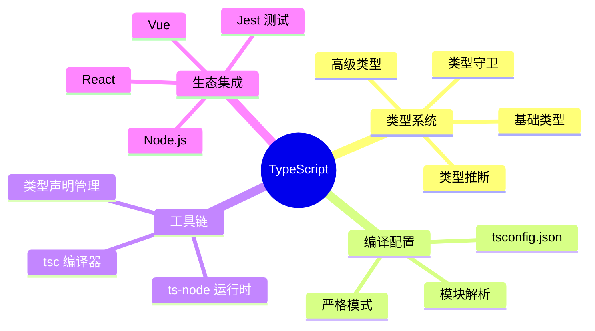
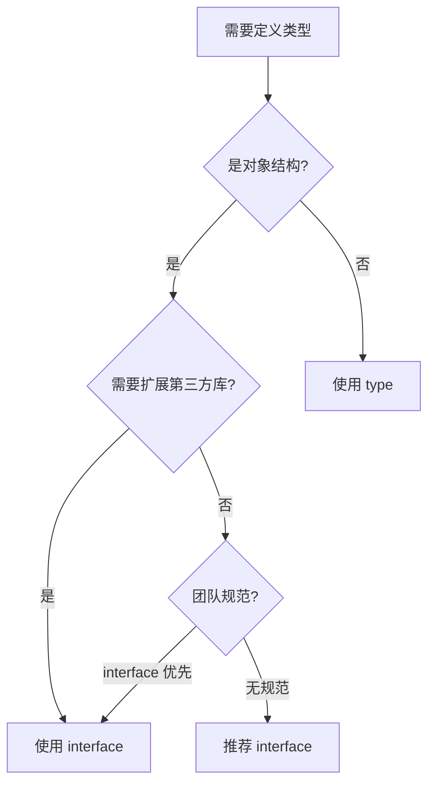

# 概览（5 分钟）

## 一句话定义

TypeScript 是 JavaScript 的超集，通过静态类型系统提升代码质量和开发体验，让大型项目更易维护。

## 核心问题

解决 JavaScript 缺乏类型检查导致的运行时错误和大型项目维护难题。

在纯 JavaScript 项目中，我们常遇到这些痛点：

- **重构恐惧症**：改一个变量名，不知道哪里会炸
- **调试困难**：`undefined is not a function` 要找半天
- **协作成本高**：看别人代码像猜谜，不知道参数类型和返回值

TypeScript 通过编译时类型检查，在代码运行前就发现这些问题。

## 适用场景

| 场景 | 是否推荐 | 理由 |
|------|---------|------|
| 大型前端应用（10k+ 行代码） | ⭐⭐⭐⭐⭐ | 类型系统让重构更安全 |
| Node.js 后端服务 | ⭐⭐⭐⭐⭐ | 提升接口定义清晰度 |
| 开源库和框架开发 | ⭐⭐⭐⭐⭐ | 自动生成类型声明 |
| 多人协作项目 | ⭐⭐⭐⭐ | 类型即文档 |
| 小型脚本（< 500 行） | ⭐⭐ | 配置成本高于收益 |

## 前置知识

- JavaScript ES6+ 基础（箭头函数、Promise、async/await）
- 面向对象编程概念（类、接口、继承）

## 知识点归类

```
TypeScript 知识体系
├── 类型系统基础
│   ├── 基础类型（string, number, boolean）
│   ├── 数组与元组
│   ├── 枚举与字面量类型
│   └── 联合类型与交叉类型
├── 高级类型特性
│   ├── 泛型
│   ├── 类型守卫
│   ├── 条件类型
│   └── 映射类型
├── 工程化配置
│   ├── tsconfig.json 配置
│   ├── 模块解析策略
│   └── 编译选项优化
└── 最佳实践
    ├── 类型声明文件（.d.ts）
    ├── 与 JavaScript 生态集成
    └── 性能优化策略
```

## 技术栈全景图



---

# 详解（60 分钟）

## 类型系统基础

### 是什么

TypeScript 的类型系统是一套**编译时**的类型约束机制，类似「合同条款」——定义变量、函数、对象的「形状」，编译器负责检查代码是否违约。

核心概念：

- **类型注解**：显式声明类型 `let age: number = 25`
- **类型推断**：编译器自动推导类型 `let name = "Alice"`（推断为 string）
- **结构化类型**：只要结构匹配即可，不要求名称一致（区别于 Java 的名义类型）

### 关键类型分类

| 类型类别 | 典型代表 | 使用场景 |
|---------|---------|---------|
| 基础类型 | `string`, `number`, `boolean` | 原始值 |
| 数组与元组 | `number[]`, `[string, number]` | 集合数据 |
| 对象类型 | `interface`, `type` | 复杂结构 |
| 联合/交叉 | `string \| number`, `A & B` | 类型组合 |
| 字面量类型 | `"success" \| "error"` | 精确值约束 |
| 函数类型 | `(x: number) => string` | 回调、高阶函数 |

### 决策影响

**何时使用 interface vs type**：

```typescript
// interface：适合定义对象形状，支持声明合并
interface User {
  name: string;
  age: number;
}
interface User {
  email: string; // 自动合并
}

// type：适合复杂类型组合
type ID = string | number;
type Status = "pending" | "success" | "error";
```

**选型依据**：

- 定义对象/类结构 → 优先 `interface`
- 联合类型/工具类型 → 使用 `type`
- 需要声明合并（如扩展第三方库）→ 必须用 `interface`



---

## 高级类型特性

### 是什么

高级类型是 TypeScript 的「类型编程」能力，通过泛型、条件类型等机制，让类型本身可以参与计算和转换。

**核心工具**：

- **泛型**：类型的「函数参数」
- **类型守卫**：运行时类型检查 + 编译时类型收窄
- **条件类型**：类型的「三元运算符」
- **映射类型**：批量转换对象类型

### 关键技术对比

| 特性 | 作用 | 示例 |
|-----|------|------|
| 泛型 | 类型复用，保留类型信息 | `Array<T>`, `Promise<T>` |
| 类型守卫 | 运行时安全收窄类型 | `typeof x === "string"` |
| 条件类型 | 根据条件选择类型 | `T extends U ? X : Y` |
| 映射类型 | 批量修改属性 | `Partial<T>`, `Readonly<T>` |

### 实战场景

**场景：封装通用请求函数**

```typescript
// 泛型保留返回值类型
async function request<T>(url: string): Promise<T> {
  const res = await fetch(url);
  return res.json();
}

// 使用时自动推断
const user = await request<User>("/api/user");
const posts = await request<Post[]>("/api/posts");
```

**场景：类型守卫解决联合类型**

```typescript
type Shape = Circle | Rectangle;

function getArea(shape: Shape) {
  // 类型守卫：检查属性存在性
  if ("radius" in shape) {
    return Math.PI * shape.radius ** 2; // 此处 shape 收窄为 Circle
  } else {
    return shape.width * shape.height; // 此处 shape 收窄为 Rectangle
  }
}
```

**工具类型速查**：

| 工具类型 | 作用 | 示例 |
|---------|------|------|
| `Partial<T>` | 所有属性变可选 | `Partial<User>` |
| `Required<T>` | 所有属性变必选 | `Required<Config>` |
| `Readonly<T>` | 所有属性只读 | `Readonly<State>` |
| `Pick<T, K>` | 提取部分属性 | `Pick<User, "name" \| "email">` |
| `Omit<T, K>` | 排除部分属性 | `Omit<User, "password">` |
| `Record<K, T>` | 构造键值对类型 | `Record<string, number>` |

---

## 工程化配置

### 是什么

`tsconfig.json` 是 TypeScript 项目的「宪法」，定义编译规则、模块解析策略、类型检查严格度。

核心配置分类：

- **编译选项**（`compilerOptions`）：输出格式、目标版本、模块系统
- **包含/排除**（`include`/`exclude`）：指定编译范围
- **类型检查**：严格模式、null 检查、隐式 any

### 关键配置项对比

| 配置项 | 作用 | 推荐值 |
|-------|------|--------|
| `target` | 编译输出 JS 版本 | `ES2020`（现代浏览器）|
| `module` | 模块系统 | `ESNext`（配合构建工具）|
| `strict` | 启用所有严格检查 | `true`（新项目必开）|
| `moduleResolution` | 模块解析策略 | `node`（Node.js 兼容）|
| `esModuleInterop` | CommonJS 互操作 | `true`（简化导入）|
| `skipLibCheck` | 跳过 `.d.ts` 检查 | `true`（加速编译）|
| `jsx` | JSX 支持 | `react-jsx`（React 17+）|

### 选型依据

**场景：新项目初始化**

```json
{
  "compilerOptions": {
    "target": "ES2020",
    "module": "ESNext",
    "lib": ["ES2020", "DOM"],
    "strict": true,
    "esModuleInterop": true,
    "skipLibCheck": true,
    "moduleResolution": "node",
    "resolveJsonModule": true,
    "isolatedModules": true,
    "jsx": "react-jsx"
  },
  "include": ["src/**/*"],
  "exclude": ["node_modules", "dist"]
}
```

**关键决策点**：

| 问题 | 选择 | 理由 |
|------|------|------|
| 需要支持 IE11? | `target: ES5` + polyfill | 兼容性 |
| 项目已有大量 JS? | `strict: false` 渐进迁移 | 减少迁移成本 |
| 构建速度慢? | 开启 `incremental`, `skipLibCheck` | 性能优化 |
| 使用 path alias? | 配置 `paths` 映射 | 简化导入路径 |

---

## 最佳实践

### 类型声明策略

**原则：类型即文档，不要重复自己（DRY）**

```typescript
// ❌ 不好：重复定义
function getUser(id: number): { name: string; age: number } {}
function updateUser(user: { name: string; age: number }) {}

// ✅ 好：提取类型
interface User {
  name: string;
  age: number;
}
function getUser(id: number): User {}
function updateUser(user: User) {}
```

### 与 JavaScript 生态集成

**场景：使用第三方 JS 库**

1. **优先安装类型包**：`npm install --save-dev @types/lodash`
2. **自定义声明文件**：

```typescript
// types/custom.d.ts
declare module "legacy-lib" {
  export function doSomething(x: number): string;
}
```

3. **渐进式迁移**：

```json
// tsconfig.json
{
  "compilerOptions": {
    "allowJs": true,        // 允许编译 .js 文件
    "checkJs": false,       // 不检查 .js 文件
    "noImplicitAny": false  // 允许隐式 any
  }
}
```

### 性能优化

| 问题 | 解决方案 | 效果 |
|------|---------|------|
| 编译慢 | 开启 `incremental` 增量编译 | 二次编译提速 50%+ |
| IDE 卡顿 | `skipLibCheck: true` | 跳过 node_modules 类型检查 |
| 类型检查过严 | 关闭部分 strict 子选项 | 渐进迁移 |
| 大型项目启动慢 | 使用 project references 拆分 | 模块化编译 |

### 前沿趋势

**TypeScript 5.x 新特性**：

- Decorators 正式支持（Stage 3）
- `const` 类型参数（更精确的类型推断）
- 性能优化（编译速度提升 20%）

**类型体操最佳实践**：避免过度复杂的类型计算，影响编译性能

**与 ESM 的深度集成**：`module: "NodeNext"` 完整支持 ESM

---

# 案例分析（25 分钟）

## 场景一：React 项目引入 TypeScript

### 需求背景

- 现有 React 项目（5 万行代码），使用 PropTypes 做类型检查
- 团队 8 人，前端 4 人，新成员加入频繁
- 痛点：重构风险高，PropTypes 运行时检查不够早

### 候选方案对比

| 方案 | 优势 | 劣势 |
|------|------|------|
| 全量迁移 TypeScript | 彻底解决类型问题 | 周期长（预计 2 个月），影响业务 |
| 渐进式迁移 | 风险可控，边开发边迁移 | 混合代码维护成本高 |
| 保持现状 + JSDoc | 无需改构建配置 | 类型检查不彻底 |

### 决策结果

选择**渐进式迁移**：

**第一阶段（2 周）**：

1. 安装 TypeScript：`npm install --save-dev typescript @types/react @types/react-dom`
2. 创建 `tsconfig.json`：

```json
{
  "compilerOptions": {
    "allowJs": true,        // 允许 .js 文件
    "checkJs": false,       // 暂不检查 .js
    "jsx": "react-jsx",
    "strict": false,        // 先关闭严格模式
    "noImplicitAny": false
  }
}
```

3. 新功能用 `.tsx` 开发，老代码保持 `.jsx`

**第二阶段（4 周）**：

- 迁移核心工具函数和类型定义
- 逐步开启 `noImplicitAny`
- 在 CI 中添加类型检查：`tsc --noEmit`

**第三阶段（6 周）**：

- 迁移剩余组件
- 开启 `strict: true`
- 移除 PropTypes 依赖

### 经验总结

- **优先迁移**：工具函数 > 组件 Props > 组件内部状态
- **类型定义先行**：先定义共享类型（`types/index.ts`），再迁移实现
- **工具辅助**：使用 `ts-migrate` 自动生成初始类型
- **团队共识**：每周 Code Review 统一类型风格

---

## 场景二：Node.js API 服务类型安全

### 需求背景

- Express API 服务，20+ 个接口
- 多个微服务调用，接口契约频繁变化
- 痛点：接口文档与实际代码不一致，联调困难

### 候选方案对比

| 方案 | 优势 | 劣势 |
|------|------|------|
| TypeScript + 手动维护类型 | 灵活 | 类型与文档仍可能不同步 |
| TypeScript + tRPC | 类型安全的 RPC，自动推导 | 需要客户端也用 TypeScript |
| OpenAPI + 代码生成 | 生成文档和类型 | 配置复杂，生成代码可读性差 |

### 决策结果

选择 **TypeScript + Zod 运行时校验**：

```typescript
import { z } from "zod";
import express from "express";

// 1. 定义请求/响应 Schema
const CreateUserSchema = z.object({
  name: z.string().min(1),
  email: z.string().email(),
  age: z.number().int().positive()
});

type CreateUserInput = z.infer<typeof CreateUserSchema>;

// 2. 中间件：运行时校验 + 类型推导
function validate<T>(schema: z.ZodSchema<T>) {
  return (req: express.Request, res: express.Response, next: express.NextFunction) => {
    const result = schema.safeParse(req.body);
    if (!result.success) {
      return res.status(400).json({ errors: result.error.errors });
    }
    req.body = result.data; // 校验通过的数据
    next();
  };
}

// 3. 路由：类型安全
app.post("/users", validate(CreateUserSchema), (req, res) => {
  const user = req.body; // 类型为 CreateUserInput
  // ... 业务逻辑
});
```

### 经验总结

- **Schema 即文档**：Zod Schema 同时作为类型定义和运行时校验
- **双重保障**：编译时类型检查 + 运行时数据校验
- **避免重复**：使用 `z.infer` 从 Schema 自动生成类型
- **工具链**：配合 `zod-to-openapi` 自动生成 API 文档

---

## 场景三：大型项目编译性能优化

### 问题背景

- 30 万行 TypeScript 代码，编译时间 5 分钟
- 开发时 HMR 卡顿，影响开发体验

### 分析过程

1. **定位瓶颈**：

```bash
# 启用编译诊断
tsc --diagnostics --noEmit
```

发现：
- `skipLibCheck: false` 导致检查 5000+ 个 `.d.ts` 文件
- 项目未使用增量编译
- 大量动态导入导致类型解析慢

2. **候选优化方案**：

| 方案 | 预计提速 | 改动成本 |
|------|---------|---------|
| 开启 `skipLibCheck` | 30% | 低（修改配置）|
| 增量编译 | 50%（二次编译）| 低 |
| Project References 拆分 | 60% | 高（重构项目结构）|
| 关闭部分严格检查 | 10% | 中（可能引入类型问题）|

### 决策结果

**分阶段优化**：

**第一阶段：配置优化（1 天）**

```json
{
  "compilerOptions": {
    "incremental": true,        // 增量编译
    "skipLibCheck": true,       // 跳过 .d.ts 检查
    "isolatedModules": true     // 优化 Vite 编译
  }
}
```

**效果**：编译时间 5 分钟 → 2 分钟

**第二阶段：结构优化（1 周）**

- 使用 Project References 拆分成 3 个子项目（shared / server / client）
- 每个子项目独立编译

**效果**：
- 全量编译 2 分钟 → 1.5 分钟
- 增量编译（修改单个子项目）10 秒内

### 经验总结

- **先低成本优化**：`skipLibCheck` 和 `incremental` 是性价比最高的选项
- **监控工具**：定期使用 `--diagnostics` 检查编译性能
- **避免类型体操**：复杂的条件类型会显著拖慢编译
- **按需拆分**：项目 > 10 万行时考虑 Project References

---

# 选型决策速查表

| 场景 | 推荐方案 | 关键配置 | 理由 |
|------|---------|---------|------|
| 新建 React 项目 | Vite + TypeScript 模板 | `strict: true`, `jsx: react-jsx` | 开箱即用，编译快 |
| 现有 JS 项目迁移 | 渐进式迁移 | `allowJs: true`, `strict: false` | 风险可控 |
| Node.js API 服务 | TypeScript + Zod | `module: NodeNext`, `target: ES2020` | 类型安全 + 运行时校验 |
| 开源库开发 | TypeScript + 发布 `.d.ts` | `declaration: true` | 自动生成类型声明 |
| 小型脚本（< 500 行）| 纯 JavaScript + JSDoc | 无 | 配置成本高于收益 |

**类型声明优先级**：

1. 优先使用 `@types/*` 官方类型包
2. 其次使用库自带的 `.d.ts`
3. 最后自己编写 `declare module`

---

# 扩展阅读

## 官方资源

- [TypeScript 官方文档](https://www.typescriptlang.org/docs/)
- [TypeScript Handbook](https://www.typescriptlang.org/docs/handbook/intro.html)
- [TypeScript Deep Dive](https://basarat.gitbook.io/typescript/)

## 进阶主题

- [Type Challenges](https://github.com/type-challenges/type-challenges) - 类型体操练习
- [ts-reset](https://github.com/total-typescript/ts-reset) - 修复 TypeScript 默认类型定义的问题
- [tRPC](https://trpc.io/) - 端到端类型安全的 RPC 框架

## 工具推荐

- [ts-node](https://typestrong.org/ts-node/) - 直接运行 TypeScript 文件
- [tsx](https://github.com/esbuild-kit/tsx) - 更快的 ts-node 替代品
- [TypeScript ESLint](https://typescript-eslint.io/) - TypeScript 代码规范

## 社区资源

- [TypeScript Weekly](https://typescript-weekly.com/) - 每周 TypeScript 资讯
- [Reddit r/typescript](https://www.reddit.com/r/typescript/) - TypeScript 讨论社区
