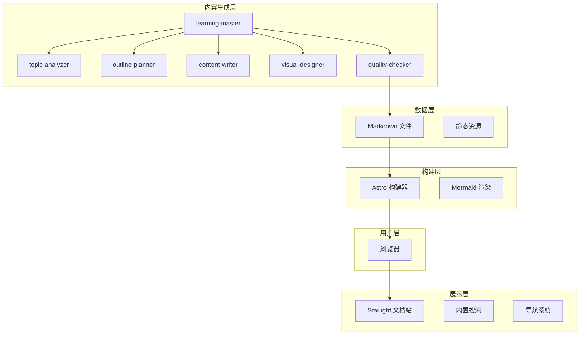
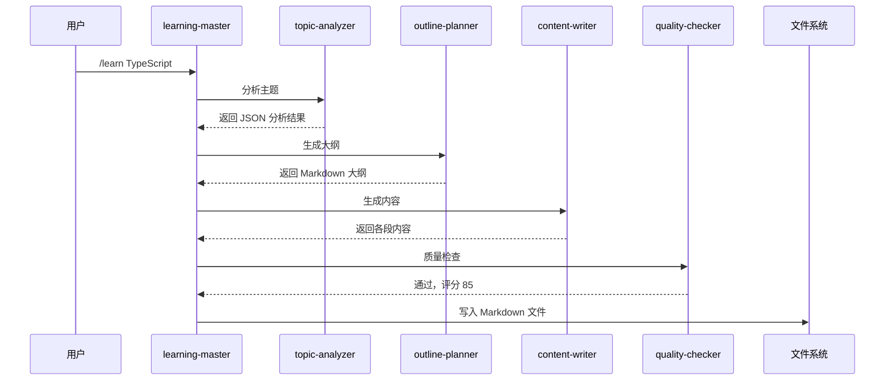
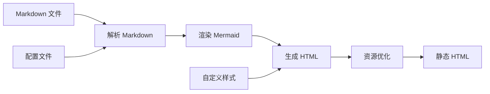

> 版本：v1.0 | 更新日期：2026-02-24

## 系统架构概览

### 分层架构



### 技术选型决策

| 层级 | 技术选择 | 选择理由 |
|------|----------|----------|
| 框架 | Astro | 零 JS 默认、构建速度快 |
| 主题 | Starlight | 开箱即用、MIT 协议 |
| 图表 | Mermaid | Markdown 原生、AI 友好 |
| 部署 | Vercel | 自动部署、预览环境 |

## 数据流设计

### 文档生成流程



### 站点构建流程



## 目录结构设计

### 项目结构

```
study-buddy/
├── src/
│   ├── content/docs/      # 学习文档
│   │   ├── tools/         # 工具类
│   │   ├── domains/       # 领域类
│   │   ├── methods/       # 方法论
│   │   └── project/       # 项目设计
│   ├── components/        # 自定义组件
│   └── styles/            # 自定义样式
├── .qoder/skills/         # AI Skills
├── astro.config.mjs       # Astro 配置
└── package.json
```

### 文档分类体系

| 分类 | 路径 | 内容范围 |
|------|------|----------|
| 工具 | /tools/ | 软件工具的使用 |
| 领域 | /domains/ | 技术领域知识体系 |
| 方法论 | /methods/ | 学习方法与思维框架 |

### 文档命名规范

| 规则 | 示例 |
|------|------|
| 使用 kebab-case | typescript-basics.md |
| 主题明确 | react-hooks.md |
| 避免缩写 | kubernetes.md |

## 本地使用方案

### 常用命令

```bash
# 开发模式
npm run dev

# 构建静态站点
npm run build

# 预览构建结果
npm run preview
```

### 使用流程

1. 在 Qoder 中执行 `/learn {topic}` 生成学习文档
2. 执行 `npm run dev` 启动本地服务器
3. 在浏览器访问 localhost:4321 查看文档

## 性能优化策略

### 构建优化

| 策略 | 实现方式 | 预期效果 |
|------|----------|----------|
| 增量构建 | Astro 默认支持 | 减少 50% 构建时间 |
| 图片优化 | @astrojs/image | 减少 70% 图片体积 |
| 代码分割 | 自动 | 减少首屏 JS |

### 运行时优化

| 策略 | 实现方式 | 预期效果 |
|------|----------|----------|
| 静态生成 | Astro 默认 | 零运行时 JS |
| CDN 缓存 | Vercel Edge | < 50ms TTFB |

## 扩展性设计

### 新增分类

1. 在 `src/content/docs/` 下创建目录
2. 在 `astro.config.mjs` 的 sidebar 配置中添加入口

### 新增 Skill

1. 在 `.qoder/skills/` 下创建目录
2. 编写 `SKILL.md` 定义
3. 在 `learning-master` 中注册调用
