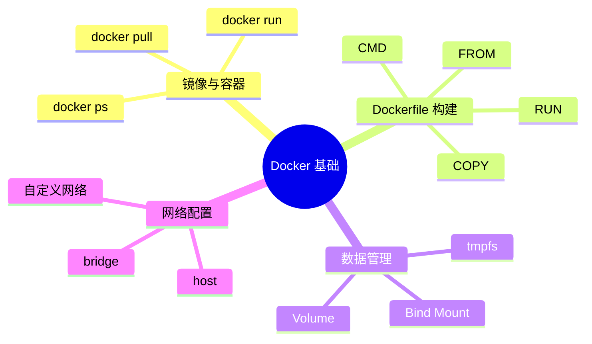
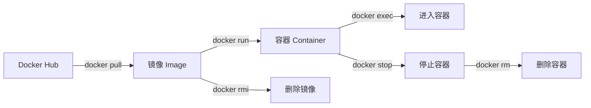
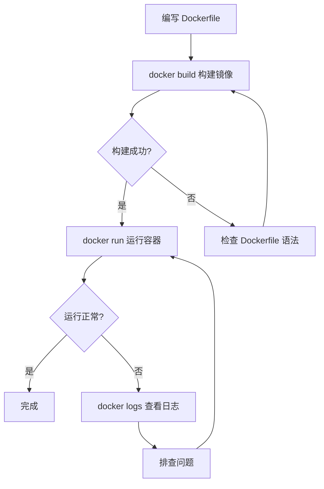

# 概览（5 分钟）

## 一句话定义

Docker 是轻量级容器化平台，让应用在任何环境一致运行。

**类比理解**：就像集装箱标准化了货物运输——不管里面装什么货物，港口、船、卡车都能统一处理。Docker 容器标准化了应用运行环境——不管应用用什么技术栈，都能在任何机器上一致运行。

## 核心问题

解决「在我机器上能跑」的环境一致性问题，实现应用的快速部署和隔离运行。

## 适用场景

| 场景 | 判断标准 |
|------|----------|
| 本地开发环境搭建 | 需要快速搭建多版本、多服务的开发环境 |
| CI/CD 流水线 | 构建过程需要可重复、可追溯 |
| 微服务部署 | 多个服务需要隔离运行、独立扩展 |
| 多版本环境切换 | 同一机器需要运行不同版本的同一服务 |

## 前置知识

- Linux 基础命令（cd、ls、cat 等）
- 了解进程与隔离概念（有助于理解容器原理）

## 知识点归类

```
Docker 基础
├── 镜像与容器    # 核心概念：类与实例的关系
├── Dockerfile 构建  # 镜像构建：从代码到镜像
├── 数据管理      # 持久化：容器删除后数据去哪
└── 网络配置      # 通信：容器之间如何连接
```

## 思维导图



# 详解（60 分钟）

## 镜像与容器

### 是什么

**镜像（Image）**：只读模板，包含运行应用所需的一切——代码、运行时、库、配置文件。就像"模具"或"类"的定义。

**容器（Container）**：镜像的运行实例，是一个独立运行的进程。就像"模具生产的产品"或"类的实例"。

**类比**：
- 镜像 = 菜谱（定义做什么菜、用什么材料）
- 容器 = 按菜谱做出来的菜（可以同时做多份）

### 为什么

没有容器时：
- 环境配置复杂，新人入职搭建环境要一天
- "我本地能跑"成了经典甩锅台词
- 多个项目依赖冲突（项目 A 要 Node 14，项目 B 要 Node 18）

有了容器：
- 一条命令启动完整环境
- 环境可复制，消除"环境差异"借口
- 每个项目独立容器，依赖互不影响

### 怎么用

```bash
# 拉取镜像（从 Docker Hub 下载）
docker pull nginx:latest

# 查看本地镜像
docker images

# 运行容器（从镜像创建实例）
docker run -d -p 8080:80 --name my-nginx nginx:latest

# 查看运行中的容器
docker ps

# 查看所有容器（包括已停止的）
docker ps -a

# 进入容器内部
docker exec -it my-nginx /bin/bash

# 停止容器
docker stop my-nginx

# 删除容器
docker rm my-nginx

# 删除镜像
docker rmi nginx:latest
```

**关键参数**：

| 参数 | 用途 | 示例 |
|------|------|------|
| `-d` | 后台运行（detached） | `docker run -d nginx` |
| `-p` | 端口映射（主机:容器） | `-p 8080:80` |
| `--name` | 指定容器名称 | `--name my-app` |
| `-it` | 交互模式 | `docker exec -it my-app /bin/bash` |

**常见陷阱**：

1. **端口冲突**：主机端口被占用，映射失败。解决：换端口或停掉占用进程
2. **容器停止后数据丢失**：容器内修改默认不持久化。解决：使用 Volume 挂载
3. **忘记容器名称**：不指定 `--name` 会生成随机名，难以管理。建议：始终命名



## Dockerfile 构建

### 是什么

Dockerfile 是构建镜像的脚本文件，定义了从基础镜像到最终镜像的所有步骤。

**类比**：就像菜谱——把原料（代码）做成成品（镜像）的步骤清单。

### 为什么

没有 Dockerfile 时：
- 手动执行一堆命令构建镜像，容易遗漏
- 构建过程不可追溯，别人无法复现
- 版本更新时要重新手动操作

有了 Dockerfile：
- 构建过程可版本化、可复用
- 一条命令完成构建
- 团队协作有统一标准

### 怎么用

```dockerfile
# 基础镜像
FROM node:18-alpine

# 设置工作目录
WORKDIR /app

# 先复制依赖文件（利用缓存层）
COPY package*.json ./

# 安装依赖
RUN npm install

# 复制源代码
COPY . .

# 暴露端口
EXPOSE 3000

# 启动命令
CMD ["npm", "start"]
```

```bash
# 构建镜像
docker build -t my-app:v1.0 .

# 运行构建的镜像
docker run -d -p 3000:3000 my-app:v1.0
```

**关键指令**：

| 指令 | 用途 | 最佳实践 |
|------|------|----------|
| FROM | 基础镜像 | 优先选 alpine 版本，体积小 |
| WORKDIR | 工作目录 | 替代 `cd` 命令 |
| COPY | 复制文件 | 配合 .dockerignore 排除 |
| RUN | 执行命令 | 合并多层减少体积 |
| CMD | 默认启动命令 | 只能有一个 |

**常见陷阱**：

1. **镜像体积过大**：未使用多阶段构建、未清理缓存
   ```dockerfile
   # 错误：每层都保留
   RUN apt-get update
   RUN apt-get install -y python3
   
   # 正确：合并并清理
   RUN apt-get update && apt-get install -y python3 && rm -rf /var/lib/apt/lists/*
   ```

2. **COPY 复制了不该复制的文件**：如 node_modules、.git
   - 解决：创建 `.dockerignore` 文件排除

3. **构建缓存失效**：改变 COPY 顺序导致后面所有层重建
   - 解决：先 COPY 依赖文件，再 COPY 源代码



## 数据管理

### 是什么

Docker 容器默认是临时的——删除容器，里面的数据也跟着消失。数据管理就是解决"数据持久化"问题。

三种方式：
- **Volume（卷）**：Docker 管理，存储在 /var/lib/docker/volumes
- **Bind Mount（绑定挂载）**：挂载主机指定目录
- **tmpfs**：仅存在内存中，适合敏感数据

### 为什么

没有数据管理时：
- 容器重启后配置、数据库数据丢失
- 多个容器无法共享数据
- 无法在主机上方便地查看容器内数据

有了数据管理：
- 数据与容器生命周期解耦
- 多容器共享同一数据源
- 方便备份、迁移

### 怎么用

```bash
# 创建 Volume
docker volume create my-data

# 使用 Volume 运行容器
docker run -d -v my-data:/app/data --name my-app nginx

# 绑定挂载（主机目录:容器目录）
docker run -d -v /host/path:/container/path nginx

# 匿名 Volume（Docker 自动创建）
docker run -d -v /app/data nginx

# 查看 Volume 列表
docker volume ls

# 查看 Volume 详情
docker volume inspect my-data

# 删除 Volume
docker volume rm my-data
```

**方式对比**：

| 方式 | 适用场景 | 优点 | 缺点 |
|------|----------|------|------|
| Volume | 生产环境、数据库 | Docker 管理，易备份 | 主机路径不直观 |
| Bind Mount | 开发环境、代码热更新 | 主机路径直观 | 路径耦合 |
| tmpfs | 敏感数据、缓存 | 不落盘，安全 | 重启丢失 |

**常见陷阱**：

1. **权限问题**：容器内进程用户与主机用户权限不匹配
   - 解决：使用 `--user` 指定用户，或在 Dockerfile 中设置

2. **Volume 路径不存在**：Docker 会自动创建空目录
   - 注意：可能覆盖容器内已有目录

3. **忘记清理 Volume**：删除容器后 Volume 仍存在，占用磁盘
   - 解决：`docker volume prune` 清理未使用的 Volume

## 网络配置

### 是什么

Docker 网络让容器之间、容器与主机之间能够通信。

四种网络模式：
- **bridge**（默认）：容器通过虚拟网桥连接
- **host**：容器直接使用主机网络
- **none**：容器无网络
- **自定义网络**：用户创建的隔离网络

### 为什么

默认网络的问题：
- 容器间只能通过 IP 通信，IP 可能变化
- 无法实现服务发现
- 网络隔离不灵活

自定义网络的优势：
- 通过容器名通信（自动 DNS 解析）
- 网络隔离，安全性更高
- 易于服务发现和负载均衡

### 怎么用

```bash
# 查看网络列表
docker network ls

# 创建自定义网络
docker network create my-network

# 运行容器并连接网络
docker run -d --name web --network my-network nginx
docker run -d --name db --network my-network mysql

# 容器间通过名称通信（在 web 容器中）
curl http://db:3306

# 连接运行中容器到网络
docker network connect my-network existing-container

# 断开网络连接
docker network disconnect my-network existing-container

# 删除网络
docker network rm my-network
```

**网络模式对比**：

| 模式 | 适用场景 | 特点 |
|------|----------|------|
| bridge | 默认模式，单机容器 | 容器有独立 IP，需要端口映射 |
| host | 高性能场景 | 无网络隔离，直接用主机端口 |
| none | 安全隔离 | 完全无网络 |
| 自定义 | 多容器应用 | 支持容器名通信，推荐 |

**常见陷阱**：

1. **容器间无法通信**：不在同一网络
   - 解决：创建自定义网络，所有容器加入

2. **端口映射冲突**：主机端口被占用
   - 解决：检查端口占用，或使用不同端口

3. **DNS 解析失败**：默认 bridge 网络不支持容器名解析
   - 解决：使用自定义网络

## 常见问题与排查

### 镜像体积过大

**现象**：镜像大小超过 1GB，拉取、部署慢

**原因**：
- 使用了完整基础镜像而非 alpine
- 每层都有残留文件
- 未使用多阶段构建

**解决方案**：
```dockerfile
# 多阶段构建示例
FROM node:18-alpine AS builder
WORKDIR /app
COPY . .
RUN npm install && npm run build

FROM node:18-alpine
WORKDIR /app
COPY --from=builder /app/dist ./dist
COPY --from=builder /app/node_modules ./node_modules
CMD ["node", "dist/main.js"]
```

### 容器数据丢失

**现象**：容器重启或删除后，数据不见了

**原因**：未使用 Volume 持久化数据

**解决方案**：
```bash
# 数据库容器必须挂载 Volume
docker run -d -v mysql-data:/var/lib/mysql mysql:8
```

### 网络连接问题

**现象**：容器间无法通信，或外部无法访问容器

**排查步骤**：
```bash
# 1. 检查容器是否运行
docker ps

# 2. 检查端口映射
docker port container-name

# 3. 检查网络配置
docker network inspect bridge

# 4. 进入容器测试连通性
docker exec -it container-name ping target-container
```

### 权限问题

**现象**：容器内操作被拒绝，或挂载目录无法访问

**原因**：容器默认以 root 运行，但主机目录权限不匹配

**解决方案**：
```dockerfile
# 在 Dockerfile 中创建用户
RUN addgroup -S appgroup && adduser -S appuser -G appgroup
USER appuser
```

```bash
# 或运行时指定用户
docker run --user 1000:1000 my-app
```

# 实战操作（25 分钟）

## 初级：运行第一个容器

**任务描述**：

使用 Docker 运行一个 Nginx Web 服务器，要求：
1. 使用官方 `nginx:alpine` 镜像
2. 容器名称为 `my-web`
3. 主机 8080 端口映射到容器 80 端口
4. 在浏览器访问 `http://localhost:8080` 确认成功

**参考答案**：

```bash
# 拉取镜像
docker pull nginx:alpine

# 运行容器
docker run -d --name my-web -p 8080:80 nginx:alpine

# 确认容器运行
docker ps

# 访问测试
curl http://localhost:8080

# 停止并清理
docker stop my-web && docker rm my-web
```

## 中级：编写 Dockerfile 构建应用镜像

**任务描述**：

为一个 Node.js Express 应用编写 Dockerfile，要求：
1. 使用 `node:18-alpine` 作为基础镜像
2. 应用端口为 3000
3. 优化构建缓存（依赖层与代码层分离）
4. 镜像标签为 `my-express:v1.0`

**思路提示**：
- 先 COPY package.json，再 npm install，最后 COPY 源代码
- 利用 .dockerignore 排除 node_modules

**完整代码**：

**Dockerfile**：
```dockerfile
FROM node:18-alpine

WORKDIR /app

# 先复制依赖文件（利用缓存）
COPY package*.json ./

# 安装依赖
RUN npm ci --only=production

# 复制源代码
COPY . .

# 暴露端口
EXPOSE 3000

# 启动命令
CMD ["node", "index.js"]
```

**.dockerignore**：
```
node_modules
npm-debug.log
.git
.env
```

**构建与运行**：
```bash
# 构建
docker build -t my-express:v1.0 .

# 运行
docker run -d -p 3000:3000 --name express-app my-express:v1.0

# 测试
curl http://localhost:3000
```

## 高级：数据持久化与网络互联

**任务描述**：

部署一个 Web 应用 + MySQL 数据库的组合，要求：
1. Web 应用能访问 MySQL
2. MySQL 数据持久化（重启不丢失）
3. 容器间通过名称通信
4. Web 应用端口映射到主机 3000

**架构设计**：

```
┌─────────────────────────────────────────┐
│             my-app-network              │
│  ┌─────────────┐    ┌─────────────┐    │
│  │   web-app   │───▶│    mysql    │    │
│  │   :3000     │    │    :3306    │    │
│  └─────────────┘    └─────────────┘    │
│         │                  │            │
│         ▼                  ▼            │
│   主机 :3000        mysql-data          │
│                    (Volume)             │
└─────────────────────────────────────────┘
```

**核心配置**：

```bash
# 创建网络
docker network create app-network

# 创建数据卷
docker volume create mysql-data

# 启动 MySQL
docker run -d \
  --name mysql \
  --network app-network \
  -v mysql-data:/var/lib/mysql \
  -e MYSQL_ROOT_PASSWORD=secret \
  -e MYSQL_DATABASE=myapp \
  mysql:8

# 启动 Web 应用（假设已构建 my-web-app 镜像）
docker run -d \
  --name web-app \
  --network app-network \
  -p 3000:3000 \
  -e DB_HOST=mysql \
  -e DB_USER=root \
  -e DB_PASSWORD=secret \
  my-web-app:v1.0

# Web 应用可通过 mysql:3306 连接数据库
```

**验证**：
```bash
# 检查容器状态
docker ps

# 检查网络连接
docker exec web-app ping mysql

# 重启 MySQL 验证数据持久化
docker restart mysql
docker exec mysql mysql -uroot -psecret -e "SHOW DATABASES;"
```

# 命令速查表

| 命令 | 用途 | 常用参数 |
|------|------|----------|
| `docker run` | 运行容器 | `-d -p -v --name --network` |
| `docker build` | 构建镜像 | `-t -f` |
| `docker images` | 查看镜像列表 | `-a` |
| `docker ps` | 查看容器列表 | `-a` |
| `docker exec` | 在容器中执行命令 | `-it` |
| `docker stop` | 停止容器 | 容器名或 ID |
| `docker rm` | 删除容器 | `-f` 强制删除运行中 |
| `docker rmi` | 删除镜像 | 镜像名或 ID |
| `docker logs` | 查看容器日志 | `-f --tail` |
| `docker volume ls` | 查看数据卷 | |
| `docker volume create` | 创建数据卷 | 卷名 |
| `docker network ls` | 查看网络列表 | |
| `docker network create` | 创建网络 | 网络名 |
| `docker compose up` | 启动多容器 | `-d -f` |
| `docker compose down` | 停止并删除 | `-v` 同时删除卷 |

# 扩展阅读

- [Docker 官方文档](https://docs.docker.com/)
- [Docker Hub 镜像仓库](https://hub.docker.com/)
- [Docker 最佳实践指南](https://docs.docker.com/develop/develop-images/dockerfile_best-practices/)
- [Docker Compose 入门](https://docs.docker.com/compose/)
