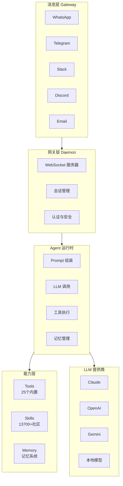
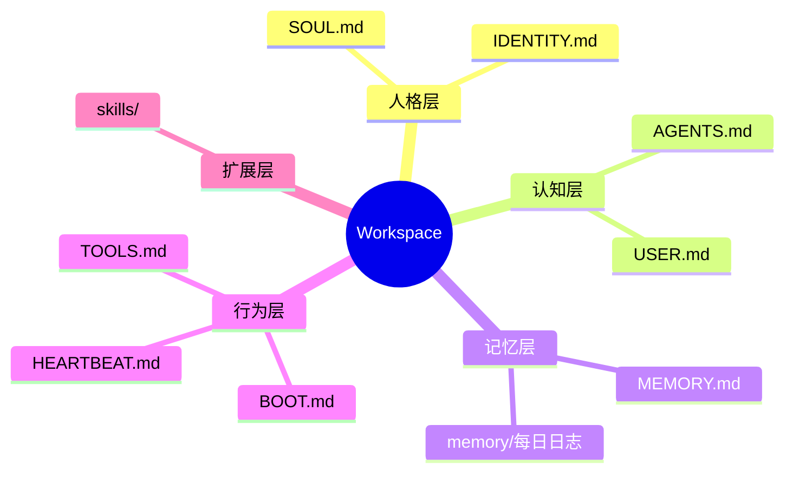
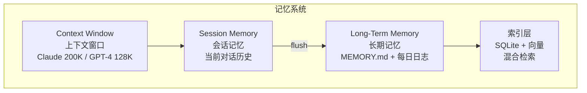
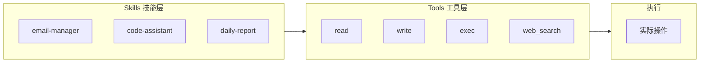

## 功能全景

## 架构全景图



## 核心概念速记表

| 概念 | 一句话说明 | 类比 |
|------|-----------|------|
| **Workspace** | Agent 的私有工作目录和记忆存储 | Agent 的"家" |
| **Skills** | 教 Agent 如何完成特定任务的能力包 | 驾驶技能 |
| **Tools** | 底层物理操作能力 | 汽车的引擎、轮子 |
| **Memory** | 跨会话的持久化记忆系统 | 大脑的记忆区 |
| **Gateway** | 消息平台与 Agent 之间的桥梁 | 电话交换机 |

---

## 核心概念详解

### Workspace（工作空间）

```
定义：Agent 的"家"，唯一的私有工作目录和记忆存储。

位置：~/.openclaw/workspace/

作用：
├── 存储 Agent 的所有认知文件
├── 工具操作的默认工作目录
├── 与配置/凭证分离（后者在 ~/.openclaw/）
└── 可用 Git 备份（私有仓库）
```

**关键点**：Workspace 是 Agent 的"大脑"所在，包含所有认知文件。

---

### 认知文件体系

Workspace 中的核心文件构成 Agent 的"大脑"：



| 文件 | 作用 | 加载时机 | 记忆口诀 |
|------|------|---------|---------|
| `SOUL.md` | 人格、语调、边界、价值观 | 每次会话 | Agent 的"灵魂" |
| `AGENTS.md` | 操作指令、行为规则 | 每次会话 | Agent 的"行为准则" |
| `USER.md` | 用户画像、偏好、称呼方式 | 每次会话 | Agent 对"你的认知" |
| `IDENTITY.md` | Agent 名称、氛围、Emoji | 初始化时 | Agent 的"名片" |
| `TOOLS.md` | 工具使用指南 | 按需加载 | Agent 的"工具手册" |
| `MEMORY.md` | 精选的长期记忆 | 主会话 | Agent 的"长期记忆" |
| `HEARTBEAT.md` | 心跳检查清单 | 定时执行 | Agent 的"健康检查" |
| `BOOT.md` | 启动时执行的任务 | Gateway 重启时 | Agent 的"晨间例程" |
| `memory/*.md` | 每日记忆日志 | 按需加载 | Agent 的"日记本" |

---

### Memory（记忆系统）



**记忆分层**：

| 层级 | 类型 | 特点 | 存储位置 |
|------|------|------|---------|
| 热数据 | 会话记忆 | 当前对话，可变 | 内存 |
| 温数据 | 日日志 | 每日记录 | `memory/YYYY-MM-DD.md` |
| 冷数据 | 长期记忆 | 精选事实，跨会话 | `MEMORY.md` |

**记忆管理命令**：

```bash
# 查询记忆
"你还记得我之前说的 XXX 项目吗？"

# 添加记忆
"记住：我的工作邮箱是 xxx@company.com"

# 删除记忆
"忘掉关于 YYY 的信息"

# CLI 操作
openclaw memory show today
openclaw memory add "重要信息"
openclaw memory search "关键词"
```

---

### Tools vs Skills（关键区分）



**核心区分**：

| 概念 | 是什么 | 数量 | 类比 | 示例 |
|------|-------|------|------|------|
| **Tools** | 物理能力，底层操作 | 25 个内置 | 汽车的引擎、轮子 | read, write, exec, web_search |
| **Skills** | 使用手册，教你如何组合工具完成任务 | 13,700+ | 驾驶技能 | email-manager, code-assistant |

**25 个内置 Tools 分类**：

| 类别 | Tools | 功能 |
|------|-------|------|
| 文件操作 | `read`, `write`, `edit` | 读写编辑文件 |
| 命令执行 | `exec`, `shell` | 执行系统命令 |
| 网络 | `web_search`, `fetch`, `browser` | 搜索、抓取、浏览器控制 |
| 记忆 | `memory_read`, `memory_write` | 记忆读写 |
| 通信 | `email`, `slack`, `discord` | 发送消息邮件 |
| 调度 | `schedule`, `cron` | 定时任务 |

**Skills 分层**：

```
Layer 3: 业务 Skills（高阶）
├── daily-report          # 日报生成
├── pr-review-assistant   # PR 审查助手
└── meeting-summary       # 会议纪要

Layer 2: 领域 Skills（中阶）
├── email-manager         # 邮件管理
├── github-integration    # GitHub 集成
└── calendar-sync         # 日历同步

Layer 1: 基础 Skills（低阶）
├── web-fetch             # 网页抓取
├── file-manager          # 文件管理
└── api-caller            # API 调用
```

---

### Gateway（网关/守护进程）

```
定义：OpenClaw 的中央服务器，管理所有状态、连接和请求。

职责：
├── WebSocket 服务器，处理客户端连接
├── 会话管理（创建、恢复、销毁）
├── 设备信任与认证
├── 消息路由（消息平台 → Agent Runtime）
├── 心跳监控
└── Hook 和调度器管理
```

---

### Agent Runtime

```
定义：核心执行引擎，处理 Prompt 组装、工具执行、记忆管理。

执行流程：
┌──────────┐   ┌──────────┐   ┌──────────┐   ┌──────────┐
│ 接收消息  │ → │ 组装Prompt│ → │ 调用LLM  │ → │ 执行工具  │
└──────────┘   └──────────┘   └──────────┘   └──────────┘
                    ↓
              ┌──────────┐
              │ 加载文件  │
              │ SOUL.md  │
              │ AGENTS.md│
              │ USER.md  │
              │ MEMORY.md│
              └──────────┘
```

---

## 完整目录结构

```
~/.openclaw/                          # OpenClaw 根目录
├── openclaw.json                     # 主配置文件
├── credentials/                      # 凭证存储（不提交Git）
│   ├── oauth_tokens.json
│   └── api_keys.enc
│
├── agents/                           # Agent 数据
│   └── <agent-id>/
│       ├── sessions/                 # 会话记录
│       └── state.json
│
├── skills/                           # 全局 Skills
│   ├── email-manager/
│   ├── code-assistant/
│   └── ...
│
├── sandboxes/                        # 沙箱工作空间
│
└── workspace/                        # Agent 工作空间（核心！）
    ├── SOUL.md                       # 人格定义
    ├── AGENTS.md                     # 操作指令
    ├── USER.md                       # 用户画像
    ├── IDENTITY.md                   # Agent 身份
    ├── TOOLS.md                      # 工具指南
    ├── MEMORY.md                     # 长期记忆
    ├── HEARTBEAT.md                  # 心跳清单
    ├── BOOT.md                       # 启动任务
    ├── skills/                       # 工作空间级 Skills
    └── memory/                       # 记忆日志
        ├── 2026-03-06.md
        └── ...
```

---

**下一步**：了解 [应用场景](./scenarios/)
