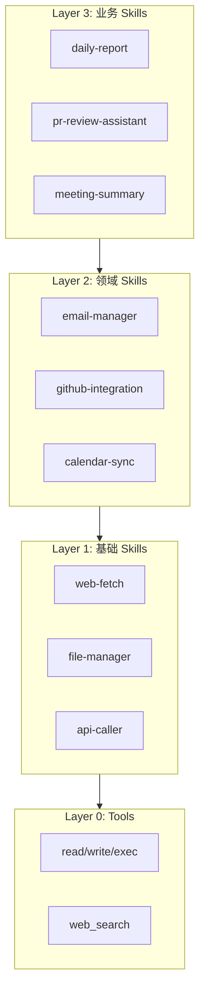
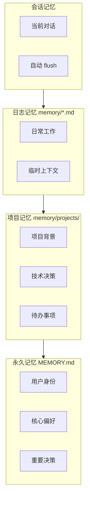
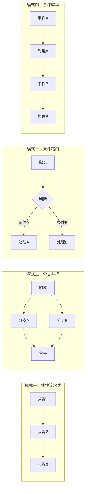

## 应用工程化

> 工程化 ≠ 部署运维，而是如何设计好、组织好、扩展好。

---

## 一、Skills 工程化设计

### 设计原则速记

| 原则 | 说明 | 口诀 |
|------|------|------|
| **单一职责** | 一个 Skill 只做一件事 | 专一 |
| **可组合** | Skills 之间可串联 | 拼搭 |
| **幂等性** | 多次执行结果一致 | 稳定 |
| **可观测** | 有清晰的输入输出 | 透明 |

### Skill 分层架构



**记忆口诀**：业务调领域，领域调基础，基础用工具

---

### Skill 目录规范

```
skills/
├── core/                           # 核心 Skills（通用）
│   ├── web-fetch/
│   └── file-manager/
│
├── domain/                         # 领域 Skills（按业务）
│   ├── email/
│   ├── github/
│   └── calendar/
│
└── business/                       # 业务 Skills（场景化）
    ├── daily-report/
    │   ├── SKILL.md
    │   ├── config.yaml
    │   └── templates/
    └── meeting-summary/
```

---

### Skill 编写规范

```markdown
<!-- SKILL.md 规范模板 -->
---
name: daily-report
description: 生成每日工作报告
version: 1.0.0
dependencies:
  - github-integration >= 1.0
  - jira-integration >= 1.0
triggers:
  - schedule: "0 18 * * 1-5"
  - command: "生成日报"
---

# 每日报告生成器

## 输入
无需显式输入，自动采集：GitHub commits, Jira 任务

## 执行流程
1. 数据采集 → 2. 数据处理 → 3. 生成报告

## 输出格式
# 每日工作报告 - ${DATE}
## 完成事项 / 进行中 / 明日计划

## 错误处理
- 数据源不可用：使用缓存 + 警告
- 无数据：返回"今日无工作记录"
```

---

## 二、记忆系统工程化

### 记忆分层规划



### 记忆写入策略

```yaml
# AGENTS.md 中定义

memory_strategy:
  auto_flush: true              # 会话结束自动保存
  flush_triggers:
    - important_decision        # 重要决策
    - user_explicit_ask         # 用户明确要求
    
  retention:
    daily_logs: 30              # 日日志保留 30 天
    project_memory: permanent   # 项目记忆永久
```

### 记忆管理清单

```
□ 分层存储：永久 vs 项目 vs 日志
□ 定期清理：设置自动清理策略
□ 敏感过滤：不存储密码、密钥
□ 项目隔离：不同项目独立记忆空间
□ 备份机制：定期备份 MEMORY.md
```

---

## 三、工作流编排

### 四种设计模式



| 模式 | 适用场景 | 示例 |
|------|---------|------|
| **线性流水线** | 固定步骤的任务 | 日报生成 |
| **分支并行** | 多数据源聚合 | 晨间简报 |
| **条件路由** | 不同类型消息分发 | 消息分类处理 |
| **事件驱动** | 触发-响应链 | PR 审查流程 |

---

### 工作流目录组织

```
workflows/
├── scheduled/              # 定时触发
│   ├── morning-brief.yaml
│   └── daily-report.yaml
│
├── event-driven/           # 事件触发
│   ├── pr-review.yaml
│   └── alert-handler.yaml
│
├── on-demand/              # 手动触发
│   └── generate-docs.yaml
│
└── shared/                 # 共享组件
    └── templates/
```

---

### 工作流设计清单

```
□ 幂等设计：多次执行不产生副作用
□ 错误恢复：失败时有重试或回滚
□ 可观测：记录执行日志和状态
□ 超时控制：设置合理的超时时间
□ 依赖管理：确保前置条件满足
```

---

## 四、多项目/多场景隔离

### 按项目隔离 Workspace

```
~/.openclaw/
├── workspaces/
│   ├── study-partner/      # 项目 A
│   │   ├── SOUL.md
│   │   ├── AGENTS.md
│   │   └── MEMORY.md
│   │
│   ├── internal-tools/     # 项目 B
│   └── personal/           # 个人场景
```

### 共享与隔离策略

```
共享内容（跨项目）：
├── ~/.openclaw/skills/     # 全局 Skills
├── ~/.openclaw/credentials/ # 凭证
└── ~/.openclaw/openclaw.json

隔离内容（按项目）：
├── workspace/SOUL.md       # 项目人格
├── workspace/AGENTS.md     # 项目规则
├── workspace/MEMORY.md     # 项目记忆
└── workspace/skills/       # 项目 Skills
```

---

## 五、工程化最佳实践速查

### Skills 开发清单

```
□ 单一职责
□ 清晰文档（触发/流程/输出）
□ 错误处理
□ 可测试
□ 版本管理
□ 依赖声明
```

### 记忆管理清单

```
□ 分层存储
□ 定期清理
□ 敏感过滤
□ 项目隔离
□ 备份机制
```

### 工作流设计清单

```
□ 幂等设计
□ 错误恢复
□ 可观测
□ 超时控制
□ 依赖管理
```

---

**下一步**：了解 [工作流集成](/tools/openclaw/integration/)
