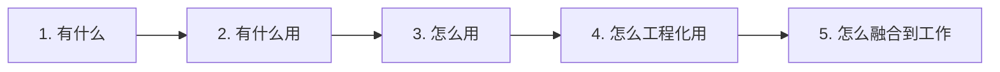

## 概览

## 一句话定义

> **OpenClaw = 开源自托管 AI Agent 框架**，在本地运行，连接消息平台 + LLM + 工具链，实现自动化任务执行。

## 核心价值

```
你用自然语言发消息 → AI Agent 理解意图 → 自动执行任务 → 返回结果
```

| 特性 | 说明 |
|------|------|
| 🏠 **自托管** | 数据本地存储，隐私可控 |
| 🧠 **有记忆** | 跨会话记住你的偏好和上下文 |
| 🔧 **可扩展** | 13,700+ 社区 Skills |
| 📱 **多平台** | Telegram / Slack / Discord / Email |
| 🔄 **持续运行** | 7x24 自动化执行任务 |

## 学习路径（五步法）



| 步骤 | 内容 | 文档 |
|------|------|------|
| 1️⃣ **有什么** | 功能全景、核心概念、架构组件 | [核心概念](concepts) |
| 2️⃣ **有什么用** | 应用场景、典型案例 | [应用场景](scenarios) |
| 3️⃣ **怎么用** | 安装配置、基本使用、交互方式 | [基本使用](usage) |
| 4️⃣ **怎么工程化用** | Skills 设计、记忆规划、工作流编排 | [工程化应用](engineering) |
| 5️⃣ **怎么融合到工作** | 工作流集成、多项目隔离、现有系统集成 | [工作流集成](integration) |

## 快速记忆

### 核心概念速记

```
Workspace  = Agent 的"家"（工作空间 + 记忆存储）
Skills     = 能力包（教你如何做事）
Tools      = 底层能力（物理操作，如读文件、执行命令）
Memory     = 记忆系统（会话记忆 + 长期记忆）
Gateway    = 网关（消息平台 → Agent 的桥梁）
```

### 关键文件速记

| 文件 | 作用 | 记忆口诀 |
|------|------|---------|
| `SOUL.md` | 人格定义 | Agent 的"灵魂" |
| `AGENTS.md` | 行为规则 | Agent 的"行为准则" |
| `USER.md` | 用户画像 | Agent 对"你的认知" |
| `MEMORY.md` | 长期记忆 | Agent 的"长期记忆" |
| `memory/*.md` | 每日日志 | Agent 的"日记本" |

### Tools vs Skills 速记

```
Tools = 汽车的引擎、轮子（底层能力）
Skills = 驾驶技能（如何组合使用工具）

Skills 调用 Tools 完成任务
```

## 目录结构

```
~/.openclaw/                      # OpenClaw 根目录
├── openclaw.json                 # 主配置
├── credentials/                  # 凭证（API Key、OAuth）
├── skills/                       # 全局 Skills
└── workspace/                    # Agent 工作空间（核心）
    ├── SOUL.md                   # 人格
    ├── AGENTS.md                 # 规则
    ├── USER.md                   # 用户
    ├── MEMORY.md                 # 记忆
    └── memory/                   # 日日志
```

## 常用命令速查

```bash
# 启动
openclaw start

# 配置
openclaw configure
openclaw connect telegram --token YOUR_TOKEN

# Skills
openclaw skills list
openclaw skills install <name>

# 记忆
openclaw memory show today
openclaw memory add "记住这个"
```

---

**下一步**：从 [核心概念](concepts) 开始深入了解。
