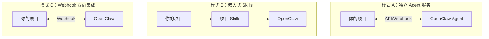

## 工作流集成

## 集成模式速览



| 模式 | 适用场景 | 特点 |
|------|---------|------|
| **独立服务** | 多项目共享 | Agent 独立运行，API 调用 |
| **嵌入式** | 单项目深度集成 | Skills 放在项目目录 |
| **Webhook** | 事件驱动 | 双向通知 |

---

## 一、与现有项目集成

### 项目集成目录结构

```
my-react-project/
├── src/
├── openclaw/                       # OpenClaw 集成目录
│   ├── skills/                     # 项目专属 Skills
│   │   ├── component-generator/
│   │   │   ├── SKILL.md
│   │   │   └── templates/
│   │   └── test-generator/
│   │
│   ├── workflows/
│   │   └── code-review.yaml
│   │
│   └── config.yaml
│
└── .openclaw.yaml                  # 关联配置
```

### 项目关联配置

```yaml
# .openclaw.yaml
project:
  name: my-react-project
  type: frontend
  
skills_dir: ./openclaw/skills
workflows_dir: ./openclaw/workflows

integrations:
  github:
    repo: user/my-react-project
    events: [pr, issue, push]
    
  slack:
    channel: "#dev-team"
```

---

## 二、典型集成场景

### 场景 1：PR 自动审查

```yaml
# workflows/pr-review.yaml
name: pr-review

trigger:
  webhook: github.pr_opened

steps:
  - name: 分析代码
    skill: code-analyzer
    action: review
    
  - name: 发布评论
    skill: github-integration
    action: post_comment
    inputs:
      pr: ${trigger.pr_number}
      comment: ${steps.analyze.result}
```

### 场景 2：Issue 自动分类

```yaml
# workflows/issue-triage.yaml
name: issue-triage

trigger:
  webhook: github.issue_opened

steps:
  - name: 分类
    skill: issue-classifier
    action: classify
    output: category
    
  - name: 分配
    skill: github-integration
    action: add_labels
    labels: ${category.labels}
    
  - name: 通知
    skill: slack-connector
    action: send_message
    channel: "#issues"
```

### 场景 3：部署监控

```yaml
# workflows/deploy-monitor.yaml
name: deploy-monitor

trigger:
  webhook: deploy.completed

steps:
  - name: 检查日志
    skill: log-analyzer
    action: check_errors
    output: errors
    
  - name: 判断是否告警
    condition: ${errors.count > 0}
    true:
      - skill: slack-connector
        action: send_alert
        severity: high
    false:
      - skill: slack-connector
        action: send_success
```

---

## 三、自定义 Skill 开发

### Skill 目录结构

```
skills/
└── my-skill/
    ├── SKILL.md              # Skill 定义（必需）
    ├── config.yaml           # 配置参数（可选）
    └── tools/                # 可执行脚本（可选）
        └── main.py
```

### SKILL.md 模板

```markdown
---
name: component-generator
description: 根据描述生成 React 组件
userInvocable: true
---

# React 组件生成器

## 触发条件
- 用户说"生成组件"或"创建组件"
- 描述组件功能

## 执行流程
1. 解析组件需求
2. 确定组件类型
3. 使用项目模板生成代码
4. 创建测试文件
5. 返回文件路径

## 输出
- src/components/[Name]/index.tsx
- src/components/[Name]/[Name].test.tsx

## 依赖
- 项目根目录存在 templates/component.tsx
```

---

## 四、多 Agent 协作

### 多 Agent 配置

```yaml
# ~/.openclaw/openclaw.json
agents:
  main:
    workspace: "~/.openclaw/workspaces/personal"
    skills: ["email-manager", "calendar-sync"]
    
  code-assistant:
    workspace: "~/.openclaw/workspaces/code"
    skills: ["github-integration", "code-review"]
    
  data-analyst:
    workspace: "~/.openclaw/workspaces/data"
    skills: ["web-scraper", "data-analyzer"]

routing:
  - match: "代码|PR|git"
    agent: "code-assistant"
  - match: "数据|分析|报表"
    agent: "data-analyst"
  - default: "main"
```

---

## 五、集成工具矩阵

| 工具 | 集成方式 | Skill | 典型用途 |
|------|---------|-------|---------|
| **GitHub** | API + Webhook | github-integration | PR 审查、Issue 管理 |
| **Slack** | Bot + Webhook | slack-connector | 消息聚合、告警推送 |
| **Notion** | API | notion-sync | 知识库同步 |
| **Jira** | API | jira-integration | 任务管理 |
| **Gmail** | OAuth + API | email-manager | 邮件分类 |
| **Obsidian** | 文件系统 | obsidian-integration | 笔记管理 |
| **Google Calendar** | API | calendar-sync | 日程管理 |

---

## 六、集成最佳实践

### 安全配置

```yaml
# 只允许特定命令
security:
  allowedCommands: [git, npm, python]
  forbiddenPaths: [/etc, ~/.ssh, ~/.aws]
  
# 敏感操作需确认
sensitive_actions:
  - send_email
  - delete_files
  - execute_command
  require_confirmation: true
```

### 错误处理

```yaml
# 工作流错误处理
error_handling:
  retry:
    max_attempts: 3
    delay: 5s
    
  fallback:
    - skill: slack-connector
      action: send_error_alert
      
  logging:
    enabled: true
    level: error
```

### 性能优化

```yaml
# 并行执行
parallel:
  - skill: github-integration
    action: get_commits
  - skill: jira-integration
    action: get_issues

# 缓存
cache:
  enabled: true
  ttl: 3600
```

---

## 七、快速集成清单

```
□ 确定集成模式（独立/嵌入式/Webhook）
□ 创建项目关联配置 .openclaw.yaml
□ 开发项目专属 Skills（如需要）
□ 配置工作流触发器
□ 设置错误处理和重试
□ 配置通知渠道
□ 测试集成流程
```

---

**返回**：[OpenClaw 概览](./)
