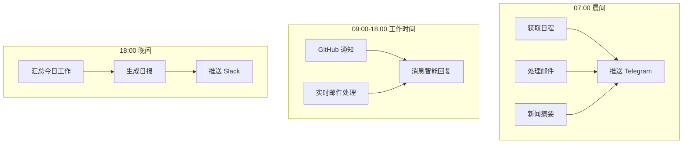

## 应用场景

## 场景能力矩阵

| 能力维度 | 具体场景 | 涉及 Skills | 节省时间 |
|---------|---------|------------|---------|
| 📧 通信自动化 | 邮件分类、自动回复、消息推送 | email, slack-connector | 3小时/周 |
| 📰 信息聚合 | 新闻摘要、RSS 聚合、日报生成 | web_search, report-generator | 1.5小时/周 |
| 📅 日程管理 | 日历同步、会议提醒、冲突检测 | calendar-sync | 2小时/周 |
| 💻 代码辅助 | 代码生成、PR 审查、Git 操作 | exec, github-integration | 视项目 |
| 📊 数据监控 | 业务监控、异常告警、报告生成 | web_fetch, schedule | 自动化 |
| 📝 知识管理 | 笔记整理、知识库同步 | read/write, obsidian-integration | 1小时/周 |

---

## 典型案例

### 案例 1：智能邮件助理

```
触发：每天上午 9 点自动执行，或手动发送"处理邮件"

流程：
┌──────────────┐    ┌──────────────┐    ┌──────────────┐
│  拉取邮件     │ → │  LLM 分类     │ → │  生成摘要     │
│  Gmail API   │    │  重要/普通    │    │  推送到手机   │
└──────────────┘    └──────────────┘    └──────────────┘

结果：
📱 Telegram 收到：
"今收到 15 封邮件，重要 2 封：
1. [紧急] 服务器告警 - 需处理
2. [项目] 需求确认 - 待回复

已起草回复草稿，请确认后发送。"
```

**节省时间**：约 **3 小时/周**

---

### 案例 2：自动化日报

```
触发：每天 18:00 自动执行

流程：
┌──────────────┐    ┌──────────────┐    ┌──────────────┐
│  数据采集     │ → │  LLM 整理     │ → │  生成报告     │
│  GitHub/JIRA │    │  提取关键信息  │    │  推送/存档    │
└──────────────┘    └──────────────┘    └──────────────┘

输出：
- 今日提交：3 个 PR，2 个已合并
- 进行中任务：PMS-123（预计明天完成）
- 明日计划：代码评审 + 技术方案
```

**节省时间**：约 **1.5 小时/周**

---

### 案例 3：代码助手

```
你：Telegram 发送"帮我写一个 Python 脚本，每天抓取某网站价格变化"

Agent 执行：
1. 生成爬虫代码
2. 本地测试运行
3. 检测到问题 → 自动修复
4. 推送到 GitHub 仓库
5. 返回：代码已提交到 xxx/price-tracker

后续：
你："加个告警功能，价格变动超 10% 发邮件"
Agent：自动更新代码，添加告警逻辑
```

---

### 案例 4：晨间简报

```
触发：每天 08:00 自动执行

        ┌→ 日程 ──────→┐
定时 →  ├→ 邮件摘要 ──→├→ 汇总 → 推送 Telegram
        └→ 新闻头条 ──→┘

输出：
☀️ 早安，今天是 2026年3月6日

📅 今日日程：
- 10:00 产品需求评审
- 14:00 技术方案讨论
- 16:00 代码评审

📧 邮件摘要：
- 3 封重要邮件待处理

📰 科技要闻：
- Claude 4 发布，性能提升 40%
- ...
```

---

## 全天候个人助理示例



---

## 开发团队助手示例

```
集成：GitHub + Slack + Jira

代码审查流程：
PR 创建 → OpenClaw 分析代码 → 生成审查评论 → 发布到 PR

Issue 处理：
新 Issue → 自动分类 → 分配负责人 → 通知到 Slack

部署监控：
部署完成 → 检查日志 → 异常告警 → 通知团队
```

---

## 与现有工具集成矩阵

| 工具 | 集成方式 | Skill | 典型用途 |
|------|---------|-------|---------|
| **GitHub** | API + Webhook | github-integration | PR 审查、Issue 管理 |
| **Slack** | Bot + Webhook | slack-connector | 消息聚合、告警推送 |
| **Notion** | API | notion-sync | 知识库同步、笔记整理 |
| **Jira** | API | jira-integration | 任务管理、进度追踪 |
| **Gmail** | OAuth + API | email-manager | 邮件分类、自动回复 |
| **Obsidian** | 文件系统 | obsidian-integration | 笔记管理、知识图谱 |
| **Google Calendar** | API | calendar-sync | 日程管理、会议提醒 |

---

**下一步**：了解 [基本使用](/tools/openclaw/usage/)
